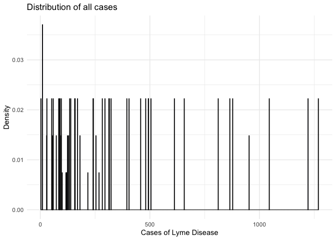
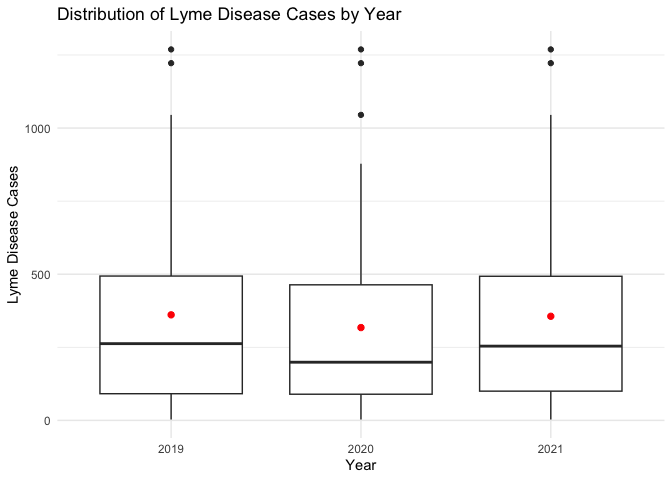
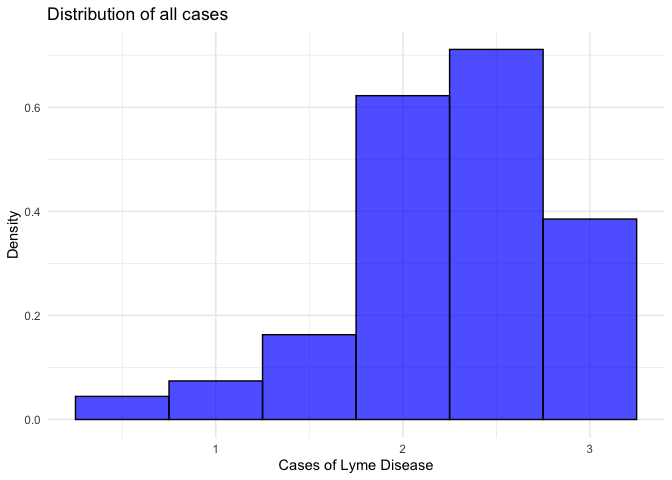
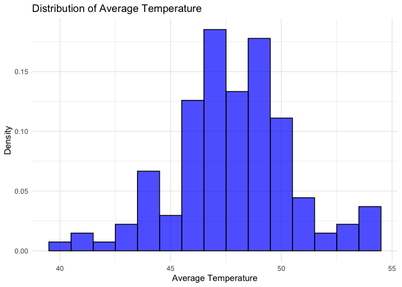
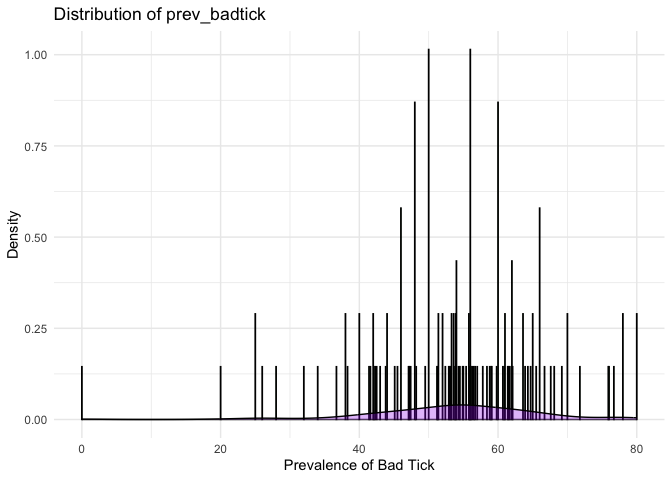
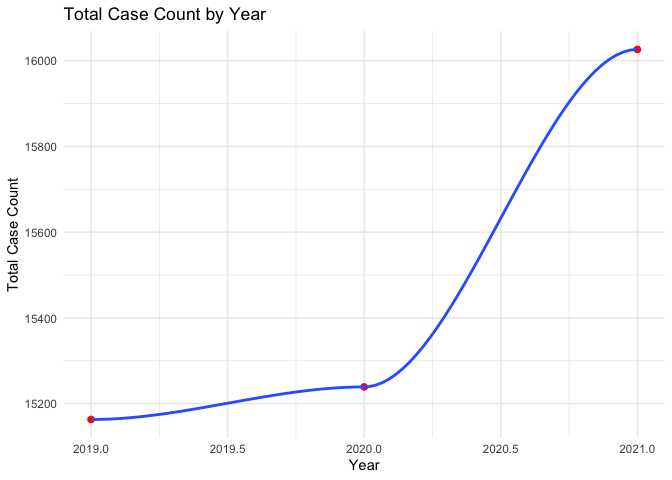

Cleaning and Description of Analytic dataset
================
2024-11-21

# Sarahy’s Data Cleaning

This document for cleaning and tidying the data.

``` r
options(repos = c(CRAN = "https://cloud.r-project.org"))

install.packages("remotes")
```

    ## 
    ## The downloaded binary packages are in
    ##  /var/folders/pj/vmjxwds93714mf9yw4qrzpkw0000gp/T//Rtmp1wTwej/downloaded_packages

``` r
install.packages("broom.helpers")
```

    ## 
    ## The downloaded binary packages are in
    ##  /var/folders/pj/vmjxwds93714mf9yw4qrzpkw0000gp/T//Rtmp1wTwej/downloaded_packages

``` r
remotes::install_github("ddsjoberg/gtsummary")
library(tidyverse)
library(rvest)
library(sf)
library(purrr)
library(knitr)
library(readxl)
library(gtsummary)
library(gt)
```

``` r
nineteen_twentyone_county_lyme = read_csv("new_york_county_lyme.csv") %>%  #read in the NYC lyme data
  janitor::clean_names() %>%  #clean the names 
  select(county_name, event_count,percent_rate ) %>%  # select variables of interest 
  rename(NAME = "county_name", 
         lyme_count = "event_count",
         lyme_rate = "percent_rate"
         ) %>%  # renaming so we can have a common variable when merging 
  mutate( data = "lyme", NAME = ifelse(NAME == "Cattaragus", "Cattaraugus", NAME)) # created a new variable so double check that merging was accurate, also fixed misspelled Cattaraugus

print(nineteen_twentyone_county_lyme)
```

    ## # A tibble: 62 × 4
    ##    NAME      lyme_count lyme_rate data 
    ##    <chr>          <dbl>     <dbl> <chr>
    ##  1 Queens           336       4.9 lyme 
    ##  2 Saratoga         494      70.8 lyme 
    ##  3 Greene           612     427.  lyme 
    ##  4 Niagara           10       1.6 lyme 
    ##  5 Allegany          59      42.3 lyme 
    ##  6 Bronx             78       1.8 lyme 
    ##  7 Ulster           657     122.  lyme 
    ##  8 Jefferson        170      49.7 lyme 
    ##  9 Orange           878      75.1 lyme 
    ## 10 Wayne            120      44.2 lyme 
    ## # ℹ 52 more rows

Tidy deer tick data

``` r
tick_surveillance = read_csv("./Deer_Tick_Surveillance__Adults__Oct_to_Dec__excluding_Powassan_virus__Beginning_2008_20241116.csv") %>% 
  janitor::clean_names() %>% # clean the names so they follow normal form 
  filter(year %in% 2019:2021 ) %>%  # filtering from the years of interest that are based from the lyme disease data 
  rename(NAME = "county") %>% # renaming for common identifier
  rename(ticks_tested = "total_tested") %>% 
  select(-total_sites_visited, -school_districts_2016_shp, -local_waterfront_revitalization_program_lwrp_communities, -new_york_zip_codes, -counties, -nys_senate_districts, -a_phagocytophilum_percent, -b_microti_percent, -b_miyamotoi_percent) %>%  # selecting and removing variables of interest , 
mutate(data = "ticks")  # adding a variable to identify merging 


print(tick_surveillance)
```

    ## # A tibble: 138 × 8
    ##     year NAME       total_ticks_collected tick_population_density ticks_tested
    ##    <dbl> <chr>                      <dbl>                   <dbl>        <dbl>
    ##  1  2021 Albany                       366                    85.8          168
    ##  2  2021 Chautauqua                   199                    36.7          107
    ##  3  2021 Dutchess                     438                    66.8           51
    ##  4  2021 Warren                        88                    13.8           87
    ##  5  2020 Albany                       114                    37.2          103
    ##  6  2020 Chemung                      271                   257.            50
    ##  7  2020 Delaware                      75                    21.9           69
    ##  8  2020 Tompkins                     131                    52.4           44
    ##  9  2020 Oneida                       157                    78.5           50
    ## 10  2020 Seneca                        51                    35.5           50
    ## # ℹ 128 more rows
    ## # ℹ 3 more variables: b_burgdorferi_percent <dbl>, county_centroid <chr>,
    ## #   data <chr>

Read in shp file for NY counties

``` r
ny_county =  st_read("./Data Preparation/Counties.shp")  # read in the county shapefile 
```

    ## Reading layer `Counties' from data source 
    ##   `/Users/nickywilliams/Desktop/Data Science/p8105_final/Data Preparation/Counties.shp' 
    ##   using driver `ESRI Shapefile'
    ## Simple feature collection with 62 features and 17 fields
    ## Geometry type: MULTIPOLYGON
    ## Dimension:     XY
    ## Bounding box:  xmin: 105571.4 ymin: 4480943 xmax: 779932.1 ymax: 4985476
    ## Projected CRS: NAD83 / UTM zone 18N

``` r
print(ny_county)
```

    ## Simple feature collection with 62 features and 17 fields
    ## Geometry type: MULTIPOLYGON
    ## Dimension:     XY
    ## Bounding box:  xmin: 105571.4 ymin: 4480943 xmax: 779932.1 ymax: 4985476
    ## Projected CRS: NAD83 / UTM zone 18N
    ## First 10 features:
    ##           NAME ABBREV GNIS_ID FIPS_CODE   SWIS   NYSP_ZONE POP1990 POP2000
    ## 1       Albany   ALBA  974099     36001 010000        East  292594  294565
    ## 2     Allegany   ALLE  974100     36003 020000        West   50470   49927
    ## 3        Bronx   BRON  974101     36005 600000 Long Island 1203789 1332650
    ## 4       Broome   BROO  974102     36007 030000     Central  212160  200536
    ## 5  Cattaraugus   CATT  974103     36009 040000        West   84234   83955
    ## 6       Cayuga   CAYU  974104     36011 050000     Central   82313   81963
    ## 7   Chautauqua   CHAU  974105     36013 060000        West  141895  139750
    ## 8      Chemung   CHEM  974106     36015 070000     Central   95195   91070
    ## 9     Chenango   CHEN  974107     36017 080000     Central   51768   51401
    ## 10     Clinton   CLIN  974108     36019 090000        East   85969   79894
    ##    POP2010 POP2020 DOS_LL DOSLL_DATE NYC CALC_SQ_MI    DATEMOD Shape_Leng
    ## 1   304204  314848   <NA>       <NA>   N  532.79178 2017-11-10  166077.83
    ## 2    48946   46456   <NA>       <NA>   N 1035.20913 2019-04-26  210499.34
    ## 3  1385108 1472654   <NA>       <NA>   Y   57.47215 2019-10-04   57253.86
    ## 4   200600  198683   <NA>       <NA>   N  715.28747 2019-04-26  227933.33
    ## 5    80317   77042   <NA>       <NA>   N 1324.30922 2019-04-26  276084.51
    ## 6    80026   76248   <NA>       <NA>   N  881.82350 2018-07-18  334039.80
    ## 7   134905  127657   <NA>       <NA>   N 1507.79455 2019-04-26  247508.47
    ## 8    88830   84148   <NA>       <NA>   N  410.95932 2019-04-26  146916.78
    ## 9    50477   47220   <NA>       <NA>   N  897.81864 2018-10-03  226955.16
    ## 10   82128   79843   <NA>       <NA>   N 1116.81373 2018-12-07  235243.35
    ##    Shape_Area                       geometry
    ## 1  1379924372 MULTIPOLYGON (((605729 4737...
    ## 2  2681179340 MULTIPOLYGON (((229573.9 47...
    ## 3   148852180 MULTIPOLYGON (((595540.7 45...
    ## 4  1852586030 MULTIPOLYGON (((428899.3 46...
    ## 5  3429945130 MULTIPOLYGON (((169747.3 47...
    ## 6  2283912393 MULTIPOLYGON (((369644.2 47...
    ## 7  3905169964 MULTIPOLYGON (((161319.8 47...
    ## 8  1064379743 MULTIPOLYGON (((353386.9 46...
    ## 9  2325339613 MULTIPOLYGON (((464936.4 47...
    ## 10 2892534278 MULTIPOLYGON (((629506.7 49...

Merging the data sets

``` r
# merging the excel sheets first 

NY_lyme_tick = full_join(tick_surveillance, nineteen_twentyone_county_lyme, by = "NAME") %>% 
  select(-data.x, -data.y)

print(NY_lyme_tick)
```

    ## # A tibble: 147 × 9
    ##     year NAME       total_ticks_collected tick_population_density ticks_tested
    ##    <dbl> <chr>                      <dbl>                   <dbl>        <dbl>
    ##  1  2021 Albany                       366                    85.8          168
    ##  2  2021 Chautauqua                   199                    36.7          107
    ##  3  2021 Dutchess                     438                    66.8           51
    ##  4  2021 Warren                        88                    13.8           87
    ##  5  2020 Albany                       114                    37.2          103
    ##  6  2020 Chemung                      271                   257.            50
    ##  7  2020 Delaware                      75                    21.9           69
    ##  8  2020 Tompkins                     131                    52.4           44
    ##  9  2020 Oneida                       157                    78.5           50
    ## 10  2020 Seneca                        51                    35.5           50
    ## # ℹ 137 more rows
    ## # ℹ 4 more variables: b_burgdorferi_percent <dbl>, county_centroid <chr>,
    ## #   lyme_count <dbl>, lyme_rate <dbl>

``` r
# now merging the shape file with excel file 

NY_lyme_tick_county = NY_lyme_tick %>%
  left_join(ny_county, by = "NAME") %>% 
  janitor::clean_names() 

# didn't delete the other parts from abbrev and later because they are part of the shapefile and if I delete I have to convert it to a dataframe making the shapefile no longer spatial. 
```

``` r
# merging and reading in tammy csv file with avg temps 

ny_temp = read_csv("./avg_temp_county.csv", skip =1) %>% 
  janitor::clean_names() %>% 
  select(county:dec_22) %>% 
mutate(county = str_replace_all(county, "(?i) county$", "")) %>% #mutated to remove the suffix county so that the data can be merged and have common identifier
  rename(name = "county") %>%  # renaming to have common identifier 
  drop_na(name) # there are two rows with entirely no data so I dropped them 
```

    ## New names:
    ## Rows: 65 Columns: 56
    ## ── Column specification
    ## ──────────────────────────────────────────────────────── Delimiter: "," chr
    ## (1): County dbl (48): Jan-19, Feb-19, Mar-19, Apr-19, May-19, Jun-19, Jul-19,
    ## Aug-19, Se... lgl (7): ...50, ...51, ...52, ...53, ...54, ...55, ...56
    ## ℹ Use `spec()` to retrieve the full column specification for this data. ℹ
    ## Specify the column types or set `show_col_types = FALSE` to quiet this message.
    ## • `` -> `...50`
    ## • `` -> `...51`
    ## • `` -> `...52`
    ## • `` -> `...53`
    ## • `` -> `...54`
    ## • `` -> `...55`
    ## • `` -> `...56`

``` r
tick_lyme_weather = NY_lyme_tick_county  %>% # now merging the entire dataset with avg weather 
  left_join(ny_temp, by = "name") %>% 
  janitor::clean_names() 
```

    ## Warning in left_join(., ny_temp, by = "name"): Detected an unexpected many-to-many relationship between `x` and `y`.
    ## ℹ Row 145 of `x` matches multiple rows in `y`.
    ## ℹ Row 2 of `y` matches multiple rows in `x`.
    ## ℹ If a many-to-many relationship is expected, set `relationship =
    ##   "many-to-many"` to silence this warning.

# Saved Final Dataset

``` r
write_csv(tick_lyme_weather, "final_data.csv")

tidied = read_csv("final_data.csv")
```

    ## Rows: 148 Columns: 74
    ## ── Column specification ────────────────────────────────────────────────────────
    ## Delimiter: ","
    ## chr   (7): name, county_centroid, abbrev, swis, nysp_zone, nyc, geometry
    ## dbl  (64): year, total_ticks_collected, tick_population_density, ticks_teste...
    ## lgl   (2): dos_ll, dosll_date
    ## date  (1): datemod
    ## 
    ## ℹ Use `spec()` to retrieve the full column specification for this data.
    ## ℹ Specify the column types or set `show_col_types = FALSE` to quiet this message.

## Attempt Using NOAA data

``` r
# importing the weather data 

library(dplyr)
library(rnoaa)

# Get a list of all NY station IDs
stations <- ghcnd_stations()
nystationids <-  stations %>% 
  filter(state == "NY") %>% 
  distinct(id)

# Pull the desired weather data for all of these stations
nydat <- meteo_pull_monitors(nystationids$id, 
                             date_min = "2019-01-01", 
                             date_max = "2021-12-31", 
                             var = c("PRCP", "SNOW", "SNWD", "TMAX", "TMIN"))

# Save the resulting data
save(nystationids, nydat, file = "nynoaadat.RData")
```

``` r
# convert from rdata to csv

load("nynoaadat.RData")

ls()  # This will list all the objects in your environment

str(nydat)


noaa_data <- as.data.frame(nydat)


write.csv(data, file = "nydat.csv", row.names = FALSE)
```

``` r
ny_weather = read_csv("./nydat.csv") %>% 
  select(id, date, prcp,tmax) %>% 
  drop_na(tmax) 


ny_weather <- ny_weather %>%
  group_by(id, date) %>%
  summarise(
    prcp = mean(prcp, na.rm = TRUE),
    tmax = mean(tmax, na.rm = TRUE),
    .groups = 'drop'
  ) %>%
  pivot_wider(
    names_from = id,
    values_from = c(date, prcp, tmax)
  )

ny_weather <- ny_weather %>%
  unnest(cols = c(date, prcp, tmax))

print(ny_weather)

summary(tick_lyme_weather)
```

# Mary’s Data Analysis

``` r
# Correct the names for Cattaraugus and St. Lawrance in the dataset
tick_lyme_weather <- tick_lyme_weather %>%
  mutate(
    name = case_when(
      name == "Cattaragus" ~ "Cattaraugus",
      name == "St Lawrance" ~ "St. Lawrance",
      TRUE ~ name))

# Verify the changes
unique(tick_lyme_weather$name)
```

    ##  [1] "Albany"       "Chautauqua"   "Dutchess"     "Warren"       "Chemung"     
    ##  [6] "Delaware"     "Tompkins"     "Oneida"       "Seneca"       "Onondaga"    
    ## [11] "Franklin"     "Livingston"   "Wayne"        "Oswego"       "Allegany"    
    ## [16] "Chenango"     "Orleans"      "St Lawrence"  "Monroe"       "Saratoga"    
    ## [21] "Cortland"     "Essex"        "Sullivan"     "Cattaraugus"  "Rockland"    
    ## [26] "Schenectady"  "Washington"   "Greene"       "Montgomery"   "Orange"      
    ## [31] "Erie"         "Yates"        "Clinton"      "Steuben"      "Cayuga"      
    ## [36] "Schoharie"    "Wyoming"      "Hamilton"     "Genesee"      "Rensselaer"  
    ## [41] "Ulster"       "Suffolk"      "Ontario"      "Niagara"      "Columbia"    
    ## [46] "Schuyler"     "Otsego"       "Jefferson"    "Westchester"  "Fulton"      
    ## [51] "Broome"       "Herkimer"     "St. Lawrence" "Madison"      "Queens"      
    ## [56] "Bronx"        "Putnam"       "Tioga"        "Kings"        "Lewis"       
    ## [61] "New York"     "Nassau"       "Richmond"

``` r
#load necessary libraries
library(broom)
library(ggplot2)
library(dplyr)
library(knitr)
```

### Table of all relevent data

``` r
# Summarize or find the mean for the data for each of the relevant topics
summary_table = tick_lyme_weather %>%
  group_by(name) %>%
  summarize(
    total_cases = sum(lyme_rate, na.rm = TRUE),            
    total_lyme_count = sum(lyme_count, na.rm = TRUE),     
    total_ticks_collected = sum(total_ticks_collected, na.rm = TRUE),  
    mean_prevalence = mean(lyme_rate, na.rm = TRUE),    
    mean_b_burgdorferi = mean(b_burgdorferi_percent, na.rm = TRUE), 
    n_observations = n()) %>%
  mutate(
    prevalence_percent = mean_prevalence * 100,          
    mean_b_burgdorferi_percent = mean_b_burgdorferi * 100)

# Create the table
summary_table %>%
  select(name, total_cases, total_lyme_count, total_ticks_collected, prevalence_percent, mean_b_burgdorferi_percent, n_observations) %>%
  knitr::kable(digits = 2, caption = "Summary of Variables by County")
```

| name | total_cases | total_lyme_count | total_ticks_collected | prevalence_percent | mean_b_burgdorferi_percent | n_observations |
|:---|---:|---:|---:|---:|---:|---:|
| Albany | 279.0 | 2595 | 973 | 9300 | 6236.67 | 3 |
| Allegany | 126.9 | 177 | 954 | 4230 | 5533.33 | 3 |
| Bronx | 1.8 | 78 | 0 | 180 | NaN | 1 |
| Broome | 326.8 | 1906 | 31 | 16340 | 5705.00 | 2 |
| Cattaraugus | 82.6 | 190 | 2106 | 4130 | 5443.33 | 3 |
| Cayuga | 125.1 | 288 | 317 | 4170 | 5666.67 | 3 |
| Chautauqua | 40.8 | 156 | 607 | 1360 | 5936.67 | 3 |
| Chemung | 46.6 | 117 | 271 | 4660 | 5600.00 | 1 |
| Chenango | 358.6 | 508 | 82 | 17930 | 6695.00 | 2 |
| Clinton | 166.5 | 402 | 470 | 5550 | 6043.33 | 3 |
| Columbia | 1340.4 | 2436 | 1754 | 44680 | 5660.00 | 3 |
| Cortland | 152.9 | 217 | 51 | 15290 | 5290.00 | 1 |
| Delaware | 541.8 | 726 | 373 | 18060 | 5556.67 | 3 |
| Dutchess | 354.0 | 3135 | 692 | 11800 | 5836.67 | 3 |
| Erie | 54.3 | 1515 | 360 | 1810 | 4666.67 | 3 |
| Essex | 230.6 | 258 | 404 | 11530 | 5890.00 | 2 |
| Franklin | 182.7 | 270 | 242 | 6090 | 4676.67 | 3 |
| Fulton | 297.6 | 477 | 431 | 9920 | 5723.33 | 3 |
| Genesee | 51.9 | 90 | 101 | 1730 | 5056.67 | 3 |
| Greene | 1281.3 | 1836 | 758 | 42710 | 5893.33 | 3 |
| Hamilton | 64.2 | 9 | 7 | 2140 | 2500.00 | 3 |
| Herkimer | 54.5 | 100 | 97 | 5450 | 3800.00 | 1 |
| Jefferson | 149.1 | 510 | 192 | 4970 | 7756.67 | 3 |
| Kings | 11.6 | 906 | 0 | 1160 | NaN | 1 |
| Lewis | 153.0 | 122 | 0 | 15300 | NaN | 1 |
| Livingston | 77.6 | 146 | 266 | 3880 | 6000.00 | 2 |
| Madison | 57.7 | 121 | 60 | 5770 | 5000.00 | 1 |
| Monroe | 32.1 | 723 | 642 | 1070 | 5063.33 | 3 |
| Montgomery | 177.6 | 264 | 602 | 5920 | 5480.00 | 3 |
| Nassau | 9.4 | 387 | 0 | 940 | NaN | 1 |
| New York | 33.6 | 1624 | 0 | 1680 | NaN | 2 |
| Niagara | 3.2 | 20 | 73 | 160 | 4675.00 | 2 |
| Oneida | 171.9 | 1185 | 444 | 5730 | 5266.67 | 3 |
| Onondaga | 67.8 | 945 | 308 | 2260 | 4653.33 | 3 |
| Ontario | 75.9 | 252 | 424 | 2530 | 6343.33 | 3 |
| Orange | 225.3 | 2634 | 360 | 7510 | 4866.67 | 3 |
| Orleans | 24.9 | 30 | 43 | 830 | 4113.33 | 3 |
| Oswego | 240.3 | 849 | 454 | 8010 | 5650.00 | 3 |
| Otsego | 520.5 | 939 | 897 | 17350 | 6176.67 | 3 |
| Putnam | 237.6 | 703 | 0 | 23760 | NaN | 1 |
| Queens | 4.9 | 336 | 0 | 490 | NaN | 1 |
| Rensselaer | 764.4 | 3666 | 1206 | 25480 | 5626.67 | 3 |
| Richmond | 10.8 | 156 | 0 | 1080 | NaN | 1 |
| Rockland | 145.8 | 1443 | 331 | 4860 | 4600.00 | 3 |
| Saratoga | 212.4 | 1482 | 1835 | 7080 | 6006.67 | 3 |
| Schenectady | 291.9 | 1374 | 968 | 9730 | 5590.00 | 3 |
| Schoharie | 509.1 | 471 | 571 | 16970 | 5473.33 | 3 |
| Schuyler | 463.6 | 248 | 154 | 23180 | 6100.00 | 2 |
| Seneca | 109.6 | 112 | 108 | 5480 | 5100.00 | 2 |
| St Lawrence | 0.0 | 0 | 241 | NaN | 4500.00 | 2 |
| St. Lawrence | 82.3 | 268 | 97 | 8230 | 4600.00 | 1 |
| Steuben | 127.0 | 362 | 792 | 6350 | 6400.00 | 2 |
| Suffolk | 84.6 | 3807 | 5267 | 2820 | 5076.67 | 3 |
| Sullivan | 180.9 | 417 | 463 | 6030 | 5200.00 | 3 |
| Tioga | 160.6 | 233 | 0 | 16060 | NaN | 1 |
| Tompkins | 390.9 | 1215 | 266 | 13030 | 5236.67 | 3 |
| Ulster | 364.5 | 1971 | 350 | 12150 | 5690.00 | 3 |
| Warren | 455.4 | 885 | 342 | 15180 | 4936.67 | 3 |
| Washington | 527.7 | 969 | 1022 | 17590 | 5496.67 | 3 |
| Wayne | 44.2 | 120 | 72 | 4420 | 6000.00 | 1 |
| Westchester | 50.4 | 1479 | 350 | 1680 | 4800.00 | 3 |
| Wyoming | 48.2 | 58 | 138 | 2410 | 4135.00 | 2 |
| Yates | 73.8 | 55 | 15 | 7380 | 2000.00 | 1 |

Summary of Variables by County

### Relationship between tick density and average temperature per month

``` r
density_vs_avg_temp <- lm(tick_population_density ~ jan_19 + feb_19 + mar_19 + apr_19 + may_19 +jun_19 + jul_19 + aug_19 + sep_19 + oct_19 + nov_19 + dec_19 + jan_20 + feb_20 + mar_20 + apr_20 + may_20 + jun_20 + jul_20 + aug_20 + sep_20 + oct_20 + nov_20 + dec_20+ jan_21 + feb_21 + mar_21 + apr_21 + may_21 + jun_21 + jul_21 + aug_21 + sep_21 + oct_21 + nov_21 + dec_21, data = tick_lyme_weather, na.action = na.exclude) #examine the relationship between tick density and average temperature

broom::tidy(density_vs_avg_temp) |> select(term, estimate, p.value) |>knitr::kable(digits =3)
```

| term        | estimate | p.value |
|:------------|---------:|--------:|
| (Intercept) |  -52.953 |   0.971 |
| jan_19      |   32.671 |   0.063 |
| feb_19      |   87.834 |   0.009 |
| mar_19      |   -2.218 |   0.937 |
| apr_19      |  -31.786 |   0.374 |
| may_19      |   -7.172 |   0.861 |
| jun_19      |  131.641 |   0.015 |
| jul_19      | -203.546 |   0.000 |
| aug_19      |  104.829 |   0.031 |
| sep_19      |   44.756 |   0.105 |
| oct_19      |   59.240 |   0.223 |
| nov_19      |   15.851 |   0.625 |
| dec_19      |   15.815 |   0.483 |
| jan_20      |  -70.825 |   0.117 |
| feb_20      |  -68.034 |   0.007 |
| mar_20      |  136.275 |   0.002 |
| apr_20      | -111.410 |   0.000 |
| may_20      |   61.492 |   0.235 |
| jun_20      |  -90.638 |   0.055 |
| jul_20      |    2.760 |   0.134 |
| aug_20      |  147.522 |   0.001 |
| sep_20      |  -58.779 |   0.176 |
| oct_20      |  -74.293 |   0.208 |
| nov_20      |  -40.459 |   0.053 |
| dec_20      |   39.541 |   0.063 |
| jan_21      |  -68.826 |   0.017 |
| feb_21      |   52.352 |   0.047 |
| mar_21      |  -44.201 |   0.267 |
| apr_21      |   70.047 |   0.047 |
| may_21      |    5.560 |   0.921 |
| jun_21      |   13.545 |   0.583 |
| jul_21      |  -74.811 |   0.031 |
| aug_21      |   58.128 |   0.058 |
| sep_21      |  -49.404 |   0.246 |
| oct_21      |  -68.462 |   0.041 |
| nov_21      |   32.918 |   0.394 |
| dec_21      |  -25.287 |   0.329 |

This output demonstrates that many of the months show non-significant
results, therefore meaning a weak or unclear association of each month
with tick density. However some months in 2019, like June (p-value=
0.015) and August (p-value = 0.031), which have significant positive
outcomes, and July (p-value \< 0.005) had a negative outcome. The
intercept was -53.0 with a large of SE of 1,473, and a p-value of 0.971.
Therefore  
NEED TO LOOK AT THE REST OF THE VARIABLES

### Relationship between lyme_count and average temperatures per month

``` r
lyme_vs_avg_temp <- lm(lyme_count ~ jan_19 + feb_19 + mar_19 + apr_19 + may_19 + jun_19 + jul_19 + aug_19 + sep_19 + oct_19 + nov_19 + dec_19 + jan_20 + feb_20 + mar_20 + apr_20 + may_20 + jun_20 + jul_20 + aug_20 + sep_20 + oct_20 + nov_20 + dec_20+ jan_21 + feb_21 + mar_21 + apr_21 + may_21 + jun_21 + jul_21 + aug_21 + sep_21 + oct_21 + nov_21 + dec_21, data = tick_lyme_weather)

broom::tidy(lyme_vs_avg_temp) |> select(term, estimate, p.value) |>knitr::kable(digits =3)
```

| term        |   estimate | p.value |
|:------------|-----------:|--------:|
| (Intercept) | -17066.636 |   0.000 |
| jan_19      |    258.449 |   0.000 |
| feb_19      |      3.441 |   0.971 |
| mar_19      |   -300.180 |   0.001 |
| apr_19      |     75.273 |   0.461 |
| may_19      |    -44.239 |   0.680 |
| jun_19      |    -96.697 |   0.429 |
| jul_19      |    264.719 |   0.038 |
| aug_19      |    244.749 |   0.041 |
| sep_19      |   -272.592 |   0.000 |
| oct_19      |    -79.027 |   0.533 |
| nov_19      |     39.460 |   0.686 |
| dec_19      |      8.347 |   0.873 |
| jan_20      |    204.935 |   0.086 |
| feb_20      |   -104.129 |   0.104 |
| mar_20      |    394.157 |   0.002 |
| apr_20      |   -505.587 |   0.000 |
| may_20      |     -1.507 |   0.992 |
| jun_20      |   -270.712 |   0.032 |
| jul_20      |     33.252 |   0.000 |
| aug_20      |   -137.283 |   0.222 |
| sep_20      |    284.838 |   0.024 |
| oct_20      |     41.076 |   0.778 |
| nov_20      |   -127.534 |   0.059 |
| dec_20      |   -280.467 |   0.000 |
| jan_21      |   -212.407 |   0.004 |
| feb_21      |    122.543 |   0.128 |
| mar_21      |   -243.546 |   0.016 |
| apr_21      |    424.075 |   0.000 |
| may_21      |    259.209 |   0.049 |
| jun_21      |   -122.999 |   0.097 |
| jul_21      |   -547.860 |   0.000 |
| aug_21      |    682.250 |   0.000 |
| sep_21      |     47.721 |   0.670 |
| oct_21      |    152.558 |   0.101 |
| nov_21      |   -388.754 |   0.001 |
| dec_21      |    315.730 |   0.000 |

Lyme count has similar findings to tick density, with strong positive
relationships in August 2019, and negative relationships in June 2019.
The intercept was -17,100 with a (SE: 3592) and a p-value \< 0.005.

### Relationship between lyme_count and population variables

``` r
lyme_rate_vs_population <- lm(lyme_count ~ tick_population_density + total_ticks_collected, data = tick_lyme_weather)

broom::tidy(lyme_rate_vs_population) |> select(term, estimate, p.value) |>knitr::kable(digits =3)
```

| term                    | estimate | p.value |
|:------------------------|---------:|--------:|
| (Intercept)             |  236.969 |   0.000 |
| tick_population_density |   -0.403 |   0.489 |
| total_ticks_collected   |    0.596 |   0.000 |

This linear regression analyzes the relationship between Lyme rate and
tick population density and total ticks collected. Intercept estimate
was 121 (SE: 16.4), with a test statistic of 7.39 and p-value\<0.005.
Therefore the intercept is highly signficant, however the predictors are
not. This demonstrates a weak association between Lyme rates and the
variables.

The calculated square mileage estimate was -0.0305 (SE: 0.0159), with a
statistic of -1.92 and a p-value\<0.005.

### Relationship between lyme_count and area variables

``` r
lyme_rate_vs_area <- lm(lyme_count ~ shape_area  + shape_leng + pop2020, data = tick_lyme_weather)

broom::tidy(lyme_rate_vs_area) |> select(term, estimate, p.value) |>knitr::kable(digits =3)
```

| term        | estimate | p.value |
|:------------|---------:|--------:|
| (Intercept) |  259.909 |   0.014 |
| shape_area  |    0.000 |   0.657 |
| shape_leng  |    0.000 |   0.763 |
| pop2020     |    0.000 |   0.000 |

``` r
summary(tick_lyme_weather$pop2020)
```

    ##    Min. 1st Qu.  Median    Mean 3rd Qu.    Max.    NA's 
    ##    5107   49532   92434  273104  234663 2736074       2

### Trying the relationship between lyme_count and area variables, including human population density in 2020

``` r
lyme_rate_vs_area_human <- lm(lyme_count ~ shape_area  + shape_leng  + pop2020, data = tick_lyme_weather)

broom::tidy(lyme_rate_vs_area_human) |> select(term, estimate, p.value) |>knitr::kable(digits =3)
```

| term        | estimate | p.value |
|:------------|---------:|--------:|
| (Intercept) |  259.909 |   0.014 |
| shape_area  |    0.000 |   0.657 |
| shape_leng  |    0.000 |   0.763 |
| pop2020     |    0.000 |   0.000 |

### Relationship between b_burgdorferi_percent and population variables

``` r
b_burgdorferi_percent_vs_population <- lm(b_burgdorferi_percent ~ lyme_count + tick_population_density + total_ticks_collected, data = tick_lyme_weather)

broom::tidy(b_burgdorferi_percent_vs_population) |> select(term, estimate, p.value) |>knitr::kable(digits =3)
```

| term                    | estimate | p.value |
|:------------------------|---------:|--------:|
| (Intercept)             |   49.796 |   0.000 |
| lyme_count              |    0.004 |   0.302 |
| tick_population_density |    0.056 |   0.025 |
| total_ticks_collected   |   -0.002 |   0.651 |

### Logarithmic examination of lyme rate versus number of ticks collected and tick population density

``` r
#Convert everything to a logarithmic format
tick_lyme_weather_log <- tick_lyme_weather |>
  mutate(
    log_total_ticks =log1p(total_ticks_collected), 
    log_tick_density = log1p(tick_population_density),
    log_lyme_count = log1p(lyme_count)
  )

# Check for linear relationship with a scatterplot
ggplot(tick_lyme_weather_log, aes(x = log_tick_density, y = log_lyme_count)) +
  geom_point() +
  geom_smooth(method = "lm") +
  labs(title = "Log Tick Density vs Log Lyme Rate",
       x = "Log Tick Density",
       y = "Log Lyme Rate")
```

    ## `geom_smooth()` using formula = 'y ~ x'

    ## Warning: Removed 13 rows containing non-finite outside the scale range
    ## (`stat_smooth()`).

    ## Warning: Removed 13 rows containing missing values or values outside the scale range
    ## (`geom_point()`).

<!-- -->

``` r
#Examination of log-linear regression 
log_model <- lm(log_lyme_count ~ log_total_ticks + log_tick_density + b_burgdorferi_percent, data = tick_lyme_weather_log)
summary(log_model)
```

    ## 
    ## Call:
    ## lm(formula = log_lyme_count ~ log_total_ticks + log_tick_density + 
    ##     b_burgdorferi_percent, data = tick_lyme_weather_log)
    ## 
    ## Residuals:
    ##      Min       1Q   Median       3Q      Max 
    ## -2.12044 -0.68382  0.02336  0.65471  2.83909 
    ## 
    ## Coefficients:
    ##                        Estimate Std. Error t value Pr(>|t|)    
    ## (Intercept)            1.668607   0.494218   3.376 0.000967 ***
    ## log_total_ticks        0.697176   0.111747   6.239 5.65e-09 ***
    ## log_tick_density      -0.161116   0.145584  -1.107 0.270456    
    ## b_burgdorferi_percent  0.015459   0.007675   2.014 0.046041 *  
    ## ---
    ## Signif. codes:  0 '***' 0.001 '**' 0.01 '*' 0.05 '.' 0.1 ' ' 1
    ## 
    ## Residual standard error: 1.015 on 131 degrees of freedom
    ##   (13 observations deleted due to missingness)
    ## Multiple R-squared:  0.363,  Adjusted R-squared:  0.3485 
    ## F-statistic: 24.89 on 3 and 131 DF,  p-value: 8.276e-13

``` r
# Analyze seasonal weather effects
tick_lyme_weather_seasonal <- tick_lyme_weather_log %>%
  mutate(across(ends_with(c("19", "20", "21")), log1p, .names = "log_{.col}"))

weather_model <- lm(log_lyme_count ~ jan_19 + feb_19 + mar_19 + apr_19 + may_19 + jun_19 + jul_19 + aug_19 + sep_19 + oct_19 + nov_19 + dec_19 + jan_20 + feb_20 + mar_20 + apr_20 + may_20 + jun_20 + jul_20 + aug_20 + sep_20 + oct_20 + nov_20 + dec_20+ jan_21 + feb_21 + mar_21 + apr_21 + may_21 + jun_21 + jul_21 + aug_21 + sep_21 + oct_21 + nov_21 + dec_21, data = tick_lyme_weather_seasonal)

broom::tidy(weather_model) |> select(term, estimate, p.value) |>knitr::kable(digits =3)
```

| term        | estimate | p.value |
|:------------|---------:|--------:|
| (Intercept) |  -28.689 |   0.050 |
| jan_19      |    1.018 |   0.000 |
| feb_19      |    1.922 |   0.000 |
| mar_19      |   -0.925 |   0.009 |
| apr_19      |    0.681 |   0.100 |
| may_19      |   -1.180 |   0.007 |
| jun_19      |   -0.021 |   0.967 |
| jul_19      |    0.170 |   0.739 |
| aug_19      |    1.588 |   0.001 |
| sep_19      |    0.103 |   0.734 |
| oct_19      |   -0.130 |   0.799 |
| nov_19      |   -0.653 |   0.100 |
| dec_19      |   -0.205 |   0.331 |
| jan_20      |   -0.966 |   0.045 |
| feb_20      |   -0.683 |   0.009 |
| mar_20      |    1.894 |   0.000 |
| apr_20      |   -0.717 |   0.046 |
| may_20      |    0.554 |   0.381 |
| jun_20      |   -1.549 |   0.003 |
| jul_20      |    0.115 |   0.000 |
| aug_20      |    0.223 |   0.622 |
| sep_20      |   -0.490 |   0.332 |
| oct_20      |   -0.415 |   0.480 |
| nov_20      |   -0.503 |   0.065 |
| dec_20      |    0.353 |   0.184 |
| jan_21      |   -1.341 |   0.000 |
| feb_21      |    0.260 |   0.422 |
| mar_21      |   -0.703 |   0.084 |
| apr_21      |    0.627 |   0.095 |
| may_21      |    1.585 |   0.003 |
| jun_21      |   -0.027 |   0.926 |
| jul_21      |   -2.820 |   0.000 |
| aug_21      |    0.998 |   0.010 |
| sep_21      |    1.168 |   0.011 |
| oct_21      |    0.890 |   0.018 |
| nov_21      |   -0.879 |   0.053 |
| dec_21      |    0.619 |   0.036 |

The logarithmic analysis found that the total number of ticks found and
the B. burgdoferi percent had a positive, significant association with
increased lyme disease rates. \<\<\<\<\<\<\< HEAD =======

Some interesting findings from looking at the log of the weather
variables include that months like March 2019 ( β=−1.002, p\<0.001) and
October 2020 (β=1.325, p=0.006) showing strong effects. Meanwhile,
months like June 2021 (β=0.848, p=0.001) and July 2021 (β=−1.159,
p=0.001)) had contrasting impacts, highlighting intra-annual variability
in environmental or biological drivers.These months highlight that tick
activity is present whenever the temperature is above freezing, is
highly variable. The low R^2 value demonstrates significant variability.
Therefore further analysis with environmental, demographic and
behavioral data would be beneficial.

# Kaleb Analytic Edits:

``` r
# Boxplot of 'lyme_count' per 'year'

data =
  read_csv("Data Preparation/combined_data_kf.csv")
```

    ## Rows: 138 Columns: 27
    ## ── Column specification ────────────────────────────────────────────────────────
    ## Delimiter: ","
    ## chr   (7): name, county_centroid, abbrev, swis, nysp_zone, nyc, geometry
    ## dbl  (17): year, total_ticks_collected, tick_population_density, ticks_teste...
    ## lgl   (2): dos_ll, dosll_date
    ## date  (1): datemod
    ## 
    ## ℹ Use `spec()` to retrieve the full column specification for this data.
    ## ℹ Specify the column types or set `show_col_types = FALSE` to quiet this message.

``` r
histogram_cases = 
  data |>
  ggplot(aes(x = lyme_count)) +
  geom_histogram(aes(y = ..density..), 
                 binwidth = 1, 
                 fill = "blue",
                 alpha = 0.7, 
                 color = "black") +
  labs(
    title = "Distribution of all cases",
    x = "Cases of Lyme Disease",
    y = "Density"
  ) +
  theme_minimal()


# Boxplot of 'lyme_count' per 'year' with mean
boxplots =
  data |>
  ggplot(aes(x = factor(year), y = lyme_count)) +
  geom_boxplot() +
  stat_summary(
    fun = mean,
    geom = "point",
    shape = 20,
    size = 3,
    color = "red",
    fill = "red"
  ) +
  labs(
    title = "Distribution of Lyme Disease Cases by Year",
    x = "Year",
    y = "Lyme Disease Cases"
  ) +
  theme_minimal()

histogram_cases
```

    ## Warning: The dot-dot notation (`..density..`) was deprecated in ggplot2 3.4.0.
    ## ℹ Please use `after_stat(density)` instead.
    ## This warning is displayed once every 8 hours.
    ## Call `lifecycle::last_lifecycle_warnings()` to see where this warning was
    ## generated.

    ## Warning: Removed 3 rows containing non-finite outside the scale range
    ## (`stat_bin()`).

<!-- -->

``` r
boxplots
```

    ## Warning: Removed 3 rows containing non-finite outside the scale range
    ## (`stat_boxplot()`).

    ## Warning: Removed 3 rows containing non-finite outside the scale range
    ## (`stat_summary()`).

<!-- -->

``` r
# cases are right skewed

data = 
  data |> 
  mutate(log_cases = log10(lyme_count))

histogram_logcases = 
  data |>
  ggplot(aes(x = log_cases)) +
  geom_histogram(aes(y = ..density..), 
                 binwidth = 0.5, 
                 fill = "blue",
                 alpha = 0.7, 
                 color = "black") +
  labs(
    title = "Distribution of all cases",
    x = "Cases of Lyme Disease",
    y = "Density"
  ) +
  theme_minimal()

histogram_logcases
```

    ## Warning: Removed 3 rows containing non-finite outside the scale range
    ## (`stat_bin()`).

<!-- -->

``` r
ggsave(
  filename = "histogram_cases.png",
  plot = histogram_cases,          
  path = "Results"
)
```

    ## Saving 7 x 5 in image

    ## Warning: Removed 3 rows containing non-finite outside the scale range
    ## (`stat_bin()`).

``` r
ggsave(
  filename = "boxplots_cases_year.png",
  plot = boxplots,          
  path = "Results"
)
```

    ## Saving 7 x 5 in image

    ## Warning: Removed 3 rows containing non-finite outside the scale range
    ## (`stat_boxplot()`).
    ## Removed 3 rows containing non-finite outside the scale range
    ## (`stat_summary()`).

``` r
ggsave(
  filename = "histogram_log_cases.png", 
  plot = histogram_logcases, 
  path = "Results"
)
```

    ## Saving 7 x 5 in image

    ## Warning: Removed 3 rows containing non-finite outside the scale range
    ## (`stat_bin()`).

``` r
#log10 transformation makes outcome a bit better distributed. 
```

``` r
# Step 2: Histogram and density plot for average temperature

histogram_temp = 
  data |>
  ggplot(aes(x = avg_temp)) +
  geom_histogram(aes(y = ..density..), 
                 binwidth = 1, 
                 fill = "blue",
                 alpha = 0.7, 
                 color = "black") +
  labs(
    title = "Distribution of Average Temperature",
    x = "Average Temperature",
    y = "Density"
  ) +
  theme_minimal()

histogram_temp
```

    ## Warning: Removed 3 rows containing non-finite outside the scale range
    ## (`stat_bin()`).

<!-- -->

``` r
# temperature is normally distributed

ggsave(
  filename = "temperature_distribution.png",
  plot = histogram_temp,          
  path = "Results"
)
```

    ## Saving 7 x 5 in image

    ## Warning: Removed 3 rows containing non-finite outside the scale range
    ## (`stat_bin()`).

``` r
# Step 3: Histogram and density plot for 'prev_badtick'

dis_bad_tick_per = 
  data |>
  ggplot(aes(x = b_burgdorferi_percent)) +
  geom_histogram(aes(y = ..density..), binwidth = 0.05, fill = "green", alpha = 0.7, color = "black") +
  geom_density(alpha = 0.3, fill = "purple") +
  labs(
    title = "Distribution of prev_badtick",
    x = "Prevalence of Bad Tick",
    y = "Density"
  ) +
  theme_minimal()

dis_bad_tick_per
```

<!-- -->

``` r
ggsave(
  filename = "tickwithbdistribution.png",
  plot = dis_bad_tick_per,          
  path = "Results"
)
```

    ## Saving 7 x 5 in image

``` r
# percentage of ticks sampled carrying lyme-causing bacteria is normally distributed
```

``` r
# Step 4: Line plot of total cases per year
annual_cases <- data %>%
  group_by(year) %>%
  summarize(total_cases = sum(lyme_count, na.rm = TRUE))

cases_per_year = 
  annual_cases |> 
  ggplot(aes(x = year, y = total_cases)) +
  geom_point(color = "red", size = 2) +
  geom_smooth() + 
  labs(
    title = "Total Case Count by Year",
    x = "Year",
    y = "Total Case Count"
  ) +
  theme_minimal()

cases_per_year
```

    ## `geom_smooth()` using method = 'loess' and formula = 'y ~ x'

    ## Warning in simpleLoess(y, x, w, span, degree = degree, parametric = parametric,
    ## : span too small.  fewer data values than degrees of freedom.

    ## Warning in simpleLoess(y, x, w, span, degree = degree, parametric = parametric,
    ## : pseudoinverse used at 2019

    ## Warning in simpleLoess(y, x, w, span, degree = degree, parametric = parametric,
    ## : neighborhood radius 1.01

    ## Warning in simpleLoess(y, x, w, span, degree = degree, parametric = parametric,
    ## : reciprocal condition number 0

    ## Warning in simpleLoess(y, x, w, span, degree = degree, parametric = parametric,
    ## : There are other near singularities as well. 1.0201

    ## Warning in predLoess(object$y, object$x, newx = if (is.null(newdata)) object$x
    ## else if (is.data.frame(newdata))
    ## as.matrix(model.frame(delete.response(terms(object)), : span too small.  fewer
    ## data values than degrees of freedom.

    ## Warning in predLoess(object$y, object$x, newx = if (is.null(newdata)) object$x
    ## else if (is.data.frame(newdata))
    ## as.matrix(model.frame(delete.response(terms(object)), : pseudoinverse used at
    ## 2019

    ## Warning in predLoess(object$y, object$x, newx = if (is.null(newdata)) object$x
    ## else if (is.data.frame(newdata))
    ## as.matrix(model.frame(delete.response(terms(object)), : neighborhood radius
    ## 1.01

    ## Warning in predLoess(object$y, object$x, newx = if (is.null(newdata)) object$x
    ## else if (is.data.frame(newdata))
    ## as.matrix(model.frame(delete.response(terms(object)), : reciprocal condition
    ## number 0

    ## Warning in predLoess(object$y, object$x, newx = if (is.null(newdata)) object$x
    ## else if (is.data.frame(newdata))
    ## as.matrix(model.frame(delete.response(terms(object)), : There are other near
    ## singularities as well. 1.0201

    ## Warning in max(ids, na.rm = TRUE): no non-missing arguments to max; returning
    ## -Inf

<!-- -->

``` r
ggsave(
  filename = "cases_per_year.png",
  plot = cases_per_year,          
  path = "Results"
)
```

    ## Saving 7 x 5 in image
    ## `geom_smooth()` using method = 'loess' and formula = 'y ~ x'

    ## Warning in simpleLoess(y, x, w, span, degree = degree, parametric = parametric,
    ## : span too small.  fewer data values than degrees of freedom.

    ## Warning in simpleLoess(y, x, w, span, degree = degree, parametric = parametric,
    ## : pseudoinverse used at 2019

    ## Warning in simpleLoess(y, x, w, span, degree = degree, parametric = parametric,
    ## : neighborhood radius 1.01

    ## Warning in simpleLoess(y, x, w, span, degree = degree, parametric = parametric,
    ## : reciprocal condition number 0

    ## Warning in simpleLoess(y, x, w, span, degree = degree, parametric = parametric,
    ## : There are other near singularities as well. 1.0201

    ## Warning in predLoess(object$y, object$x, newx = if (is.null(newdata)) object$x
    ## else if (is.data.frame(newdata))
    ## as.matrix(model.frame(delete.response(terms(object)), : span too small.  fewer
    ## data values than degrees of freedom.

    ## Warning in predLoess(object$y, object$x, newx = if (is.null(newdata)) object$x
    ## else if (is.data.frame(newdata))
    ## as.matrix(model.frame(delete.response(terms(object)), : pseudoinverse used at
    ## 2019

    ## Warning in predLoess(object$y, object$x, newx = if (is.null(newdata)) object$x
    ## else if (is.data.frame(newdata))
    ## as.matrix(model.frame(delete.response(terms(object)), : neighborhood radius
    ## 1.01

    ## Warning in predLoess(object$y, object$x, newx = if (is.null(newdata)) object$x
    ## else if (is.data.frame(newdata))
    ## as.matrix(model.frame(delete.response(terms(object)), : reciprocal condition
    ## number 0

    ## Warning in predLoess(object$y, object$x, newx = if (is.null(newdata)) object$x
    ## else if (is.data.frame(newdata))
    ## as.matrix(model.frame(delete.response(terms(object)), : There are other near
    ## singularities as well. 1.0201

    ## Warning in max(ids, na.rm = TRUE): no non-missing arguments to max; returning
    ## -Inf

``` r
# Regression model of case_count on prev_badtick controlling for avg_temperature
model <- lm(log_cases ~ b_burgdorferi_percent + avg_temp, data = data)
summary(model)
```

    ## 
    ## Call:
    ## lm(formula = log_cases ~ b_burgdorferi_percent + avg_temp, data = data)
    ## 
    ## Residuals:
    ##     Min      1Q  Median      3Q     Max 
    ## -1.3960 -0.2972  0.1318  0.3733  0.9181 
    ## 
    ## Coefficients:
    ##                        Estimate Std. Error t value Pr(>|t|)    
    ## (Intercept)           -2.051909   0.797594  -2.573 0.011199 *  
    ## b_burgdorferi_percent  0.013028   0.003553   3.667 0.000355 ***
    ## avg_temp               0.076001   0.016203   4.690 6.72e-06 ***
    ## ---
    ## Signif. codes:  0 '***' 0.001 '**' 0.01 '*' 0.05 '.' 0.1 ' ' 1
    ## 
    ## Residual standard error: 0.5007 on 132 degrees of freedom
    ##   (3 observations deleted due to missingness)
    ## Multiple R-squared:  0.2131, Adjusted R-squared:  0.2012 
    ## F-statistic: 17.87 on 2 and 132 DF,  p-value: 1.353e-07

``` r
regression_table = 
  tbl_regression(
  model,
  intercept = TRUE,
  label = list(
    b_burgdorferi_percent ~ "% Ticks Carry",
    avg_temp ~ "Avg Temp"
  )
)

regression_table
```

<div id="mohgxhncbz" style="padding-left:0px;padding-right:0px;padding-top:10px;padding-bottom:10px;overflow-x:auto;overflow-y:auto;width:auto;height:auto;">
<style>#mohgxhncbz table {
  font-family: system-ui, 'Segoe UI', Roboto, Helvetica, Arial, sans-serif, 'Apple Color Emoji', 'Segoe UI Emoji', 'Segoe UI Symbol', 'Noto Color Emoji';
  -webkit-font-smoothing: antialiased;
  -moz-osx-font-smoothing: grayscale;
}
&#10;#mohgxhncbz thead, #mohgxhncbz tbody, #mohgxhncbz tfoot, #mohgxhncbz tr, #mohgxhncbz td, #mohgxhncbz th {
  border-style: none;
}
&#10;#mohgxhncbz p {
  margin: 0;
  padding: 0;
}
&#10;#mohgxhncbz .gt_table {
  display: table;
  border-collapse: collapse;
  line-height: normal;
  margin-left: auto;
  margin-right: auto;
  color: #333333;
  font-size: 16px;
  font-weight: normal;
  font-style: normal;
  background-color: #FFFFFF;
  width: auto;
  border-top-style: solid;
  border-top-width: 2px;
  border-top-color: #A8A8A8;
  border-right-style: none;
  border-right-width: 2px;
  border-right-color: #D3D3D3;
  border-bottom-style: solid;
  border-bottom-width: 2px;
  border-bottom-color: #A8A8A8;
  border-left-style: none;
  border-left-width: 2px;
  border-left-color: #D3D3D3;
}
&#10;#mohgxhncbz .gt_caption {
  padding-top: 4px;
  padding-bottom: 4px;
}
&#10;#mohgxhncbz .gt_title {
  color: #333333;
  font-size: 125%;
  font-weight: initial;
  padding-top: 4px;
  padding-bottom: 4px;
  padding-left: 5px;
  padding-right: 5px;
  border-bottom-color: #FFFFFF;
  border-bottom-width: 0;
}
&#10;#mohgxhncbz .gt_subtitle {
  color: #333333;
  font-size: 85%;
  font-weight: initial;
  padding-top: 3px;
  padding-bottom: 5px;
  padding-left: 5px;
  padding-right: 5px;
  border-top-color: #FFFFFF;
  border-top-width: 0;
}
&#10;#mohgxhncbz .gt_heading {
  background-color: #FFFFFF;
  text-align: center;
  border-bottom-color: #FFFFFF;
  border-left-style: none;
  border-left-width: 1px;
  border-left-color: #D3D3D3;
  border-right-style: none;
  border-right-width: 1px;
  border-right-color: #D3D3D3;
}
&#10;#mohgxhncbz .gt_bottom_border {
  border-bottom-style: solid;
  border-bottom-width: 2px;
  border-bottom-color: #D3D3D3;
}
&#10;#mohgxhncbz .gt_col_headings {
  border-top-style: solid;
  border-top-width: 2px;
  border-top-color: #D3D3D3;
  border-bottom-style: solid;
  border-bottom-width: 2px;
  border-bottom-color: #D3D3D3;
  border-left-style: none;
  border-left-width: 1px;
  border-left-color: #D3D3D3;
  border-right-style: none;
  border-right-width: 1px;
  border-right-color: #D3D3D3;
}
&#10;#mohgxhncbz .gt_col_heading {
  color: #333333;
  background-color: #FFFFFF;
  font-size: 100%;
  font-weight: normal;
  text-transform: inherit;
  border-left-style: none;
  border-left-width: 1px;
  border-left-color: #D3D3D3;
  border-right-style: none;
  border-right-width: 1px;
  border-right-color: #D3D3D3;
  vertical-align: bottom;
  padding-top: 5px;
  padding-bottom: 6px;
  padding-left: 5px;
  padding-right: 5px;
  overflow-x: hidden;
}
&#10;#mohgxhncbz .gt_column_spanner_outer {
  color: #333333;
  background-color: #FFFFFF;
  font-size: 100%;
  font-weight: normal;
  text-transform: inherit;
  padding-top: 0;
  padding-bottom: 0;
  padding-left: 4px;
  padding-right: 4px;
}
&#10;#mohgxhncbz .gt_column_spanner_outer:first-child {
  padding-left: 0;
}
&#10;#mohgxhncbz .gt_column_spanner_outer:last-child {
  padding-right: 0;
}
&#10;#mohgxhncbz .gt_column_spanner {
  border-bottom-style: solid;
  border-bottom-width: 2px;
  border-bottom-color: #D3D3D3;
  vertical-align: bottom;
  padding-top: 5px;
  padding-bottom: 5px;
  overflow-x: hidden;
  display: inline-block;
  width: 100%;
}
&#10;#mohgxhncbz .gt_spanner_row {
  border-bottom-style: hidden;
}
&#10;#mohgxhncbz .gt_group_heading {
  padding-top: 8px;
  padding-bottom: 8px;
  padding-left: 5px;
  padding-right: 5px;
  color: #333333;
  background-color: #FFFFFF;
  font-size: 100%;
  font-weight: initial;
  text-transform: inherit;
  border-top-style: solid;
  border-top-width: 2px;
  border-top-color: #D3D3D3;
  border-bottom-style: solid;
  border-bottom-width: 2px;
  border-bottom-color: #D3D3D3;
  border-left-style: none;
  border-left-width: 1px;
  border-left-color: #D3D3D3;
  border-right-style: none;
  border-right-width: 1px;
  border-right-color: #D3D3D3;
  vertical-align: middle;
  text-align: left;
}
&#10;#mohgxhncbz .gt_empty_group_heading {
  padding: 0.5px;
  color: #333333;
  background-color: #FFFFFF;
  font-size: 100%;
  font-weight: initial;
  border-top-style: solid;
  border-top-width: 2px;
  border-top-color: #D3D3D3;
  border-bottom-style: solid;
  border-bottom-width: 2px;
  border-bottom-color: #D3D3D3;
  vertical-align: middle;
}
&#10;#mohgxhncbz .gt_from_md > :first-child {
  margin-top: 0;
}
&#10;#mohgxhncbz .gt_from_md > :last-child {
  margin-bottom: 0;
}
&#10;#mohgxhncbz .gt_row {
  padding-top: 8px;
  padding-bottom: 8px;
  padding-left: 5px;
  padding-right: 5px;
  margin: 10px;
  border-top-style: solid;
  border-top-width: 1px;
  border-top-color: #D3D3D3;
  border-left-style: none;
  border-left-width: 1px;
  border-left-color: #D3D3D3;
  border-right-style: none;
  border-right-width: 1px;
  border-right-color: #D3D3D3;
  vertical-align: middle;
  overflow-x: hidden;
}
&#10;#mohgxhncbz .gt_stub {
  color: #333333;
  background-color: #FFFFFF;
  font-size: 100%;
  font-weight: initial;
  text-transform: inherit;
  border-right-style: solid;
  border-right-width: 2px;
  border-right-color: #D3D3D3;
  padding-left: 5px;
  padding-right: 5px;
}
&#10;#mohgxhncbz .gt_stub_row_group {
  color: #333333;
  background-color: #FFFFFF;
  font-size: 100%;
  font-weight: initial;
  text-transform: inherit;
  border-right-style: solid;
  border-right-width: 2px;
  border-right-color: #D3D3D3;
  padding-left: 5px;
  padding-right: 5px;
  vertical-align: top;
}
&#10;#mohgxhncbz .gt_row_group_first td {
  border-top-width: 2px;
}
&#10;#mohgxhncbz .gt_row_group_first th {
  border-top-width: 2px;
}
&#10;#mohgxhncbz .gt_summary_row {
  color: #333333;
  background-color: #FFFFFF;
  text-transform: inherit;
  padding-top: 8px;
  padding-bottom: 8px;
  padding-left: 5px;
  padding-right: 5px;
}
&#10;#mohgxhncbz .gt_first_summary_row {
  border-top-style: solid;
  border-top-color: #D3D3D3;
}
&#10;#mohgxhncbz .gt_first_summary_row.thick {
  border-top-width: 2px;
}
&#10;#mohgxhncbz .gt_last_summary_row {
  padding-top: 8px;
  padding-bottom: 8px;
  padding-left: 5px;
  padding-right: 5px;
  border-bottom-style: solid;
  border-bottom-width: 2px;
  border-bottom-color: #D3D3D3;
}
&#10;#mohgxhncbz .gt_grand_summary_row {
  color: #333333;
  background-color: #FFFFFF;
  text-transform: inherit;
  padding-top: 8px;
  padding-bottom: 8px;
  padding-left: 5px;
  padding-right: 5px;
}
&#10;#mohgxhncbz .gt_first_grand_summary_row {
  padding-top: 8px;
  padding-bottom: 8px;
  padding-left: 5px;
  padding-right: 5px;
  border-top-style: double;
  border-top-width: 6px;
  border-top-color: #D3D3D3;
}
&#10;#mohgxhncbz .gt_last_grand_summary_row_top {
  padding-top: 8px;
  padding-bottom: 8px;
  padding-left: 5px;
  padding-right: 5px;
  border-bottom-style: double;
  border-bottom-width: 6px;
  border-bottom-color: #D3D3D3;
}
&#10;#mohgxhncbz .gt_striped {
  background-color: rgba(128, 128, 128, 0.05);
}
&#10;#mohgxhncbz .gt_table_body {
  border-top-style: solid;
  border-top-width: 2px;
  border-top-color: #D3D3D3;
  border-bottom-style: solid;
  border-bottom-width: 2px;
  border-bottom-color: #D3D3D3;
}
&#10;#mohgxhncbz .gt_footnotes {
  color: #333333;
  background-color: #FFFFFF;
  border-bottom-style: none;
  border-bottom-width: 2px;
  border-bottom-color: #D3D3D3;
  border-left-style: none;
  border-left-width: 2px;
  border-left-color: #D3D3D3;
  border-right-style: none;
  border-right-width: 2px;
  border-right-color: #D3D3D3;
}
&#10;#mohgxhncbz .gt_footnote {
  margin: 0px;
  font-size: 90%;
  padding-top: 4px;
  padding-bottom: 4px;
  padding-left: 5px;
  padding-right: 5px;
}
&#10;#mohgxhncbz .gt_sourcenotes {
  color: #333333;
  background-color: #FFFFFF;
  border-bottom-style: none;
  border-bottom-width: 2px;
  border-bottom-color: #D3D3D3;
  border-left-style: none;
  border-left-width: 2px;
  border-left-color: #D3D3D3;
  border-right-style: none;
  border-right-width: 2px;
  border-right-color: #D3D3D3;
}
&#10;#mohgxhncbz .gt_sourcenote {
  font-size: 90%;
  padding-top: 4px;
  padding-bottom: 4px;
  padding-left: 5px;
  padding-right: 5px;
}
&#10;#mohgxhncbz .gt_left {
  text-align: left;
}
&#10;#mohgxhncbz .gt_center {
  text-align: center;
}
&#10;#mohgxhncbz .gt_right {
  text-align: right;
  font-variant-numeric: tabular-nums;
}
&#10;#mohgxhncbz .gt_font_normal {
  font-weight: normal;
}
&#10;#mohgxhncbz .gt_font_bold {
  font-weight: bold;
}
&#10;#mohgxhncbz .gt_font_italic {
  font-style: italic;
}
&#10;#mohgxhncbz .gt_super {
  font-size: 65%;
}
&#10;#mohgxhncbz .gt_footnote_marks {
  font-size: 75%;
  vertical-align: 0.4em;
  position: initial;
}
&#10;#mohgxhncbz .gt_asterisk {
  font-size: 100%;
  vertical-align: 0;
}
&#10;#mohgxhncbz .gt_indent_1 {
  text-indent: 5px;
}
&#10;#mohgxhncbz .gt_indent_2 {
  text-indent: 10px;
}
&#10;#mohgxhncbz .gt_indent_3 {
  text-indent: 15px;
}
&#10;#mohgxhncbz .gt_indent_4 {
  text-indent: 20px;
}
&#10;#mohgxhncbz .gt_indent_5 {
  text-indent: 25px;
}
&#10;#mohgxhncbz .katex-display {
  display: inline-flex !important;
  margin-bottom: 0.75em !important;
}
&#10;#mohgxhncbz div.Reactable > div.rt-table > div.rt-thead > div.rt-tr.rt-tr-group-header > div.rt-th-group:after {
  height: 0px !important;
}
</style>
<table class="gt_table" data-quarto-disable-processing="false" data-quarto-bootstrap="false">
  <thead>
    <tr class="gt_col_headings">
      <th class="gt_col_heading gt_columns_bottom_border gt_left" rowspan="1" colspan="1" scope="col" id="label"><span class='gt_from_md'><strong>Characteristic</strong></span></th>
      <th class="gt_col_heading gt_columns_bottom_border gt_center" rowspan="1" colspan="1" scope="col" id="estimate"><span class='gt_from_md'><strong>Beta</strong></span></th>
      <th class="gt_col_heading gt_columns_bottom_border gt_center" rowspan="1" colspan="1" scope="col" id="conf.low"><span class='gt_from_md'><strong>95% CI</strong></span><span class="gt_footnote_marks" style="white-space:nowrap;font-style:italic;font-weight:normal;line-height:0;"><sup>1</sup></span></th>
      <th class="gt_col_heading gt_columns_bottom_border gt_center" rowspan="1" colspan="1" scope="col" id="p.value"><span class='gt_from_md'><strong>p-value</strong></span></th>
    </tr>
  </thead>
  <tbody class="gt_table_body">
    <tr><td headers="label" class="gt_row gt_left">(Intercept)</td>
<td headers="estimate" class="gt_row gt_center">-2.1</td>
<td headers="conf.low" class="gt_row gt_center">-3.6, -0.47</td>
<td headers="p.value" class="gt_row gt_center">0.011</td></tr>
    <tr><td headers="label" class="gt_row gt_left">% Ticks Carry</td>
<td headers="estimate" class="gt_row gt_center">0.01</td>
<td headers="conf.low" class="gt_row gt_center">0.01, 0.02</td>
<td headers="p.value" class="gt_row gt_center"><0.001</td></tr>
    <tr><td headers="label" class="gt_row gt_left">Avg Temp</td>
<td headers="estimate" class="gt_row gt_center">0.08</td>
<td headers="conf.low" class="gt_row gt_center">0.04, 0.11</td>
<td headers="p.value" class="gt_row gt_center"><0.001</td></tr>
  </tbody>
  &#10;  <tfoot class="gt_footnotes">
    <tr>
      <td class="gt_footnote" colspan="4"><span class="gt_footnote_marks" style="white-space:nowrap;font-style:italic;font-weight:normal;line-height:0;"><sup>1</sup></span> <span class='gt_from_md'>CI = Confidence Interval</span></td>
    </tr>
  </tfoot>
</table>
</div>

``` r
gt_table = 
  as_gt(regression_table)

gtsave(gt_table, filename = "Results/regress.html")
```

``` r
# Step 6: Create a summary statistics table (Table 1) for each county
table1 = 
  data |> 
  select(name, lyme_count, avg_temp, b_burgdorferi_percent) |> 
  tbl_summary(
    by = name,
    statistic = list(
      all_continuous() ~ "{mean} ({sd})",
      all_categorical() ~ "{n} / {N} ({p}%)"
    ),
    digits = all_continuous() ~ 2
  ) %>%
  add_overall() %>%
  bold_labels() 

# Display the summary table
table1
```

<div id="ucpwlddulg" style="padding-left:0px;padding-right:0px;padding-top:10px;padding-bottom:10px;overflow-x:auto;overflow-y:auto;width:auto;height:auto;">
<style>#ucpwlddulg table {
  font-family: system-ui, 'Segoe UI', Roboto, Helvetica, Arial, sans-serif, 'Apple Color Emoji', 'Segoe UI Emoji', 'Segoe UI Symbol', 'Noto Color Emoji';
  -webkit-font-smoothing: antialiased;
  -moz-osx-font-smoothing: grayscale;
}
&#10;#ucpwlddulg thead, #ucpwlddulg tbody, #ucpwlddulg tfoot, #ucpwlddulg tr, #ucpwlddulg td, #ucpwlddulg th {
  border-style: none;
}
&#10;#ucpwlddulg p {
  margin: 0;
  padding: 0;
}
&#10;#ucpwlddulg .gt_table {
  display: table;
  border-collapse: collapse;
  line-height: normal;
  margin-left: auto;
  margin-right: auto;
  color: #333333;
  font-size: 16px;
  font-weight: normal;
  font-style: normal;
  background-color: #FFFFFF;
  width: auto;
  border-top-style: solid;
  border-top-width: 2px;
  border-top-color: #A8A8A8;
  border-right-style: none;
  border-right-width: 2px;
  border-right-color: #D3D3D3;
  border-bottom-style: solid;
  border-bottom-width: 2px;
  border-bottom-color: #A8A8A8;
  border-left-style: none;
  border-left-width: 2px;
  border-left-color: #D3D3D3;
}
&#10;#ucpwlddulg .gt_caption {
  padding-top: 4px;
  padding-bottom: 4px;
}
&#10;#ucpwlddulg .gt_title {
  color: #333333;
  font-size: 125%;
  font-weight: initial;
  padding-top: 4px;
  padding-bottom: 4px;
  padding-left: 5px;
  padding-right: 5px;
  border-bottom-color: #FFFFFF;
  border-bottom-width: 0;
}
&#10;#ucpwlddulg .gt_subtitle {
  color: #333333;
  font-size: 85%;
  font-weight: initial;
  padding-top: 3px;
  padding-bottom: 5px;
  padding-left: 5px;
  padding-right: 5px;
  border-top-color: #FFFFFF;
  border-top-width: 0;
}
&#10;#ucpwlddulg .gt_heading {
  background-color: #FFFFFF;
  text-align: center;
  border-bottom-color: #FFFFFF;
  border-left-style: none;
  border-left-width: 1px;
  border-left-color: #D3D3D3;
  border-right-style: none;
  border-right-width: 1px;
  border-right-color: #D3D3D3;
}
&#10;#ucpwlddulg .gt_bottom_border {
  border-bottom-style: solid;
  border-bottom-width: 2px;
  border-bottom-color: #D3D3D3;
}
&#10;#ucpwlddulg .gt_col_headings {
  border-top-style: solid;
  border-top-width: 2px;
  border-top-color: #D3D3D3;
  border-bottom-style: solid;
  border-bottom-width: 2px;
  border-bottom-color: #D3D3D3;
  border-left-style: none;
  border-left-width: 1px;
  border-left-color: #D3D3D3;
  border-right-style: none;
  border-right-width: 1px;
  border-right-color: #D3D3D3;
}
&#10;#ucpwlddulg .gt_col_heading {
  color: #333333;
  background-color: #FFFFFF;
  font-size: 100%;
  font-weight: normal;
  text-transform: inherit;
  border-left-style: none;
  border-left-width: 1px;
  border-left-color: #D3D3D3;
  border-right-style: none;
  border-right-width: 1px;
  border-right-color: #D3D3D3;
  vertical-align: bottom;
  padding-top: 5px;
  padding-bottom: 6px;
  padding-left: 5px;
  padding-right: 5px;
  overflow-x: hidden;
}
&#10;#ucpwlddulg .gt_column_spanner_outer {
  color: #333333;
  background-color: #FFFFFF;
  font-size: 100%;
  font-weight: normal;
  text-transform: inherit;
  padding-top: 0;
  padding-bottom: 0;
  padding-left: 4px;
  padding-right: 4px;
}
&#10;#ucpwlddulg .gt_column_spanner_outer:first-child {
  padding-left: 0;
}
&#10;#ucpwlddulg .gt_column_spanner_outer:last-child {
  padding-right: 0;
}
&#10;#ucpwlddulg .gt_column_spanner {
  border-bottom-style: solid;
  border-bottom-width: 2px;
  border-bottom-color: #D3D3D3;
  vertical-align: bottom;
  padding-top: 5px;
  padding-bottom: 5px;
  overflow-x: hidden;
  display: inline-block;
  width: 100%;
}
&#10;#ucpwlddulg .gt_spanner_row {
  border-bottom-style: hidden;
}
&#10;#ucpwlddulg .gt_group_heading {
  padding-top: 8px;
  padding-bottom: 8px;
  padding-left: 5px;
  padding-right: 5px;
  color: #333333;
  background-color: #FFFFFF;
  font-size: 100%;
  font-weight: initial;
  text-transform: inherit;
  border-top-style: solid;
  border-top-width: 2px;
  border-top-color: #D3D3D3;
  border-bottom-style: solid;
  border-bottom-width: 2px;
  border-bottom-color: #D3D3D3;
  border-left-style: none;
  border-left-width: 1px;
  border-left-color: #D3D3D3;
  border-right-style: none;
  border-right-width: 1px;
  border-right-color: #D3D3D3;
  vertical-align: middle;
  text-align: left;
}
&#10;#ucpwlddulg .gt_empty_group_heading {
  padding: 0.5px;
  color: #333333;
  background-color: #FFFFFF;
  font-size: 100%;
  font-weight: initial;
  border-top-style: solid;
  border-top-width: 2px;
  border-top-color: #D3D3D3;
  border-bottom-style: solid;
  border-bottom-width: 2px;
  border-bottom-color: #D3D3D3;
  vertical-align: middle;
}
&#10;#ucpwlddulg .gt_from_md > :first-child {
  margin-top: 0;
}
&#10;#ucpwlddulg .gt_from_md > :last-child {
  margin-bottom: 0;
}
&#10;#ucpwlddulg .gt_row {
  padding-top: 8px;
  padding-bottom: 8px;
  padding-left: 5px;
  padding-right: 5px;
  margin: 10px;
  border-top-style: solid;
  border-top-width: 1px;
  border-top-color: #D3D3D3;
  border-left-style: none;
  border-left-width: 1px;
  border-left-color: #D3D3D3;
  border-right-style: none;
  border-right-width: 1px;
  border-right-color: #D3D3D3;
  vertical-align: middle;
  overflow-x: hidden;
}
&#10;#ucpwlddulg .gt_stub {
  color: #333333;
  background-color: #FFFFFF;
  font-size: 100%;
  font-weight: initial;
  text-transform: inherit;
  border-right-style: solid;
  border-right-width: 2px;
  border-right-color: #D3D3D3;
  padding-left: 5px;
  padding-right: 5px;
}
&#10;#ucpwlddulg .gt_stub_row_group {
  color: #333333;
  background-color: #FFFFFF;
  font-size: 100%;
  font-weight: initial;
  text-transform: inherit;
  border-right-style: solid;
  border-right-width: 2px;
  border-right-color: #D3D3D3;
  padding-left: 5px;
  padding-right: 5px;
  vertical-align: top;
}
&#10;#ucpwlddulg .gt_row_group_first td {
  border-top-width: 2px;
}
&#10;#ucpwlddulg .gt_row_group_first th {
  border-top-width: 2px;
}
&#10;#ucpwlddulg .gt_summary_row {
  color: #333333;
  background-color: #FFFFFF;
  text-transform: inherit;
  padding-top: 8px;
  padding-bottom: 8px;
  padding-left: 5px;
  padding-right: 5px;
}
&#10;#ucpwlddulg .gt_first_summary_row {
  border-top-style: solid;
  border-top-color: #D3D3D3;
}
&#10;#ucpwlddulg .gt_first_summary_row.thick {
  border-top-width: 2px;
}
&#10;#ucpwlddulg .gt_last_summary_row {
  padding-top: 8px;
  padding-bottom: 8px;
  padding-left: 5px;
  padding-right: 5px;
  border-bottom-style: solid;
  border-bottom-width: 2px;
  border-bottom-color: #D3D3D3;
}
&#10;#ucpwlddulg .gt_grand_summary_row {
  color: #333333;
  background-color: #FFFFFF;
  text-transform: inherit;
  padding-top: 8px;
  padding-bottom: 8px;
  padding-left: 5px;
  padding-right: 5px;
}
&#10;#ucpwlddulg .gt_first_grand_summary_row {
  padding-top: 8px;
  padding-bottom: 8px;
  padding-left: 5px;
  padding-right: 5px;
  border-top-style: double;
  border-top-width: 6px;
  border-top-color: #D3D3D3;
}
&#10;#ucpwlddulg .gt_last_grand_summary_row_top {
  padding-top: 8px;
  padding-bottom: 8px;
  padding-left: 5px;
  padding-right: 5px;
  border-bottom-style: double;
  border-bottom-width: 6px;
  border-bottom-color: #D3D3D3;
}
&#10;#ucpwlddulg .gt_striped {
  background-color: rgba(128, 128, 128, 0.05);
}
&#10;#ucpwlddulg .gt_table_body {
  border-top-style: solid;
  border-top-width: 2px;
  border-top-color: #D3D3D3;
  border-bottom-style: solid;
  border-bottom-width: 2px;
  border-bottom-color: #D3D3D3;
}
&#10;#ucpwlddulg .gt_footnotes {
  color: #333333;
  background-color: #FFFFFF;
  border-bottom-style: none;
  border-bottom-width: 2px;
  border-bottom-color: #D3D3D3;
  border-left-style: none;
  border-left-width: 2px;
  border-left-color: #D3D3D3;
  border-right-style: none;
  border-right-width: 2px;
  border-right-color: #D3D3D3;
}
&#10;#ucpwlddulg .gt_footnote {
  margin: 0px;
  font-size: 90%;
  padding-top: 4px;
  padding-bottom: 4px;
  padding-left: 5px;
  padding-right: 5px;
}
&#10;#ucpwlddulg .gt_sourcenotes {
  color: #333333;
  background-color: #FFFFFF;
  border-bottom-style: none;
  border-bottom-width: 2px;
  border-bottom-color: #D3D3D3;
  border-left-style: none;
  border-left-width: 2px;
  border-left-color: #D3D3D3;
  border-right-style: none;
  border-right-width: 2px;
  border-right-color: #D3D3D3;
}
&#10;#ucpwlddulg .gt_sourcenote {
  font-size: 90%;
  padding-top: 4px;
  padding-bottom: 4px;
  padding-left: 5px;
  padding-right: 5px;
}
&#10;#ucpwlddulg .gt_left {
  text-align: left;
}
&#10;#ucpwlddulg .gt_center {
  text-align: center;
}
&#10;#ucpwlddulg .gt_right {
  text-align: right;
  font-variant-numeric: tabular-nums;
}
&#10;#ucpwlddulg .gt_font_normal {
  font-weight: normal;
}
&#10;#ucpwlddulg .gt_font_bold {
  font-weight: bold;
}
&#10;#ucpwlddulg .gt_font_italic {
  font-style: italic;
}
&#10;#ucpwlddulg .gt_super {
  font-size: 65%;
}
&#10;#ucpwlddulg .gt_footnote_marks {
  font-size: 75%;
  vertical-align: 0.4em;
  position: initial;
}
&#10;#ucpwlddulg .gt_asterisk {
  font-size: 100%;
  vertical-align: 0;
}
&#10;#ucpwlddulg .gt_indent_1 {
  text-indent: 5px;
}
&#10;#ucpwlddulg .gt_indent_2 {
  text-indent: 10px;
}
&#10;#ucpwlddulg .gt_indent_3 {
  text-indent: 15px;
}
&#10;#ucpwlddulg .gt_indent_4 {
  text-indent: 20px;
}
&#10;#ucpwlddulg .gt_indent_5 {
  text-indent: 25px;
}
&#10;#ucpwlddulg .katex-display {
  display: inline-flex !important;
  margin-bottom: 0.75em !important;
}
&#10;#ucpwlddulg div.Reactable > div.rt-table > div.rt-thead > div.rt-tr.rt-tr-group-header > div.rt-th-group:after {
  height: 0px !important;
}
</style>
<table class="gt_table" data-quarto-disable-processing="false" data-quarto-bootstrap="false">
  <thead>
    <tr class="gt_col_headings">
      <th class="gt_col_heading gt_columns_bottom_border gt_left" rowspan="1" colspan="1" scope="col" id="label"><span class='gt_from_md'><strong>Characteristic</strong></span></th>
      <th class="gt_col_heading gt_columns_bottom_border gt_center" rowspan="1" colspan="1" scope="col" id="stat_0"><span class='gt_from_md'><strong>Overall</strong><br />
N = 138</span><span class="gt_footnote_marks" style="white-space:nowrap;font-style:italic;font-weight:normal;line-height:0;"><sup>1</sup></span></th>
      <th class="gt_col_heading gt_columns_bottom_border gt_center" rowspan="1" colspan="1" scope="col" id="stat_1"><span class='gt_from_md'><strong>Albany</strong><br />
N = 3</span><span class="gt_footnote_marks" style="white-space:nowrap;font-style:italic;font-weight:normal;line-height:0;"><sup>1</sup></span></th>
      <th class="gt_col_heading gt_columns_bottom_border gt_center" rowspan="1" colspan="1" scope="col" id="stat_2"><span class='gt_from_md'><strong>Allegany</strong><br />
N = 3</span><span class="gt_footnote_marks" style="white-space:nowrap;font-style:italic;font-weight:normal;line-height:0;"><sup>1</sup></span></th>
      <th class="gt_col_heading gt_columns_bottom_border gt_center" rowspan="1" colspan="1" scope="col" id="stat_3"><span class='gt_from_md'><strong>Broome</strong><br />
N = 2</span><span class="gt_footnote_marks" style="white-space:nowrap;font-style:italic;font-weight:normal;line-height:0;"><sup>1</sup></span></th>
      <th class="gt_col_heading gt_columns_bottom_border gt_center" rowspan="1" colspan="1" scope="col" id="stat_4"><span class='gt_from_md'><strong>Cattaragus</strong><br />
N = 1</span><span class="gt_footnote_marks" style="white-space:nowrap;font-style:italic;font-weight:normal;line-height:0;"><sup>1</sup></span></th>
      <th class="gt_col_heading gt_columns_bottom_border gt_center" rowspan="1" colspan="1" scope="col" id="stat_5"><span class='gt_from_md'><strong>Cattaraugus</strong><br />
N = 2</span><span class="gt_footnote_marks" style="white-space:nowrap;font-style:italic;font-weight:normal;line-height:0;"><sup>1</sup></span></th>
      <th class="gt_col_heading gt_columns_bottom_border gt_center" rowspan="1" colspan="1" scope="col" id="stat_6"><span class='gt_from_md'><strong>Cayuga</strong><br />
N = 3</span><span class="gt_footnote_marks" style="white-space:nowrap;font-style:italic;font-weight:normal;line-height:0;"><sup>1</sup></span></th>
      <th class="gt_col_heading gt_columns_bottom_border gt_center" rowspan="1" colspan="1" scope="col" id="stat_7"><span class='gt_from_md'><strong>Chautauqua</strong><br />
N = 3</span><span class="gt_footnote_marks" style="white-space:nowrap;font-style:italic;font-weight:normal;line-height:0;"><sup>1</sup></span></th>
      <th class="gt_col_heading gt_columns_bottom_border gt_center" rowspan="1" colspan="1" scope="col" id="stat_8"><span class='gt_from_md'><strong>Chemung</strong><br />
N = 1</span><span class="gt_footnote_marks" style="white-space:nowrap;font-style:italic;font-weight:normal;line-height:0;"><sup>1</sup></span></th>
      <th class="gt_col_heading gt_columns_bottom_border gt_center" rowspan="1" colspan="1" scope="col" id="stat_9"><span class='gt_from_md'><strong>Chenango</strong><br />
N = 2</span><span class="gt_footnote_marks" style="white-space:nowrap;font-style:italic;font-weight:normal;line-height:0;"><sup>1</sup></span></th>
      <th class="gt_col_heading gt_columns_bottom_border gt_center" rowspan="1" colspan="1" scope="col" id="stat_10"><span class='gt_from_md'><strong>Clinton</strong><br />
N = 3</span><span class="gt_footnote_marks" style="white-space:nowrap;font-style:italic;font-weight:normal;line-height:0;"><sup>1</sup></span></th>
      <th class="gt_col_heading gt_columns_bottom_border gt_center" rowspan="1" colspan="1" scope="col" id="stat_11"><span class='gt_from_md'><strong>Columbia</strong><br />
N = 3</span><span class="gt_footnote_marks" style="white-space:nowrap;font-style:italic;font-weight:normal;line-height:0;"><sup>1</sup></span></th>
      <th class="gt_col_heading gt_columns_bottom_border gt_center" rowspan="1" colspan="1" scope="col" id="stat_12"><span class='gt_from_md'><strong>Cortland</strong><br />
N = 1</span><span class="gt_footnote_marks" style="white-space:nowrap;font-style:italic;font-weight:normal;line-height:0;"><sup>1</sup></span></th>
      <th class="gt_col_heading gt_columns_bottom_border gt_center" rowspan="1" colspan="1" scope="col" id="stat_13"><span class='gt_from_md'><strong>Delaware</strong><br />
N = 3</span><span class="gt_footnote_marks" style="white-space:nowrap;font-style:italic;font-weight:normal;line-height:0;"><sup>1</sup></span></th>
      <th class="gt_col_heading gt_columns_bottom_border gt_center" rowspan="1" colspan="1" scope="col" id="stat_14"><span class='gt_from_md'><strong>Dutchess</strong><br />
N = 3</span><span class="gt_footnote_marks" style="white-space:nowrap;font-style:italic;font-weight:normal;line-height:0;"><sup>1</sup></span></th>
      <th class="gt_col_heading gt_columns_bottom_border gt_center" rowspan="1" colspan="1" scope="col" id="stat_15"><span class='gt_from_md'><strong>Erie</strong><br />
N = 3</span><span class="gt_footnote_marks" style="white-space:nowrap;font-style:italic;font-weight:normal;line-height:0;"><sup>1</sup></span></th>
      <th class="gt_col_heading gt_columns_bottom_border gt_center" rowspan="1" colspan="1" scope="col" id="stat_16"><span class='gt_from_md'><strong>Essex</strong><br />
N = 2</span><span class="gt_footnote_marks" style="white-space:nowrap;font-style:italic;font-weight:normal;line-height:0;"><sup>1</sup></span></th>
      <th class="gt_col_heading gt_columns_bottom_border gt_center" rowspan="1" colspan="1" scope="col" id="stat_17"><span class='gt_from_md'><strong>Franklin</strong><br />
N = 3</span><span class="gt_footnote_marks" style="white-space:nowrap;font-style:italic;font-weight:normal;line-height:0;"><sup>1</sup></span></th>
      <th class="gt_col_heading gt_columns_bottom_border gt_center" rowspan="1" colspan="1" scope="col" id="stat_18"><span class='gt_from_md'><strong>Fulton</strong><br />
N = 3</span><span class="gt_footnote_marks" style="white-space:nowrap;font-style:italic;font-weight:normal;line-height:0;"><sup>1</sup></span></th>
      <th class="gt_col_heading gt_columns_bottom_border gt_center" rowspan="1" colspan="1" scope="col" id="stat_19"><span class='gt_from_md'><strong>Genesee</strong><br />
N = 3</span><span class="gt_footnote_marks" style="white-space:nowrap;font-style:italic;font-weight:normal;line-height:0;"><sup>1</sup></span></th>
      <th class="gt_col_heading gt_columns_bottom_border gt_center" rowspan="1" colspan="1" scope="col" id="stat_20"><span class='gt_from_md'><strong>Greene</strong><br />
N = 3</span><span class="gt_footnote_marks" style="white-space:nowrap;font-style:italic;font-weight:normal;line-height:0;"><sup>1</sup></span></th>
      <th class="gt_col_heading gt_columns_bottom_border gt_center" rowspan="1" colspan="1" scope="col" id="stat_21"><span class='gt_from_md'><strong>Hamilton</strong><br />
N = 3</span><span class="gt_footnote_marks" style="white-space:nowrap;font-style:italic;font-weight:normal;line-height:0;"><sup>1</sup></span></th>
      <th class="gt_col_heading gt_columns_bottom_border gt_center" rowspan="1" colspan="1" scope="col" id="stat_22"><span class='gt_from_md'><strong>Herkimer</strong><br />
N = 1</span><span class="gt_footnote_marks" style="white-space:nowrap;font-style:italic;font-weight:normal;line-height:0;"><sup>1</sup></span></th>
      <th class="gt_col_heading gt_columns_bottom_border gt_center" rowspan="1" colspan="1" scope="col" id="stat_23"><span class='gt_from_md'><strong>Jefferson</strong><br />
N = 3</span><span class="gt_footnote_marks" style="white-space:nowrap;font-style:italic;font-weight:normal;line-height:0;"><sup>1</sup></span></th>
      <th class="gt_col_heading gt_columns_bottom_border gt_center" rowspan="1" colspan="1" scope="col" id="stat_24"><span class='gt_from_md'><strong>Livingston</strong><br />
N = 2</span><span class="gt_footnote_marks" style="white-space:nowrap;font-style:italic;font-weight:normal;line-height:0;"><sup>1</sup></span></th>
      <th class="gt_col_heading gt_columns_bottom_border gt_center" rowspan="1" colspan="1" scope="col" id="stat_25"><span class='gt_from_md'><strong>Madison</strong><br />
N = 1</span><span class="gt_footnote_marks" style="white-space:nowrap;font-style:italic;font-weight:normal;line-height:0;"><sup>1</sup></span></th>
      <th class="gt_col_heading gt_columns_bottom_border gt_center" rowspan="1" colspan="1" scope="col" id="stat_26"><span class='gt_from_md'><strong>Monroe</strong><br />
N = 3</span><span class="gt_footnote_marks" style="white-space:nowrap;font-style:italic;font-weight:normal;line-height:0;"><sup>1</sup></span></th>
      <th class="gt_col_heading gt_columns_bottom_border gt_center" rowspan="1" colspan="1" scope="col" id="stat_27"><span class='gt_from_md'><strong>Montgomery</strong><br />
N = 3</span><span class="gt_footnote_marks" style="white-space:nowrap;font-style:italic;font-weight:normal;line-height:0;"><sup>1</sup></span></th>
      <th class="gt_col_heading gt_columns_bottom_border gt_center" rowspan="1" colspan="1" scope="col" id="stat_28"><span class='gt_from_md'><strong>Niagara</strong><br />
N = 2</span><span class="gt_footnote_marks" style="white-space:nowrap;font-style:italic;font-weight:normal;line-height:0;"><sup>1</sup></span></th>
      <th class="gt_col_heading gt_columns_bottom_border gt_center" rowspan="1" colspan="1" scope="col" id="stat_29"><span class='gt_from_md'><strong>Oneida</strong><br />
N = 3</span><span class="gt_footnote_marks" style="white-space:nowrap;font-style:italic;font-weight:normal;line-height:0;"><sup>1</sup></span></th>
      <th class="gt_col_heading gt_columns_bottom_border gt_center" rowspan="1" colspan="1" scope="col" id="stat_30"><span class='gt_from_md'><strong>Onondaga</strong><br />
N = 3</span><span class="gt_footnote_marks" style="white-space:nowrap;font-style:italic;font-weight:normal;line-height:0;"><sup>1</sup></span></th>
      <th class="gt_col_heading gt_columns_bottom_border gt_center" rowspan="1" colspan="1" scope="col" id="stat_31"><span class='gt_from_md'><strong>Ontario</strong><br />
N = 3</span><span class="gt_footnote_marks" style="white-space:nowrap;font-style:italic;font-weight:normal;line-height:0;"><sup>1</sup></span></th>
      <th class="gt_col_heading gt_columns_bottom_border gt_center" rowspan="1" colspan="1" scope="col" id="stat_32"><span class='gt_from_md'><strong>Orange</strong><br />
N = 3</span><span class="gt_footnote_marks" style="white-space:nowrap;font-style:italic;font-weight:normal;line-height:0;"><sup>1</sup></span></th>
      <th class="gt_col_heading gt_columns_bottom_border gt_center" rowspan="1" colspan="1" scope="col" id="stat_33"><span class='gt_from_md'><strong>Orleans</strong><br />
N = 3</span><span class="gt_footnote_marks" style="white-space:nowrap;font-style:italic;font-weight:normal;line-height:0;"><sup>1</sup></span></th>
      <th class="gt_col_heading gt_columns_bottom_border gt_center" rowspan="1" colspan="1" scope="col" id="stat_34"><span class='gt_from_md'><strong>Oswego</strong><br />
N = 3</span><span class="gt_footnote_marks" style="white-space:nowrap;font-style:italic;font-weight:normal;line-height:0;"><sup>1</sup></span></th>
      <th class="gt_col_heading gt_columns_bottom_border gt_center" rowspan="1" colspan="1" scope="col" id="stat_35"><span class='gt_from_md'><strong>Otsego</strong><br />
N = 3</span><span class="gt_footnote_marks" style="white-space:nowrap;font-style:italic;font-weight:normal;line-height:0;"><sup>1</sup></span></th>
      <th class="gt_col_heading gt_columns_bottom_border gt_center" rowspan="1" colspan="1" scope="col" id="stat_36"><span class='gt_from_md'><strong>Rensselaer</strong><br />
N = 3</span><span class="gt_footnote_marks" style="white-space:nowrap;font-style:italic;font-weight:normal;line-height:0;"><sup>1</sup></span></th>
      <th class="gt_col_heading gt_columns_bottom_border gt_center" rowspan="1" colspan="1" scope="col" id="stat_37"><span class='gt_from_md'><strong>Rockland</strong><br />
N = 3</span><span class="gt_footnote_marks" style="white-space:nowrap;font-style:italic;font-weight:normal;line-height:0;"><sup>1</sup></span></th>
      <th class="gt_col_heading gt_columns_bottom_border gt_center" rowspan="1" colspan="1" scope="col" id="stat_38"><span class='gt_from_md'><strong>Saratoga</strong><br />
N = 3</span><span class="gt_footnote_marks" style="white-space:nowrap;font-style:italic;font-weight:normal;line-height:0;"><sup>1</sup></span></th>
      <th class="gt_col_heading gt_columns_bottom_border gt_center" rowspan="1" colspan="1" scope="col" id="stat_39"><span class='gt_from_md'><strong>Schenectady</strong><br />
N = 3</span><span class="gt_footnote_marks" style="white-space:nowrap;font-style:italic;font-weight:normal;line-height:0;"><sup>1</sup></span></th>
      <th class="gt_col_heading gt_columns_bottom_border gt_center" rowspan="1" colspan="1" scope="col" id="stat_40"><span class='gt_from_md'><strong>Schoharie</strong><br />
N = 3</span><span class="gt_footnote_marks" style="white-space:nowrap;font-style:italic;font-weight:normal;line-height:0;"><sup>1</sup></span></th>
      <th class="gt_col_heading gt_columns_bottom_border gt_center" rowspan="1" colspan="1" scope="col" id="stat_41"><span class='gt_from_md'><strong>Schuyler</strong><br />
N = 2</span><span class="gt_footnote_marks" style="white-space:nowrap;font-style:italic;font-weight:normal;line-height:0;"><sup>1</sup></span></th>
      <th class="gt_col_heading gt_columns_bottom_border gt_center" rowspan="1" colspan="1" scope="col" id="stat_42"><span class='gt_from_md'><strong>Seneca</strong><br />
N = 2</span><span class="gt_footnote_marks" style="white-space:nowrap;font-style:italic;font-weight:normal;line-height:0;"><sup>1</sup></span></th>
      <th class="gt_col_heading gt_columns_bottom_border gt_center" rowspan="1" colspan="1" scope="col" id="stat_43"><span class='gt_from_md'><strong>St Lawrence</strong><br />
N = 2</span><span class="gt_footnote_marks" style="white-space:nowrap;font-style:italic;font-weight:normal;line-height:0;"><sup>1</sup></span></th>
      <th class="gt_col_heading gt_columns_bottom_border gt_center" rowspan="1" colspan="1" scope="col" id="stat_44"><span class='gt_from_md'><strong>St. Lawrence</strong><br />
N = 1</span><span class="gt_footnote_marks" style="white-space:nowrap;font-style:italic;font-weight:normal;line-height:0;"><sup>1</sup></span></th>
      <th class="gt_col_heading gt_columns_bottom_border gt_center" rowspan="1" colspan="1" scope="col" id="stat_45"><span class='gt_from_md'><strong>Steuben</strong><br />
N = 2</span><span class="gt_footnote_marks" style="white-space:nowrap;font-style:italic;font-weight:normal;line-height:0;"><sup>1</sup></span></th>
      <th class="gt_col_heading gt_columns_bottom_border gt_center" rowspan="1" colspan="1" scope="col" id="stat_46"><span class='gt_from_md'><strong>Suffolk</strong><br />
N = 3</span><span class="gt_footnote_marks" style="white-space:nowrap;font-style:italic;font-weight:normal;line-height:0;"><sup>1</sup></span></th>
      <th class="gt_col_heading gt_columns_bottom_border gt_center" rowspan="1" colspan="1" scope="col" id="stat_47"><span class='gt_from_md'><strong>Sullivan</strong><br />
N = 3</span><span class="gt_footnote_marks" style="white-space:nowrap;font-style:italic;font-weight:normal;line-height:0;"><sup>1</sup></span></th>
      <th class="gt_col_heading gt_columns_bottom_border gt_center" rowspan="1" colspan="1" scope="col" id="stat_48"><span class='gt_from_md'><strong>Tompkins</strong><br />
N = 3</span><span class="gt_footnote_marks" style="white-space:nowrap;font-style:italic;font-weight:normal;line-height:0;"><sup>1</sup></span></th>
      <th class="gt_col_heading gt_columns_bottom_border gt_center" rowspan="1" colspan="1" scope="col" id="stat_49"><span class='gt_from_md'><strong>Ulster</strong><br />
N = 3</span><span class="gt_footnote_marks" style="white-space:nowrap;font-style:italic;font-weight:normal;line-height:0;"><sup>1</sup></span></th>
      <th class="gt_col_heading gt_columns_bottom_border gt_center" rowspan="1" colspan="1" scope="col" id="stat_50"><span class='gt_from_md'><strong>Warren</strong><br />
N = 3</span><span class="gt_footnote_marks" style="white-space:nowrap;font-style:italic;font-weight:normal;line-height:0;"><sup>1</sup></span></th>
      <th class="gt_col_heading gt_columns_bottom_border gt_center" rowspan="1" colspan="1" scope="col" id="stat_51"><span class='gt_from_md'><strong>Washington</strong><br />
N = 3</span><span class="gt_footnote_marks" style="white-space:nowrap;font-style:italic;font-weight:normal;line-height:0;"><sup>1</sup></span></th>
      <th class="gt_col_heading gt_columns_bottom_border gt_center" rowspan="1" colspan="1" scope="col" id="stat_52"><span class='gt_from_md'><strong>Wayne</strong><br />
N = 1</span><span class="gt_footnote_marks" style="white-space:nowrap;font-style:italic;font-weight:normal;line-height:0;"><sup>1</sup></span></th>
      <th class="gt_col_heading gt_columns_bottom_border gt_center" rowspan="1" colspan="1" scope="col" id="stat_53"><span class='gt_from_md'><strong>Westchester</strong><br />
N = 3</span><span class="gt_footnote_marks" style="white-space:nowrap;font-style:italic;font-weight:normal;line-height:0;"><sup>1</sup></span></th>
      <th class="gt_col_heading gt_columns_bottom_border gt_center" rowspan="1" colspan="1" scope="col" id="stat_54"><span class='gt_from_md'><strong>Wyoming</strong><br />
N = 2</span><span class="gt_footnote_marks" style="white-space:nowrap;font-style:italic;font-weight:normal;line-height:0;"><sup>1</sup></span></th>
      <th class="gt_col_heading gt_columns_bottom_border gt_center" rowspan="1" colspan="1" scope="col" id="stat_55"><span class='gt_from_md'><strong>Yates</strong><br />
N = 1</span><span class="gt_footnote_marks" style="white-space:nowrap;font-style:italic;font-weight:normal;line-height:0;"><sup>1</sup></span></th>
    </tr>
  </thead>
  <tbody class="gt_table_body">
    <tr><td headers="label" class="gt_row gt_left" style="font-weight: bold;">lyme_count</td>
<td headers="stat_0" class="gt_row gt_center">343.91 (330.00)</td>
<td headers="stat_1" class="gt_row gt_center">865.00 (0.00)</td>
<td headers="stat_2" class="gt_row gt_center">59.00 (0.00)</td>
<td headers="stat_3" class="gt_row gt_center">953.00 (0.00)</td>
<td headers="stat_4" class="gt_row gt_center">NA (NA)</td>
<td headers="stat_5" class="gt_row gt_center">95.00 (0.00)</td>
<td headers="stat_6" class="gt_row gt_center">96.00 (0.00)</td>
<td headers="stat_7" class="gt_row gt_center">52.00 (0.00)</td>
<td headers="stat_8" class="gt_row gt_center">117.00 (NA)</td>
<td headers="stat_9" class="gt_row gt_center">254.00 (0.00)</td>
<td headers="stat_10" class="gt_row gt_center">134.00 (0.00)</td>
<td headers="stat_11" class="gt_row gt_center">812.00 (0.00)</td>
<td headers="stat_12" class="gt_row gt_center">217.00 (NA)</td>
<td headers="stat_13" class="gt_row gt_center">242.00 (0.00)</td>
<td headers="stat_14" class="gt_row gt_center">1,045.00 (0.00)</td>
<td headers="stat_15" class="gt_row gt_center">505.00 (0.00)</td>
<td headers="stat_16" class="gt_row gt_center">129.00 (0.00)</td>
<td headers="stat_17" class="gt_row gt_center">90.00 (0.00)</td>
<td headers="stat_18" class="gt_row gt_center">159.00 (0.00)</td>
<td headers="stat_19" class="gt_row gt_center">30.00 (0.00)</td>
<td headers="stat_20" class="gt_row gt_center">612.00 (0.00)</td>
<td headers="stat_21" class="gt_row gt_center">3.00 (0.00)</td>
<td headers="stat_22" class="gt_row gt_center">100.00 (NA)</td>
<td headers="stat_23" class="gt_row gt_center">170.00 (0.00)</td>
<td headers="stat_24" class="gt_row gt_center">73.00 (0.00)</td>
<td headers="stat_25" class="gt_row gt_center">121.00 (NA)</td>
<td headers="stat_26" class="gt_row gt_center">241.00 (0.00)</td>
<td headers="stat_27" class="gt_row gt_center">88.00 (0.00)</td>
<td headers="stat_28" class="gt_row gt_center">10.00 (0.00)</td>
<td headers="stat_29" class="gt_row gt_center">395.00 (0.00)</td>
<td headers="stat_30" class="gt_row gt_center">315.00 (0.00)</td>
<td headers="stat_31" class="gt_row gt_center">84.00 (0.00)</td>
<td headers="stat_32" class="gt_row gt_center">878.00 (0.00)</td>
<td headers="stat_33" class="gt_row gt_center">10.00 (0.00)</td>
<td headers="stat_34" class="gt_row gt_center">283.00 (0.00)</td>
<td headers="stat_35" class="gt_row gt_center">313.00 (0.00)</td>
<td headers="stat_36" class="gt_row gt_center">1,222.00 (0.00)</td>
<td headers="stat_37" class="gt_row gt_center">481.00 (0.00)</td>
<td headers="stat_38" class="gt_row gt_center">494.00 (0.00)</td>
<td headers="stat_39" class="gt_row gt_center">458.00 (0.00)</td>
<td headers="stat_40" class="gt_row gt_center">157.00 (0.00)</td>
<td headers="stat_41" class="gt_row gt_center">124.00 (0.00)</td>
<td headers="stat_42" class="gt_row gt_center">56.00 (0.00)</td>
<td headers="stat_43" class="gt_row gt_center">NA (NA)</td>
<td headers="stat_44" class="gt_row gt_center">268.00 (NA)</td>
<td headers="stat_45" class="gt_row gt_center">181.00 (0.00)</td>
<td headers="stat_46" class="gt_row gt_center">1,269.00 (0.00)</td>
<td headers="stat_47" class="gt_row gt_center">139.00 (0.00)</td>
<td headers="stat_48" class="gt_row gt_center">405.00 (0.00)</td>
<td headers="stat_49" class="gt_row gt_center">657.00 (0.00)</td>
<td headers="stat_50" class="gt_row gt_center">295.00 (0.00)</td>
<td headers="stat_51" class="gt_row gt_center">323.00 (0.00)</td>
<td headers="stat_52" class="gt_row gt_center">120.00 (NA)</td>
<td headers="stat_53" class="gt_row gt_center">493.00 (0.00)</td>
<td headers="stat_54" class="gt_row gt_center">29.00 (0.00)</td>
<td headers="stat_55" class="gt_row gt_center">55.00 (NA)</td></tr>
    <tr><td headers="label" class="gt_row gt_left">    Unknown</td>
<td headers="stat_0" class="gt_row gt_center">3</td>
<td headers="stat_1" class="gt_row gt_center">0</td>
<td headers="stat_2" class="gt_row gt_center">0</td>
<td headers="stat_3" class="gt_row gt_center">0</td>
<td headers="stat_4" class="gt_row gt_center">1</td>
<td headers="stat_5" class="gt_row gt_center">0</td>
<td headers="stat_6" class="gt_row gt_center">0</td>
<td headers="stat_7" class="gt_row gt_center">0</td>
<td headers="stat_8" class="gt_row gt_center">0</td>
<td headers="stat_9" class="gt_row gt_center">0</td>
<td headers="stat_10" class="gt_row gt_center">0</td>
<td headers="stat_11" class="gt_row gt_center">0</td>
<td headers="stat_12" class="gt_row gt_center">0</td>
<td headers="stat_13" class="gt_row gt_center">0</td>
<td headers="stat_14" class="gt_row gt_center">0</td>
<td headers="stat_15" class="gt_row gt_center">0</td>
<td headers="stat_16" class="gt_row gt_center">0</td>
<td headers="stat_17" class="gt_row gt_center">0</td>
<td headers="stat_18" class="gt_row gt_center">0</td>
<td headers="stat_19" class="gt_row gt_center">0</td>
<td headers="stat_20" class="gt_row gt_center">0</td>
<td headers="stat_21" class="gt_row gt_center">0</td>
<td headers="stat_22" class="gt_row gt_center">0</td>
<td headers="stat_23" class="gt_row gt_center">0</td>
<td headers="stat_24" class="gt_row gt_center">0</td>
<td headers="stat_25" class="gt_row gt_center">0</td>
<td headers="stat_26" class="gt_row gt_center">0</td>
<td headers="stat_27" class="gt_row gt_center">0</td>
<td headers="stat_28" class="gt_row gt_center">0</td>
<td headers="stat_29" class="gt_row gt_center">0</td>
<td headers="stat_30" class="gt_row gt_center">0</td>
<td headers="stat_31" class="gt_row gt_center">0</td>
<td headers="stat_32" class="gt_row gt_center">0</td>
<td headers="stat_33" class="gt_row gt_center">0</td>
<td headers="stat_34" class="gt_row gt_center">0</td>
<td headers="stat_35" class="gt_row gt_center">0</td>
<td headers="stat_36" class="gt_row gt_center">0</td>
<td headers="stat_37" class="gt_row gt_center">0</td>
<td headers="stat_38" class="gt_row gt_center">0</td>
<td headers="stat_39" class="gt_row gt_center">0</td>
<td headers="stat_40" class="gt_row gt_center">0</td>
<td headers="stat_41" class="gt_row gt_center">0</td>
<td headers="stat_42" class="gt_row gt_center">0</td>
<td headers="stat_43" class="gt_row gt_center">2</td>
<td headers="stat_44" class="gt_row gt_center">0</td>
<td headers="stat_45" class="gt_row gt_center">0</td>
<td headers="stat_46" class="gt_row gt_center">0</td>
<td headers="stat_47" class="gt_row gt_center">0</td>
<td headers="stat_48" class="gt_row gt_center">0</td>
<td headers="stat_49" class="gt_row gt_center">0</td>
<td headers="stat_50" class="gt_row gt_center">0</td>
<td headers="stat_51" class="gt_row gt_center">0</td>
<td headers="stat_52" class="gt_row gt_center">0</td>
<td headers="stat_53" class="gt_row gt_center">0</td>
<td headers="stat_54" class="gt_row gt_center">0</td>
<td headers="stat_55" class="gt_row gt_center">0</td></tr>
    <tr><td headers="label" class="gt_row gt_left" style="font-weight: bold;">avg_temp</td>
<td headers="stat_0" class="gt_row gt_center">47.82 (2.67)</td>
<td headers="stat_1" class="gt_row gt_center">48.72 (1.36)</td>
<td headers="stat_2" class="gt_row gt_center">47.42 (1.27)</td>
<td headers="stat_3" class="gt_row gt_center">47.10 (1.37)</td>
<td headers="stat_4" class="gt_row gt_center">NA (NA)</td>
<td headers="stat_5" class="gt_row gt_center">47.09 (1.69)</td>
<td headers="stat_6" class="gt_row gt_center">47.94 (1.64)</td>
<td headers="stat_7" class="gt_row gt_center">48.80 (1.32)</td>
<td headers="stat_8" class="gt_row gt_center">48.95 (NA)</td>
<td headers="stat_9" class="gt_row gt_center">47.04 (0.53)</td>
<td headers="stat_10" class="gt_row gt_center">44.43 (1.75)</td>
<td headers="stat_11" class="gt_row gt_center">49.75 (1.35)</td>
<td headers="stat_12" class="gt_row gt_center">47.18 (NA)</td>
<td headers="stat_13" class="gt_row gt_center">45.84 (1.25)</td>
<td headers="stat_14" class="gt_row gt_center">50.92 (1.00)</td>
<td headers="stat_15" class="gt_row gt_center">49.02 (1.71)</td>
<td headers="stat_16" class="gt_row gt_center">42.16 (2.20)</td>
<td headers="stat_17" class="gt_row gt_center">42.92 (1.80)</td>
<td headers="stat_18" class="gt_row gt_center">45.74 (1.50)</td>
<td headers="stat_19" class="gt_row gt_center">48.24 (1.58)</td>
<td headers="stat_20" class="gt_row gt_center">47.44 (1.47)</td>
<td headers="stat_21" class="gt_row gt_center">42.00 (1.70)</td>
<td headers="stat_22" class="gt_row gt_center">44.61 (NA)</td>
<td headers="stat_23" class="gt_row gt_center">46.09 (1.74)</td>
<td headers="stat_24" class="gt_row gt_center">48.23 (1.48)</td>
<td headers="stat_25" class="gt_row gt_center">47.08 (NA)</td>
<td headers="stat_26" class="gt_row gt_center">49.21 (1.58)</td>
<td headers="stat_27" class="gt_row gt_center">47.79 (1.56)</td>
<td headers="stat_28" class="gt_row gt_center">48.99 (2.45)</td>
<td headers="stat_29" class="gt_row gt_center">46.27 (1.55)</td>
<td headers="stat_30" class="gt_row gt_center">48.13 (1.68)</td>
<td headers="stat_31" class="gt_row gt_center">48.53 (1.57)</td>
<td headers="stat_32" class="gt_row gt_center">50.87 (0.93)</td>
<td headers="stat_33" class="gt_row gt_center">48.88 (1.82)</td>
<td headers="stat_34" class="gt_row gt_center">47.60 (1.80)</td>
<td headers="stat_35" class="gt_row gt_center">45.61 (1.43)</td>
<td headers="stat_36" class="gt_row gt_center">48.71 (1.57)</td>
<td headers="stat_37" class="gt_row gt_center">53.27 (1.05)</td>
<td headers="stat_38" class="gt_row gt_center">47.45 (1.37)</td>
<td headers="stat_39" class="gt_row gt_center">48.35 (1.39)</td>
<td headers="stat_40" class="gt_row gt_center">46.27 (1.60)</td>
<td headers="stat_41" class="gt_row gt_center">48.51 (0.18)</td>
<td headers="stat_42" class="gt_row gt_center">49.67 (0.14)</td>
<td headers="stat_43" class="gt_row gt_center">NA (NA)</td>
<td headers="stat_44" class="gt_row gt_center">45.59 (NA)</td>
<td headers="stat_45" class="gt_row gt_center">48.38 (0.02)</td>
<td headers="stat_46" class="gt_row gt_center">53.45 (0.71)</td>
<td headers="stat_47" class="gt_row gt_center">47.98 (1.20)</td>
<td headers="stat_48" class="gt_row gt_center">47.35 (1.42)</td>
<td headers="stat_49" class="gt_row gt_center">48.89 (1.27)</td>
<td headers="stat_50" class="gt_row gt_center">44.66 (1.49)</td>
<td headers="stat_51" class="gt_row gt_center">47.01 (1.22)</td>
<td headers="stat_52" class="gt_row gt_center">49.30 (NA)</td>
<td headers="stat_53" class="gt_row gt_center">53.40 (0.77)</td>
<td headers="stat_54" class="gt_row gt_center">47.06 (2.12)</td>
<td headers="stat_55" class="gt_row gt_center">49.13 (NA)</td></tr>
    <tr><td headers="label" class="gt_row gt_left">    Unknown</td>
<td headers="stat_0" class="gt_row gt_center">3</td>
<td headers="stat_1" class="gt_row gt_center">0</td>
<td headers="stat_2" class="gt_row gt_center">0</td>
<td headers="stat_3" class="gt_row gt_center">0</td>
<td headers="stat_4" class="gt_row gt_center">1</td>
<td headers="stat_5" class="gt_row gt_center">0</td>
<td headers="stat_6" class="gt_row gt_center">0</td>
<td headers="stat_7" class="gt_row gt_center">0</td>
<td headers="stat_8" class="gt_row gt_center">0</td>
<td headers="stat_9" class="gt_row gt_center">0</td>
<td headers="stat_10" class="gt_row gt_center">0</td>
<td headers="stat_11" class="gt_row gt_center">0</td>
<td headers="stat_12" class="gt_row gt_center">0</td>
<td headers="stat_13" class="gt_row gt_center">0</td>
<td headers="stat_14" class="gt_row gt_center">0</td>
<td headers="stat_15" class="gt_row gt_center">0</td>
<td headers="stat_16" class="gt_row gt_center">0</td>
<td headers="stat_17" class="gt_row gt_center">0</td>
<td headers="stat_18" class="gt_row gt_center">0</td>
<td headers="stat_19" class="gt_row gt_center">0</td>
<td headers="stat_20" class="gt_row gt_center">0</td>
<td headers="stat_21" class="gt_row gt_center">0</td>
<td headers="stat_22" class="gt_row gt_center">0</td>
<td headers="stat_23" class="gt_row gt_center">0</td>
<td headers="stat_24" class="gt_row gt_center">0</td>
<td headers="stat_25" class="gt_row gt_center">0</td>
<td headers="stat_26" class="gt_row gt_center">0</td>
<td headers="stat_27" class="gt_row gt_center">0</td>
<td headers="stat_28" class="gt_row gt_center">0</td>
<td headers="stat_29" class="gt_row gt_center">0</td>
<td headers="stat_30" class="gt_row gt_center">0</td>
<td headers="stat_31" class="gt_row gt_center">0</td>
<td headers="stat_32" class="gt_row gt_center">0</td>
<td headers="stat_33" class="gt_row gt_center">0</td>
<td headers="stat_34" class="gt_row gt_center">0</td>
<td headers="stat_35" class="gt_row gt_center">0</td>
<td headers="stat_36" class="gt_row gt_center">0</td>
<td headers="stat_37" class="gt_row gt_center">0</td>
<td headers="stat_38" class="gt_row gt_center">0</td>
<td headers="stat_39" class="gt_row gt_center">0</td>
<td headers="stat_40" class="gt_row gt_center">0</td>
<td headers="stat_41" class="gt_row gt_center">0</td>
<td headers="stat_42" class="gt_row gt_center">0</td>
<td headers="stat_43" class="gt_row gt_center">2</td>
<td headers="stat_44" class="gt_row gt_center">0</td>
<td headers="stat_45" class="gt_row gt_center">0</td>
<td headers="stat_46" class="gt_row gt_center">0</td>
<td headers="stat_47" class="gt_row gt_center">0</td>
<td headers="stat_48" class="gt_row gt_center">0</td>
<td headers="stat_49" class="gt_row gt_center">0</td>
<td headers="stat_50" class="gt_row gt_center">0</td>
<td headers="stat_51" class="gt_row gt_center">0</td>
<td headers="stat_52" class="gt_row gt_center">0</td>
<td headers="stat_53" class="gt_row gt_center">0</td>
<td headers="stat_54" class="gt_row gt_center">0</td>
<td headers="stat_55" class="gt_row gt_center">0</td></tr>
    <tr><td headers="label" class="gt_row gt_left" style="font-weight: bold;">b_burgdorferi_percent</td>
<td headers="stat_0" class="gt_row gt_center">53.72 (12.09)</td>
<td headers="stat_1" class="gt_row gt_center">62.37 (9.12)</td>
<td headers="stat_2" class="gt_row gt_center">55.33 (13.61)</td>
<td headers="stat_3" class="gt_row gt_center">57.05 (13.65)</td>
<td headers="stat_4" class="gt_row gt_center">56.50 (NA)</td>
<td headers="stat_5" class="gt_row gt_center">53.40 (0.28)</td>
<td headers="stat_6" class="gt_row gt_center">56.67 (3.06)</td>
<td headers="stat_7" class="gt_row gt_center">59.37 (4.90)</td>
<td headers="stat_8" class="gt_row gt_center">56.00 (NA)</td>
<td headers="stat_9" class="gt_row gt_center">66.95 (18.46)</td>
<td headers="stat_10" class="gt_row gt_center">60.43 (8.07)</td>
<td headers="stat_11" class="gt_row gt_center">56.60 (4.26)</td>
<td headers="stat_12" class="gt_row gt_center">52.90 (NA)</td>
<td headers="stat_13" class="gt_row gt_center">55.57 (11.06)</td>
<td headers="stat_14" class="gt_row gt_center">58.37 (18.74)</td>
<td headers="stat_15" class="gt_row gt_center">46.67 (7.57)</td>
<td headers="stat_16" class="gt_row gt_center">58.90 (7.07)</td>
<td headers="stat_17" class="gt_row gt_center">46.77 (11.66)</td>
<td headers="stat_18" class="gt_row gt_center">57.23 (3.20)</td>
<td headers="stat_19" class="gt_row gt_center">50.57 (22.72)</td>
<td headers="stat_20" class="gt_row gt_center">58.93 (2.61)</td>
<td headers="stat_21" class="gt_row gt_center">25.00 (25.00)</td>
<td headers="stat_22" class="gt_row gt_center">38.00 (NA)</td>
<td headers="stat_23" class="gt_row gt_center">77.57 (0.75)</td>
<td headers="stat_24" class="gt_row gt_center">60.00 (14.14)</td>
<td headers="stat_25" class="gt_row gt_center">50.00 (NA)</td>
<td headers="stat_26" class="gt_row gt_center">50.63 (6.77)</td>
<td headers="stat_27" class="gt_row gt_center">54.80 (7.06)</td>
<td headers="stat_28" class="gt_row gt_center">46.75 (1.77)</td>
<td headers="stat_29" class="gt_row gt_center">52.67 (4.16)</td>
<td headers="stat_30" class="gt_row gt_center">46.53 (4.39)</td>
<td headers="stat_31" class="gt_row gt_center">63.43 (3.09)</td>
<td headers="stat_32" class="gt_row gt_center">48.67 (9.87)</td>
<td headers="stat_33" class="gt_row gt_center">41.13 (15.67)</td>
<td headers="stat_34" class="gt_row gt_center">56.50 (11.69)</td>
<td headers="stat_35" class="gt_row gt_center">61.77 (4.44)</td>
<td headers="stat_36" class="gt_row gt_center">56.27 (5.66)</td>
<td headers="stat_37" class="gt_row gt_center">46.00 (26.15)</td>
<td headers="stat_38" class="gt_row gt_center">60.07 (6.21)</td>
<td headers="stat_39" class="gt_row gt_center">55.90 (4.75)</td>
<td headers="stat_40" class="gt_row gt_center">54.73 (7.96)</td>
<td headers="stat_41" class="gt_row gt_center">61.00 (7.07)</td>
<td headers="stat_42" class="gt_row gt_center">51.00 (7.07)</td>
<td headers="stat_43" class="gt_row gt_center">45.00 (4.24)</td>
<td headers="stat_44" class="gt_row gt_center">46.00 (NA)</td>
<td headers="stat_45" class="gt_row gt_center">64.00 (2.83)</td>
<td headers="stat_46" class="gt_row gt_center">50.77 (7.97)</td>
<td headers="stat_47" class="gt_row gt_center">52.00 (2.00)</td>
<td headers="stat_48" class="gt_row gt_center">52.37 (6.56)</td>
<td headers="stat_49" class="gt_row gt_center">56.90 (11.25)</td>
<td headers="stat_50" class="gt_row gt_center">49.37 (7.20)</td>
<td headers="stat_51" class="gt_row gt_center">54.97 (15.06)</td>
<td headers="stat_52" class="gt_row gt_center">60.00 (NA)</td>
<td headers="stat_53" class="gt_row gt_center">48.00 (19.29)</td>
<td headers="stat_54" class="gt_row gt_center">41.35 (6.58)</td>
<td headers="stat_55" class="gt_row gt_center">20.00 (NA)</td></tr>
  </tbody>
  &#10;  <tfoot class="gt_footnotes">
    <tr>
      <td class="gt_footnote" colspan="57"><span class="gt_footnote_marks" style="white-space:nowrap;font-style:italic;font-weight:normal;line-height:0;"><sup>1</sup></span> <span class='gt_from_md'>Mean (SD)</span></td>
    </tr>
  </tfoot>
</table>
</div>

``` r
library(dplyr)
library(gt)

# Calculate summary statistics for each county
summary_stats <- data %>%
  group_by(name) %>%
  summarize(
    years_with_data = n(),
    lyme_count_mean = mean(lyme_count, na.rm = TRUE),
    avg_temp_mean = mean(avg_temp, na.rm = TRUE),
    avg_temp_sd = sd(avg_temp, na.rm = TRUE),
    b_burgdorferi_percent_mean = mean(b_burgdorferi_percent, na.rm = TRUE),
    b_burgdorferi_percent_sd = sd(b_burgdorferi_percent, na.rm = TRUE)
  ) %>%
  ungroup()

# Create a gt table
summary_table <- summary_stats %>%
  gt(rowname_col = "name") %>%
  fmt_number(
    columns = vars(years_with_data, lyme_count_mean, avg_temp_mean, avg_temp_sd, b_burgdorferi_percent_mean, b_burgdorferi_percent_sd),
    decimals = 2
  ) %>%
  cols_label(
    years_with_data = "Non-Missing Years",
    lyme_count_mean = "All Year Mean Lyme Cases",
    avg_temp_mean = "Mean Temperature",
    avg_temp_sd = "SD",
    b_burgdorferi_percent_mean = "Mean B. burgdorferi % ",
    b_burgdorferi_percent_sd = "SD"
  ) %>%
  tab_header(
    title = "Summary Statistics by County"
  )
```

    ## Warning: Since gt v0.3.0, `columns = vars(...)` has been deprecated.
    ## • Please use `columns = c(...)` instead.

``` r
# Display the table
summary_table
```

<div id="beausgtmnl" style="padding-left:0px;padding-right:0px;padding-top:10px;padding-bottom:10px;overflow-x:auto;overflow-y:auto;width:auto;height:auto;">
<style>#beausgtmnl table {
  font-family: system-ui, 'Segoe UI', Roboto, Helvetica, Arial, sans-serif, 'Apple Color Emoji', 'Segoe UI Emoji', 'Segoe UI Symbol', 'Noto Color Emoji';
  -webkit-font-smoothing: antialiased;
  -moz-osx-font-smoothing: grayscale;
}
&#10;#beausgtmnl thead, #beausgtmnl tbody, #beausgtmnl tfoot, #beausgtmnl tr, #beausgtmnl td, #beausgtmnl th {
  border-style: none;
}
&#10;#beausgtmnl p {
  margin: 0;
  padding: 0;
}
&#10;#beausgtmnl .gt_table {
  display: table;
  border-collapse: collapse;
  line-height: normal;
  margin-left: auto;
  margin-right: auto;
  color: #333333;
  font-size: 16px;
  font-weight: normal;
  font-style: normal;
  background-color: #FFFFFF;
  width: auto;
  border-top-style: solid;
  border-top-width: 2px;
  border-top-color: #A8A8A8;
  border-right-style: none;
  border-right-width: 2px;
  border-right-color: #D3D3D3;
  border-bottom-style: solid;
  border-bottom-width: 2px;
  border-bottom-color: #A8A8A8;
  border-left-style: none;
  border-left-width: 2px;
  border-left-color: #D3D3D3;
}
&#10;#beausgtmnl .gt_caption {
  padding-top: 4px;
  padding-bottom: 4px;
}
&#10;#beausgtmnl .gt_title {
  color: #333333;
  font-size: 125%;
  font-weight: initial;
  padding-top: 4px;
  padding-bottom: 4px;
  padding-left: 5px;
  padding-right: 5px;
  border-bottom-color: #FFFFFF;
  border-bottom-width: 0;
}
&#10;#beausgtmnl .gt_subtitle {
  color: #333333;
  font-size: 85%;
  font-weight: initial;
  padding-top: 3px;
  padding-bottom: 5px;
  padding-left: 5px;
  padding-right: 5px;
  border-top-color: #FFFFFF;
  border-top-width: 0;
}
&#10;#beausgtmnl .gt_heading {
  background-color: #FFFFFF;
  text-align: center;
  border-bottom-color: #FFFFFF;
  border-left-style: none;
  border-left-width: 1px;
  border-left-color: #D3D3D3;
  border-right-style: none;
  border-right-width: 1px;
  border-right-color: #D3D3D3;
}
&#10;#beausgtmnl .gt_bottom_border {
  border-bottom-style: solid;
  border-bottom-width: 2px;
  border-bottom-color: #D3D3D3;
}
&#10;#beausgtmnl .gt_col_headings {
  border-top-style: solid;
  border-top-width: 2px;
  border-top-color: #D3D3D3;
  border-bottom-style: solid;
  border-bottom-width: 2px;
  border-bottom-color: #D3D3D3;
  border-left-style: none;
  border-left-width: 1px;
  border-left-color: #D3D3D3;
  border-right-style: none;
  border-right-width: 1px;
  border-right-color: #D3D3D3;
}
&#10;#beausgtmnl .gt_col_heading {
  color: #333333;
  background-color: #FFFFFF;
  font-size: 100%;
  font-weight: normal;
  text-transform: inherit;
  border-left-style: none;
  border-left-width: 1px;
  border-left-color: #D3D3D3;
  border-right-style: none;
  border-right-width: 1px;
  border-right-color: #D3D3D3;
  vertical-align: bottom;
  padding-top: 5px;
  padding-bottom: 6px;
  padding-left: 5px;
  padding-right: 5px;
  overflow-x: hidden;
}
&#10;#beausgtmnl .gt_column_spanner_outer {
  color: #333333;
  background-color: #FFFFFF;
  font-size: 100%;
  font-weight: normal;
  text-transform: inherit;
  padding-top: 0;
  padding-bottom: 0;
  padding-left: 4px;
  padding-right: 4px;
}
&#10;#beausgtmnl .gt_column_spanner_outer:first-child {
  padding-left: 0;
}
&#10;#beausgtmnl .gt_column_spanner_outer:last-child {
  padding-right: 0;
}
&#10;#beausgtmnl .gt_column_spanner {
  border-bottom-style: solid;
  border-bottom-width: 2px;
  border-bottom-color: #D3D3D3;
  vertical-align: bottom;
  padding-top: 5px;
  padding-bottom: 5px;
  overflow-x: hidden;
  display: inline-block;
  width: 100%;
}
&#10;#beausgtmnl .gt_spanner_row {
  border-bottom-style: hidden;
}
&#10;#beausgtmnl .gt_group_heading {
  padding-top: 8px;
  padding-bottom: 8px;
  padding-left: 5px;
  padding-right: 5px;
  color: #333333;
  background-color: #FFFFFF;
  font-size: 100%;
  font-weight: initial;
  text-transform: inherit;
  border-top-style: solid;
  border-top-width: 2px;
  border-top-color: #D3D3D3;
  border-bottom-style: solid;
  border-bottom-width: 2px;
  border-bottom-color: #D3D3D3;
  border-left-style: none;
  border-left-width: 1px;
  border-left-color: #D3D3D3;
  border-right-style: none;
  border-right-width: 1px;
  border-right-color: #D3D3D3;
  vertical-align: middle;
  text-align: left;
}
&#10;#beausgtmnl .gt_empty_group_heading {
  padding: 0.5px;
  color: #333333;
  background-color: #FFFFFF;
  font-size: 100%;
  font-weight: initial;
  border-top-style: solid;
  border-top-width: 2px;
  border-top-color: #D3D3D3;
  border-bottom-style: solid;
  border-bottom-width: 2px;
  border-bottom-color: #D3D3D3;
  vertical-align: middle;
}
&#10;#beausgtmnl .gt_from_md > :first-child {
  margin-top: 0;
}
&#10;#beausgtmnl .gt_from_md > :last-child {
  margin-bottom: 0;
}
&#10;#beausgtmnl .gt_row {
  padding-top: 8px;
  padding-bottom: 8px;
  padding-left: 5px;
  padding-right: 5px;
  margin: 10px;
  border-top-style: solid;
  border-top-width: 1px;
  border-top-color: #D3D3D3;
  border-left-style: none;
  border-left-width: 1px;
  border-left-color: #D3D3D3;
  border-right-style: none;
  border-right-width: 1px;
  border-right-color: #D3D3D3;
  vertical-align: middle;
  overflow-x: hidden;
}
&#10;#beausgtmnl .gt_stub {
  color: #333333;
  background-color: #FFFFFF;
  font-size: 100%;
  font-weight: initial;
  text-transform: inherit;
  border-right-style: solid;
  border-right-width: 2px;
  border-right-color: #D3D3D3;
  padding-left: 5px;
  padding-right: 5px;
}
&#10;#beausgtmnl .gt_stub_row_group {
  color: #333333;
  background-color: #FFFFFF;
  font-size: 100%;
  font-weight: initial;
  text-transform: inherit;
  border-right-style: solid;
  border-right-width: 2px;
  border-right-color: #D3D3D3;
  padding-left: 5px;
  padding-right: 5px;
  vertical-align: top;
}
&#10;#beausgtmnl .gt_row_group_first td {
  border-top-width: 2px;
}
&#10;#beausgtmnl .gt_row_group_first th {
  border-top-width: 2px;
}
&#10;#beausgtmnl .gt_summary_row {
  color: #333333;
  background-color: #FFFFFF;
  text-transform: inherit;
  padding-top: 8px;
  padding-bottom: 8px;
  padding-left: 5px;
  padding-right: 5px;
}
&#10;#beausgtmnl .gt_first_summary_row {
  border-top-style: solid;
  border-top-color: #D3D3D3;
}
&#10;#beausgtmnl .gt_first_summary_row.thick {
  border-top-width: 2px;
}
&#10;#beausgtmnl .gt_last_summary_row {
  padding-top: 8px;
  padding-bottom: 8px;
  padding-left: 5px;
  padding-right: 5px;
  border-bottom-style: solid;
  border-bottom-width: 2px;
  border-bottom-color: #D3D3D3;
}
&#10;#beausgtmnl .gt_grand_summary_row {
  color: #333333;
  background-color: #FFFFFF;
  text-transform: inherit;
  padding-top: 8px;
  padding-bottom: 8px;
  padding-left: 5px;
  padding-right: 5px;
}
&#10;#beausgtmnl .gt_first_grand_summary_row {
  padding-top: 8px;
  padding-bottom: 8px;
  padding-left: 5px;
  padding-right: 5px;
  border-top-style: double;
  border-top-width: 6px;
  border-top-color: #D3D3D3;
}
&#10;#beausgtmnl .gt_last_grand_summary_row_top {
  padding-top: 8px;
  padding-bottom: 8px;
  padding-left: 5px;
  padding-right: 5px;
  border-bottom-style: double;
  border-bottom-width: 6px;
  border-bottom-color: #D3D3D3;
}
&#10;#beausgtmnl .gt_striped {
  background-color: rgba(128, 128, 128, 0.05);
}
&#10;#beausgtmnl .gt_table_body {
  border-top-style: solid;
  border-top-width: 2px;
  border-top-color: #D3D3D3;
  border-bottom-style: solid;
  border-bottom-width: 2px;
  border-bottom-color: #D3D3D3;
}
&#10;#beausgtmnl .gt_footnotes {
  color: #333333;
  background-color: #FFFFFF;
  border-bottom-style: none;
  border-bottom-width: 2px;
  border-bottom-color: #D3D3D3;
  border-left-style: none;
  border-left-width: 2px;
  border-left-color: #D3D3D3;
  border-right-style: none;
  border-right-width: 2px;
  border-right-color: #D3D3D3;
}
&#10;#beausgtmnl .gt_footnote {
  margin: 0px;
  font-size: 90%;
  padding-top: 4px;
  padding-bottom: 4px;
  padding-left: 5px;
  padding-right: 5px;
}
&#10;#beausgtmnl .gt_sourcenotes {
  color: #333333;
  background-color: #FFFFFF;
  border-bottom-style: none;
  border-bottom-width: 2px;
  border-bottom-color: #D3D3D3;
  border-left-style: none;
  border-left-width: 2px;
  border-left-color: #D3D3D3;
  border-right-style: none;
  border-right-width: 2px;
  border-right-color: #D3D3D3;
}
&#10;#beausgtmnl .gt_sourcenote {
  font-size: 90%;
  padding-top: 4px;
  padding-bottom: 4px;
  padding-left: 5px;
  padding-right: 5px;
}
&#10;#beausgtmnl .gt_left {
  text-align: left;
}
&#10;#beausgtmnl .gt_center {
  text-align: center;
}
&#10;#beausgtmnl .gt_right {
  text-align: right;
  font-variant-numeric: tabular-nums;
}
&#10;#beausgtmnl .gt_font_normal {
  font-weight: normal;
}
&#10;#beausgtmnl .gt_font_bold {
  font-weight: bold;
}
&#10;#beausgtmnl .gt_font_italic {
  font-style: italic;
}
&#10;#beausgtmnl .gt_super {
  font-size: 65%;
}
&#10;#beausgtmnl .gt_footnote_marks {
  font-size: 75%;
  vertical-align: 0.4em;
  position: initial;
}
&#10;#beausgtmnl .gt_asterisk {
  font-size: 100%;
  vertical-align: 0;
}
&#10;#beausgtmnl .gt_indent_1 {
  text-indent: 5px;
}
&#10;#beausgtmnl .gt_indent_2 {
  text-indent: 10px;
}
&#10;#beausgtmnl .gt_indent_3 {
  text-indent: 15px;
}
&#10;#beausgtmnl .gt_indent_4 {
  text-indent: 20px;
}
&#10;#beausgtmnl .gt_indent_5 {
  text-indent: 25px;
}
&#10;#beausgtmnl .katex-display {
  display: inline-flex !important;
  margin-bottom: 0.75em !important;
}
&#10;#beausgtmnl div.Reactable > div.rt-table > div.rt-thead > div.rt-tr.rt-tr-group-header > div.rt-th-group:after {
  height: 0px !important;
}
</style>
<table class="gt_table" data-quarto-disable-processing="false" data-quarto-bootstrap="false">
  <thead>
    <tr class="gt_heading">
      <td colspan="7" class="gt_heading gt_title gt_font_normal gt_bottom_border" style>Summary Statistics by County</td>
    </tr>
    &#10;    <tr class="gt_col_headings">
      <th class="gt_col_heading gt_columns_bottom_border gt_left" rowspan="1" colspan="1" scope="col" id="a::stub"></th>
      <th class="gt_col_heading gt_columns_bottom_border gt_right" rowspan="1" colspan="1" scope="col" id="years_with_data">Non-Missing Years</th>
      <th class="gt_col_heading gt_columns_bottom_border gt_right" rowspan="1" colspan="1" scope="col" id="lyme_count_mean">All Year Mean Lyme Cases</th>
      <th class="gt_col_heading gt_columns_bottom_border gt_right" rowspan="1" colspan="1" scope="col" id="avg_temp_mean">Mean Temperature</th>
      <th class="gt_col_heading gt_columns_bottom_border gt_right" rowspan="1" colspan="1" scope="col" id="avg_temp_sd">SD</th>
      <th class="gt_col_heading gt_columns_bottom_border gt_right" rowspan="1" colspan="1" scope="col" id="b_burgdorferi_percent_mean">Mean B. burgdorferi % </th>
      <th class="gt_col_heading gt_columns_bottom_border gt_right" rowspan="1" colspan="1" scope="col" id="b_burgdorferi_percent_sd">SD</th>
    </tr>
  </thead>
  <tbody class="gt_table_body">
    <tr><th id="stub_1_1" scope="row" class="gt_row gt_left gt_stub">Albany</th>
<td headers="stub_1_1 years_with_data" class="gt_row gt_right">3.00</td>
<td headers="stub_1_1 lyme_count_mean" class="gt_row gt_right">865.00</td>
<td headers="stub_1_1 avg_temp_mean" class="gt_row gt_right">48.72</td>
<td headers="stub_1_1 avg_temp_sd" class="gt_row gt_right">1.36</td>
<td headers="stub_1_1 b_burgdorferi_percent_mean" class="gt_row gt_right">62.37</td>
<td headers="stub_1_1 b_burgdorferi_percent_sd" class="gt_row gt_right">9.12</td></tr>
    <tr><th id="stub_1_2" scope="row" class="gt_row gt_left gt_stub">Allegany</th>
<td headers="stub_1_2 years_with_data" class="gt_row gt_right">3.00</td>
<td headers="stub_1_2 lyme_count_mean" class="gt_row gt_right">59.00</td>
<td headers="stub_1_2 avg_temp_mean" class="gt_row gt_right">47.42</td>
<td headers="stub_1_2 avg_temp_sd" class="gt_row gt_right">1.27</td>
<td headers="stub_1_2 b_burgdorferi_percent_mean" class="gt_row gt_right">55.33</td>
<td headers="stub_1_2 b_burgdorferi_percent_sd" class="gt_row gt_right">13.61</td></tr>
    <tr><th id="stub_1_3" scope="row" class="gt_row gt_left gt_stub">Broome</th>
<td headers="stub_1_3 years_with_data" class="gt_row gt_right">2.00</td>
<td headers="stub_1_3 lyme_count_mean" class="gt_row gt_right">953.00</td>
<td headers="stub_1_3 avg_temp_mean" class="gt_row gt_right">47.10</td>
<td headers="stub_1_3 avg_temp_sd" class="gt_row gt_right">1.37</td>
<td headers="stub_1_3 b_burgdorferi_percent_mean" class="gt_row gt_right">57.05</td>
<td headers="stub_1_3 b_burgdorferi_percent_sd" class="gt_row gt_right">13.65</td></tr>
    <tr><th id="stub_1_4" scope="row" class="gt_row gt_left gt_stub">Cattaragus</th>
<td headers="stub_1_4 years_with_data" class="gt_row gt_right">1.00</td>
<td headers="stub_1_4 lyme_count_mean" class="gt_row gt_right">NaN</td>
<td headers="stub_1_4 avg_temp_mean" class="gt_row gt_right">NaN</td>
<td headers="stub_1_4 avg_temp_sd" class="gt_row gt_right">NA</td>
<td headers="stub_1_4 b_burgdorferi_percent_mean" class="gt_row gt_right">56.50</td>
<td headers="stub_1_4 b_burgdorferi_percent_sd" class="gt_row gt_right">NA</td></tr>
    <tr><th id="stub_1_5" scope="row" class="gt_row gt_left gt_stub">Cattaraugus</th>
<td headers="stub_1_5 years_with_data" class="gt_row gt_right">2.00</td>
<td headers="stub_1_5 lyme_count_mean" class="gt_row gt_right">95.00</td>
<td headers="stub_1_5 avg_temp_mean" class="gt_row gt_right">47.09</td>
<td headers="stub_1_5 avg_temp_sd" class="gt_row gt_right">1.69</td>
<td headers="stub_1_5 b_burgdorferi_percent_mean" class="gt_row gt_right">53.40</td>
<td headers="stub_1_5 b_burgdorferi_percent_sd" class="gt_row gt_right">0.28</td></tr>
    <tr><th id="stub_1_6" scope="row" class="gt_row gt_left gt_stub">Cayuga</th>
<td headers="stub_1_6 years_with_data" class="gt_row gt_right">3.00</td>
<td headers="stub_1_6 lyme_count_mean" class="gt_row gt_right">96.00</td>
<td headers="stub_1_6 avg_temp_mean" class="gt_row gt_right">47.94</td>
<td headers="stub_1_6 avg_temp_sd" class="gt_row gt_right">1.64</td>
<td headers="stub_1_6 b_burgdorferi_percent_mean" class="gt_row gt_right">56.67</td>
<td headers="stub_1_6 b_burgdorferi_percent_sd" class="gt_row gt_right">3.06</td></tr>
    <tr><th id="stub_1_7" scope="row" class="gt_row gt_left gt_stub">Chautauqua</th>
<td headers="stub_1_7 years_with_data" class="gt_row gt_right">3.00</td>
<td headers="stub_1_7 lyme_count_mean" class="gt_row gt_right">52.00</td>
<td headers="stub_1_7 avg_temp_mean" class="gt_row gt_right">48.80</td>
<td headers="stub_1_7 avg_temp_sd" class="gt_row gt_right">1.32</td>
<td headers="stub_1_7 b_burgdorferi_percent_mean" class="gt_row gt_right">59.37</td>
<td headers="stub_1_7 b_burgdorferi_percent_sd" class="gt_row gt_right">4.90</td></tr>
    <tr><th id="stub_1_8" scope="row" class="gt_row gt_left gt_stub">Chemung</th>
<td headers="stub_1_8 years_with_data" class="gt_row gt_right">1.00</td>
<td headers="stub_1_8 lyme_count_mean" class="gt_row gt_right">117.00</td>
<td headers="stub_1_8 avg_temp_mean" class="gt_row gt_right">48.95</td>
<td headers="stub_1_8 avg_temp_sd" class="gt_row gt_right">NA</td>
<td headers="stub_1_8 b_burgdorferi_percent_mean" class="gt_row gt_right">56.00</td>
<td headers="stub_1_8 b_burgdorferi_percent_sd" class="gt_row gt_right">NA</td></tr>
    <tr><th id="stub_1_9" scope="row" class="gt_row gt_left gt_stub">Chenango</th>
<td headers="stub_1_9 years_with_data" class="gt_row gt_right">2.00</td>
<td headers="stub_1_9 lyme_count_mean" class="gt_row gt_right">254.00</td>
<td headers="stub_1_9 avg_temp_mean" class="gt_row gt_right">47.04</td>
<td headers="stub_1_9 avg_temp_sd" class="gt_row gt_right">0.53</td>
<td headers="stub_1_9 b_burgdorferi_percent_mean" class="gt_row gt_right">66.95</td>
<td headers="stub_1_9 b_burgdorferi_percent_sd" class="gt_row gt_right">18.46</td></tr>
    <tr><th id="stub_1_10" scope="row" class="gt_row gt_left gt_stub">Clinton</th>
<td headers="stub_1_10 years_with_data" class="gt_row gt_right">3.00</td>
<td headers="stub_1_10 lyme_count_mean" class="gt_row gt_right">134.00</td>
<td headers="stub_1_10 avg_temp_mean" class="gt_row gt_right">44.43</td>
<td headers="stub_1_10 avg_temp_sd" class="gt_row gt_right">1.75</td>
<td headers="stub_1_10 b_burgdorferi_percent_mean" class="gt_row gt_right">60.43</td>
<td headers="stub_1_10 b_burgdorferi_percent_sd" class="gt_row gt_right">8.07</td></tr>
    <tr><th id="stub_1_11" scope="row" class="gt_row gt_left gt_stub">Columbia</th>
<td headers="stub_1_11 years_with_data" class="gt_row gt_right">3.00</td>
<td headers="stub_1_11 lyme_count_mean" class="gt_row gt_right">812.00</td>
<td headers="stub_1_11 avg_temp_mean" class="gt_row gt_right">49.75</td>
<td headers="stub_1_11 avg_temp_sd" class="gt_row gt_right">1.35</td>
<td headers="stub_1_11 b_burgdorferi_percent_mean" class="gt_row gt_right">56.60</td>
<td headers="stub_1_11 b_burgdorferi_percent_sd" class="gt_row gt_right">4.26</td></tr>
    <tr><th id="stub_1_12" scope="row" class="gt_row gt_left gt_stub">Cortland</th>
<td headers="stub_1_12 years_with_data" class="gt_row gt_right">1.00</td>
<td headers="stub_1_12 lyme_count_mean" class="gt_row gt_right">217.00</td>
<td headers="stub_1_12 avg_temp_mean" class="gt_row gt_right">47.18</td>
<td headers="stub_1_12 avg_temp_sd" class="gt_row gt_right">NA</td>
<td headers="stub_1_12 b_burgdorferi_percent_mean" class="gt_row gt_right">52.90</td>
<td headers="stub_1_12 b_burgdorferi_percent_sd" class="gt_row gt_right">NA</td></tr>
    <tr><th id="stub_1_13" scope="row" class="gt_row gt_left gt_stub">Delaware</th>
<td headers="stub_1_13 years_with_data" class="gt_row gt_right">3.00</td>
<td headers="stub_1_13 lyme_count_mean" class="gt_row gt_right">242.00</td>
<td headers="stub_1_13 avg_temp_mean" class="gt_row gt_right">45.84</td>
<td headers="stub_1_13 avg_temp_sd" class="gt_row gt_right">1.25</td>
<td headers="stub_1_13 b_burgdorferi_percent_mean" class="gt_row gt_right">55.57</td>
<td headers="stub_1_13 b_burgdorferi_percent_sd" class="gt_row gt_right">11.06</td></tr>
    <tr><th id="stub_1_14" scope="row" class="gt_row gt_left gt_stub">Dutchess</th>
<td headers="stub_1_14 years_with_data" class="gt_row gt_right">3.00</td>
<td headers="stub_1_14 lyme_count_mean" class="gt_row gt_right">1,045.00</td>
<td headers="stub_1_14 avg_temp_mean" class="gt_row gt_right">50.92</td>
<td headers="stub_1_14 avg_temp_sd" class="gt_row gt_right">1.00</td>
<td headers="stub_1_14 b_burgdorferi_percent_mean" class="gt_row gt_right">58.37</td>
<td headers="stub_1_14 b_burgdorferi_percent_sd" class="gt_row gt_right">18.74</td></tr>
    <tr><th id="stub_1_15" scope="row" class="gt_row gt_left gt_stub">Erie</th>
<td headers="stub_1_15 years_with_data" class="gt_row gt_right">3.00</td>
<td headers="stub_1_15 lyme_count_mean" class="gt_row gt_right">505.00</td>
<td headers="stub_1_15 avg_temp_mean" class="gt_row gt_right">49.02</td>
<td headers="stub_1_15 avg_temp_sd" class="gt_row gt_right">1.71</td>
<td headers="stub_1_15 b_burgdorferi_percent_mean" class="gt_row gt_right">46.67</td>
<td headers="stub_1_15 b_burgdorferi_percent_sd" class="gt_row gt_right">7.57</td></tr>
    <tr><th id="stub_1_16" scope="row" class="gt_row gt_left gt_stub">Essex</th>
<td headers="stub_1_16 years_with_data" class="gt_row gt_right">2.00</td>
<td headers="stub_1_16 lyme_count_mean" class="gt_row gt_right">129.00</td>
<td headers="stub_1_16 avg_temp_mean" class="gt_row gt_right">42.16</td>
<td headers="stub_1_16 avg_temp_sd" class="gt_row gt_right">2.20</td>
<td headers="stub_1_16 b_burgdorferi_percent_mean" class="gt_row gt_right">58.90</td>
<td headers="stub_1_16 b_burgdorferi_percent_sd" class="gt_row gt_right">7.07</td></tr>
    <tr><th id="stub_1_17" scope="row" class="gt_row gt_left gt_stub">Franklin</th>
<td headers="stub_1_17 years_with_data" class="gt_row gt_right">3.00</td>
<td headers="stub_1_17 lyme_count_mean" class="gt_row gt_right">90.00</td>
<td headers="stub_1_17 avg_temp_mean" class="gt_row gt_right">42.92</td>
<td headers="stub_1_17 avg_temp_sd" class="gt_row gt_right">1.80</td>
<td headers="stub_1_17 b_burgdorferi_percent_mean" class="gt_row gt_right">46.77</td>
<td headers="stub_1_17 b_burgdorferi_percent_sd" class="gt_row gt_right">11.66</td></tr>
    <tr><th id="stub_1_18" scope="row" class="gt_row gt_left gt_stub">Fulton</th>
<td headers="stub_1_18 years_with_data" class="gt_row gt_right">3.00</td>
<td headers="stub_1_18 lyme_count_mean" class="gt_row gt_right">159.00</td>
<td headers="stub_1_18 avg_temp_mean" class="gt_row gt_right">45.74</td>
<td headers="stub_1_18 avg_temp_sd" class="gt_row gt_right">1.50</td>
<td headers="stub_1_18 b_burgdorferi_percent_mean" class="gt_row gt_right">57.23</td>
<td headers="stub_1_18 b_burgdorferi_percent_sd" class="gt_row gt_right">3.20</td></tr>
    <tr><th id="stub_1_19" scope="row" class="gt_row gt_left gt_stub">Genesee</th>
<td headers="stub_1_19 years_with_data" class="gt_row gt_right">3.00</td>
<td headers="stub_1_19 lyme_count_mean" class="gt_row gt_right">30.00</td>
<td headers="stub_1_19 avg_temp_mean" class="gt_row gt_right">48.24</td>
<td headers="stub_1_19 avg_temp_sd" class="gt_row gt_right">1.57</td>
<td headers="stub_1_19 b_burgdorferi_percent_mean" class="gt_row gt_right">50.57</td>
<td headers="stub_1_19 b_burgdorferi_percent_sd" class="gt_row gt_right">22.72</td></tr>
    <tr><th id="stub_1_20" scope="row" class="gt_row gt_left gt_stub">Greene</th>
<td headers="stub_1_20 years_with_data" class="gt_row gt_right">3.00</td>
<td headers="stub_1_20 lyme_count_mean" class="gt_row gt_right">612.00</td>
<td headers="stub_1_20 avg_temp_mean" class="gt_row gt_right">47.44</td>
<td headers="stub_1_20 avg_temp_sd" class="gt_row gt_right">1.47</td>
<td headers="stub_1_20 b_burgdorferi_percent_mean" class="gt_row gt_right">58.93</td>
<td headers="stub_1_20 b_burgdorferi_percent_sd" class="gt_row gt_right">2.61</td></tr>
    <tr><th id="stub_1_21" scope="row" class="gt_row gt_left gt_stub">Hamilton</th>
<td headers="stub_1_21 years_with_data" class="gt_row gt_right">3.00</td>
<td headers="stub_1_21 lyme_count_mean" class="gt_row gt_right">3.00</td>
<td headers="stub_1_21 avg_temp_mean" class="gt_row gt_right">42.00</td>
<td headers="stub_1_21 avg_temp_sd" class="gt_row gt_right">1.70</td>
<td headers="stub_1_21 b_burgdorferi_percent_mean" class="gt_row gt_right">25.00</td>
<td headers="stub_1_21 b_burgdorferi_percent_sd" class="gt_row gt_right">25.00</td></tr>
    <tr><th id="stub_1_22" scope="row" class="gt_row gt_left gt_stub">Herkimer</th>
<td headers="stub_1_22 years_with_data" class="gt_row gt_right">1.00</td>
<td headers="stub_1_22 lyme_count_mean" class="gt_row gt_right">100.00</td>
<td headers="stub_1_22 avg_temp_mean" class="gt_row gt_right">44.61</td>
<td headers="stub_1_22 avg_temp_sd" class="gt_row gt_right">NA</td>
<td headers="stub_1_22 b_burgdorferi_percent_mean" class="gt_row gt_right">38.00</td>
<td headers="stub_1_22 b_burgdorferi_percent_sd" class="gt_row gt_right">NA</td></tr>
    <tr><th id="stub_1_23" scope="row" class="gt_row gt_left gt_stub">Jefferson</th>
<td headers="stub_1_23 years_with_data" class="gt_row gt_right">3.00</td>
<td headers="stub_1_23 lyme_count_mean" class="gt_row gt_right">170.00</td>
<td headers="stub_1_23 avg_temp_mean" class="gt_row gt_right">46.09</td>
<td headers="stub_1_23 avg_temp_sd" class="gt_row gt_right">1.74</td>
<td headers="stub_1_23 b_burgdorferi_percent_mean" class="gt_row gt_right">77.57</td>
<td headers="stub_1_23 b_burgdorferi_percent_sd" class="gt_row gt_right">0.75</td></tr>
    <tr><th id="stub_1_24" scope="row" class="gt_row gt_left gt_stub">Livingston</th>
<td headers="stub_1_24 years_with_data" class="gt_row gt_right">2.00</td>
<td headers="stub_1_24 lyme_count_mean" class="gt_row gt_right">73.00</td>
<td headers="stub_1_24 avg_temp_mean" class="gt_row gt_right">48.23</td>
<td headers="stub_1_24 avg_temp_sd" class="gt_row gt_right">1.48</td>
<td headers="stub_1_24 b_burgdorferi_percent_mean" class="gt_row gt_right">60.00</td>
<td headers="stub_1_24 b_burgdorferi_percent_sd" class="gt_row gt_right">14.14</td></tr>
    <tr><th id="stub_1_25" scope="row" class="gt_row gt_left gt_stub">Madison</th>
<td headers="stub_1_25 years_with_data" class="gt_row gt_right">1.00</td>
<td headers="stub_1_25 lyme_count_mean" class="gt_row gt_right">121.00</td>
<td headers="stub_1_25 avg_temp_mean" class="gt_row gt_right">47.08</td>
<td headers="stub_1_25 avg_temp_sd" class="gt_row gt_right">NA</td>
<td headers="stub_1_25 b_burgdorferi_percent_mean" class="gt_row gt_right">50.00</td>
<td headers="stub_1_25 b_burgdorferi_percent_sd" class="gt_row gt_right">NA</td></tr>
    <tr><th id="stub_1_26" scope="row" class="gt_row gt_left gt_stub">Monroe</th>
<td headers="stub_1_26 years_with_data" class="gt_row gt_right">3.00</td>
<td headers="stub_1_26 lyme_count_mean" class="gt_row gt_right">241.00</td>
<td headers="stub_1_26 avg_temp_mean" class="gt_row gt_right">49.21</td>
<td headers="stub_1_26 avg_temp_sd" class="gt_row gt_right">1.58</td>
<td headers="stub_1_26 b_burgdorferi_percent_mean" class="gt_row gt_right">50.63</td>
<td headers="stub_1_26 b_burgdorferi_percent_sd" class="gt_row gt_right">6.77</td></tr>
    <tr><th id="stub_1_27" scope="row" class="gt_row gt_left gt_stub">Montgomery</th>
<td headers="stub_1_27 years_with_data" class="gt_row gt_right">3.00</td>
<td headers="stub_1_27 lyme_count_mean" class="gt_row gt_right">88.00</td>
<td headers="stub_1_27 avg_temp_mean" class="gt_row gt_right">47.79</td>
<td headers="stub_1_27 avg_temp_sd" class="gt_row gt_right">1.56</td>
<td headers="stub_1_27 b_burgdorferi_percent_mean" class="gt_row gt_right">54.80</td>
<td headers="stub_1_27 b_burgdorferi_percent_sd" class="gt_row gt_right">7.06</td></tr>
    <tr><th id="stub_1_28" scope="row" class="gt_row gt_left gt_stub">Niagara</th>
<td headers="stub_1_28 years_with_data" class="gt_row gt_right">2.00</td>
<td headers="stub_1_28 lyme_count_mean" class="gt_row gt_right">10.00</td>
<td headers="stub_1_28 avg_temp_mean" class="gt_row gt_right">48.99</td>
<td headers="stub_1_28 avg_temp_sd" class="gt_row gt_right">2.45</td>
<td headers="stub_1_28 b_burgdorferi_percent_mean" class="gt_row gt_right">46.75</td>
<td headers="stub_1_28 b_burgdorferi_percent_sd" class="gt_row gt_right">1.77</td></tr>
    <tr><th id="stub_1_29" scope="row" class="gt_row gt_left gt_stub">Oneida</th>
<td headers="stub_1_29 years_with_data" class="gt_row gt_right">3.00</td>
<td headers="stub_1_29 lyme_count_mean" class="gt_row gt_right">395.00</td>
<td headers="stub_1_29 avg_temp_mean" class="gt_row gt_right">46.27</td>
<td headers="stub_1_29 avg_temp_sd" class="gt_row gt_right">1.55</td>
<td headers="stub_1_29 b_burgdorferi_percent_mean" class="gt_row gt_right">52.67</td>
<td headers="stub_1_29 b_burgdorferi_percent_sd" class="gt_row gt_right">4.16</td></tr>
    <tr><th id="stub_1_30" scope="row" class="gt_row gt_left gt_stub">Onondaga</th>
<td headers="stub_1_30 years_with_data" class="gt_row gt_right">3.00</td>
<td headers="stub_1_30 lyme_count_mean" class="gt_row gt_right">315.00</td>
<td headers="stub_1_30 avg_temp_mean" class="gt_row gt_right">48.13</td>
<td headers="stub_1_30 avg_temp_sd" class="gt_row gt_right">1.68</td>
<td headers="stub_1_30 b_burgdorferi_percent_mean" class="gt_row gt_right">46.53</td>
<td headers="stub_1_30 b_burgdorferi_percent_sd" class="gt_row gt_right">4.39</td></tr>
    <tr><th id="stub_1_31" scope="row" class="gt_row gt_left gt_stub">Ontario</th>
<td headers="stub_1_31 years_with_data" class="gt_row gt_right">3.00</td>
<td headers="stub_1_31 lyme_count_mean" class="gt_row gt_right">84.00</td>
<td headers="stub_1_31 avg_temp_mean" class="gt_row gt_right">48.53</td>
<td headers="stub_1_31 avg_temp_sd" class="gt_row gt_right">1.57</td>
<td headers="stub_1_31 b_burgdorferi_percent_mean" class="gt_row gt_right">63.43</td>
<td headers="stub_1_31 b_burgdorferi_percent_sd" class="gt_row gt_right">3.09</td></tr>
    <tr><th id="stub_1_32" scope="row" class="gt_row gt_left gt_stub">Orange</th>
<td headers="stub_1_32 years_with_data" class="gt_row gt_right">3.00</td>
<td headers="stub_1_32 lyme_count_mean" class="gt_row gt_right">878.00</td>
<td headers="stub_1_32 avg_temp_mean" class="gt_row gt_right">50.87</td>
<td headers="stub_1_32 avg_temp_sd" class="gt_row gt_right">0.93</td>
<td headers="stub_1_32 b_burgdorferi_percent_mean" class="gt_row gt_right">48.67</td>
<td headers="stub_1_32 b_burgdorferi_percent_sd" class="gt_row gt_right">9.87</td></tr>
    <tr><th id="stub_1_33" scope="row" class="gt_row gt_left gt_stub">Orleans</th>
<td headers="stub_1_33 years_with_data" class="gt_row gt_right">3.00</td>
<td headers="stub_1_33 lyme_count_mean" class="gt_row gt_right">10.00</td>
<td headers="stub_1_33 avg_temp_mean" class="gt_row gt_right">48.88</td>
<td headers="stub_1_33 avg_temp_sd" class="gt_row gt_right">1.82</td>
<td headers="stub_1_33 b_burgdorferi_percent_mean" class="gt_row gt_right">41.13</td>
<td headers="stub_1_33 b_burgdorferi_percent_sd" class="gt_row gt_right">15.67</td></tr>
    <tr><th id="stub_1_34" scope="row" class="gt_row gt_left gt_stub">Oswego</th>
<td headers="stub_1_34 years_with_data" class="gt_row gt_right">3.00</td>
<td headers="stub_1_34 lyme_count_mean" class="gt_row gt_right">283.00</td>
<td headers="stub_1_34 avg_temp_mean" class="gt_row gt_right">47.60</td>
<td headers="stub_1_34 avg_temp_sd" class="gt_row gt_right">1.80</td>
<td headers="stub_1_34 b_burgdorferi_percent_mean" class="gt_row gt_right">56.50</td>
<td headers="stub_1_34 b_burgdorferi_percent_sd" class="gt_row gt_right">11.69</td></tr>
    <tr><th id="stub_1_35" scope="row" class="gt_row gt_left gt_stub">Otsego</th>
<td headers="stub_1_35 years_with_data" class="gt_row gt_right">3.00</td>
<td headers="stub_1_35 lyme_count_mean" class="gt_row gt_right">313.00</td>
<td headers="stub_1_35 avg_temp_mean" class="gt_row gt_right">45.61</td>
<td headers="stub_1_35 avg_temp_sd" class="gt_row gt_right">1.43</td>
<td headers="stub_1_35 b_burgdorferi_percent_mean" class="gt_row gt_right">61.77</td>
<td headers="stub_1_35 b_burgdorferi_percent_sd" class="gt_row gt_right">4.44</td></tr>
    <tr><th id="stub_1_36" scope="row" class="gt_row gt_left gt_stub">Rensselaer</th>
<td headers="stub_1_36 years_with_data" class="gt_row gt_right">3.00</td>
<td headers="stub_1_36 lyme_count_mean" class="gt_row gt_right">1,222.00</td>
<td headers="stub_1_36 avg_temp_mean" class="gt_row gt_right">48.71</td>
<td headers="stub_1_36 avg_temp_sd" class="gt_row gt_right">1.57</td>
<td headers="stub_1_36 b_burgdorferi_percent_mean" class="gt_row gt_right">56.27</td>
<td headers="stub_1_36 b_burgdorferi_percent_sd" class="gt_row gt_right">5.66</td></tr>
    <tr><th id="stub_1_37" scope="row" class="gt_row gt_left gt_stub">Rockland</th>
<td headers="stub_1_37 years_with_data" class="gt_row gt_right">3.00</td>
<td headers="stub_1_37 lyme_count_mean" class="gt_row gt_right">481.00</td>
<td headers="stub_1_37 avg_temp_mean" class="gt_row gt_right">53.27</td>
<td headers="stub_1_37 avg_temp_sd" class="gt_row gt_right">1.05</td>
<td headers="stub_1_37 b_burgdorferi_percent_mean" class="gt_row gt_right">46.00</td>
<td headers="stub_1_37 b_burgdorferi_percent_sd" class="gt_row gt_right">26.15</td></tr>
    <tr><th id="stub_1_38" scope="row" class="gt_row gt_left gt_stub">Saratoga</th>
<td headers="stub_1_38 years_with_data" class="gt_row gt_right">3.00</td>
<td headers="stub_1_38 lyme_count_mean" class="gt_row gt_right">494.00</td>
<td headers="stub_1_38 avg_temp_mean" class="gt_row gt_right">47.45</td>
<td headers="stub_1_38 avg_temp_sd" class="gt_row gt_right">1.37</td>
<td headers="stub_1_38 b_burgdorferi_percent_mean" class="gt_row gt_right">60.07</td>
<td headers="stub_1_38 b_burgdorferi_percent_sd" class="gt_row gt_right">6.21</td></tr>
    <tr><th id="stub_1_39" scope="row" class="gt_row gt_left gt_stub">Schenectady</th>
<td headers="stub_1_39 years_with_data" class="gt_row gt_right">3.00</td>
<td headers="stub_1_39 lyme_count_mean" class="gt_row gt_right">458.00</td>
<td headers="stub_1_39 avg_temp_mean" class="gt_row gt_right">48.35</td>
<td headers="stub_1_39 avg_temp_sd" class="gt_row gt_right">1.39</td>
<td headers="stub_1_39 b_burgdorferi_percent_mean" class="gt_row gt_right">55.90</td>
<td headers="stub_1_39 b_burgdorferi_percent_sd" class="gt_row gt_right">4.75</td></tr>
    <tr><th id="stub_1_40" scope="row" class="gt_row gt_left gt_stub">Schoharie</th>
<td headers="stub_1_40 years_with_data" class="gt_row gt_right">3.00</td>
<td headers="stub_1_40 lyme_count_mean" class="gt_row gt_right">157.00</td>
<td headers="stub_1_40 avg_temp_mean" class="gt_row gt_right">46.27</td>
<td headers="stub_1_40 avg_temp_sd" class="gt_row gt_right">1.60</td>
<td headers="stub_1_40 b_burgdorferi_percent_mean" class="gt_row gt_right">54.73</td>
<td headers="stub_1_40 b_burgdorferi_percent_sd" class="gt_row gt_right">7.96</td></tr>
    <tr><th id="stub_1_41" scope="row" class="gt_row gt_left gt_stub">Schuyler</th>
<td headers="stub_1_41 years_with_data" class="gt_row gt_right">2.00</td>
<td headers="stub_1_41 lyme_count_mean" class="gt_row gt_right">124.00</td>
<td headers="stub_1_41 avg_temp_mean" class="gt_row gt_right">48.51</td>
<td headers="stub_1_41 avg_temp_sd" class="gt_row gt_right">0.18</td>
<td headers="stub_1_41 b_burgdorferi_percent_mean" class="gt_row gt_right">61.00</td>
<td headers="stub_1_41 b_burgdorferi_percent_sd" class="gt_row gt_right">7.07</td></tr>
    <tr><th id="stub_1_42" scope="row" class="gt_row gt_left gt_stub">Seneca</th>
<td headers="stub_1_42 years_with_data" class="gt_row gt_right">2.00</td>
<td headers="stub_1_42 lyme_count_mean" class="gt_row gt_right">56.00</td>
<td headers="stub_1_42 avg_temp_mean" class="gt_row gt_right">49.67</td>
<td headers="stub_1_42 avg_temp_sd" class="gt_row gt_right">0.14</td>
<td headers="stub_1_42 b_burgdorferi_percent_mean" class="gt_row gt_right">51.00</td>
<td headers="stub_1_42 b_burgdorferi_percent_sd" class="gt_row gt_right">7.07</td></tr>
    <tr><th id="stub_1_43" scope="row" class="gt_row gt_left gt_stub">St Lawrence</th>
<td headers="stub_1_43 years_with_data" class="gt_row gt_right">2.00</td>
<td headers="stub_1_43 lyme_count_mean" class="gt_row gt_right">NaN</td>
<td headers="stub_1_43 avg_temp_mean" class="gt_row gt_right">NaN</td>
<td headers="stub_1_43 avg_temp_sd" class="gt_row gt_right">NA</td>
<td headers="stub_1_43 b_burgdorferi_percent_mean" class="gt_row gt_right">45.00</td>
<td headers="stub_1_43 b_burgdorferi_percent_sd" class="gt_row gt_right">4.24</td></tr>
    <tr><th id="stub_1_44" scope="row" class="gt_row gt_left gt_stub">St. Lawrence</th>
<td headers="stub_1_44 years_with_data" class="gt_row gt_right">1.00</td>
<td headers="stub_1_44 lyme_count_mean" class="gt_row gt_right">268.00</td>
<td headers="stub_1_44 avg_temp_mean" class="gt_row gt_right">45.59</td>
<td headers="stub_1_44 avg_temp_sd" class="gt_row gt_right">NA</td>
<td headers="stub_1_44 b_burgdorferi_percent_mean" class="gt_row gt_right">46.00</td>
<td headers="stub_1_44 b_burgdorferi_percent_sd" class="gt_row gt_right">NA</td></tr>
    <tr><th id="stub_1_45" scope="row" class="gt_row gt_left gt_stub">Steuben</th>
<td headers="stub_1_45 years_with_data" class="gt_row gt_right">2.00</td>
<td headers="stub_1_45 lyme_count_mean" class="gt_row gt_right">181.00</td>
<td headers="stub_1_45 avg_temp_mean" class="gt_row gt_right">48.38</td>
<td headers="stub_1_45 avg_temp_sd" class="gt_row gt_right">0.02</td>
<td headers="stub_1_45 b_burgdorferi_percent_mean" class="gt_row gt_right">64.00</td>
<td headers="stub_1_45 b_burgdorferi_percent_sd" class="gt_row gt_right">2.83</td></tr>
    <tr><th id="stub_1_46" scope="row" class="gt_row gt_left gt_stub">Suffolk</th>
<td headers="stub_1_46 years_with_data" class="gt_row gt_right">3.00</td>
<td headers="stub_1_46 lyme_count_mean" class="gt_row gt_right">1,269.00</td>
<td headers="stub_1_46 avg_temp_mean" class="gt_row gt_right">53.45</td>
<td headers="stub_1_46 avg_temp_sd" class="gt_row gt_right">0.71</td>
<td headers="stub_1_46 b_burgdorferi_percent_mean" class="gt_row gt_right">50.77</td>
<td headers="stub_1_46 b_burgdorferi_percent_sd" class="gt_row gt_right">7.97</td></tr>
    <tr><th id="stub_1_47" scope="row" class="gt_row gt_left gt_stub">Sullivan</th>
<td headers="stub_1_47 years_with_data" class="gt_row gt_right">3.00</td>
<td headers="stub_1_47 lyme_count_mean" class="gt_row gt_right">139.00</td>
<td headers="stub_1_47 avg_temp_mean" class="gt_row gt_right">47.98</td>
<td headers="stub_1_47 avg_temp_sd" class="gt_row gt_right">1.20</td>
<td headers="stub_1_47 b_burgdorferi_percent_mean" class="gt_row gt_right">52.00</td>
<td headers="stub_1_47 b_burgdorferi_percent_sd" class="gt_row gt_right">2.00</td></tr>
    <tr><th id="stub_1_48" scope="row" class="gt_row gt_left gt_stub">Tompkins</th>
<td headers="stub_1_48 years_with_data" class="gt_row gt_right">3.00</td>
<td headers="stub_1_48 lyme_count_mean" class="gt_row gt_right">405.00</td>
<td headers="stub_1_48 avg_temp_mean" class="gt_row gt_right">47.35</td>
<td headers="stub_1_48 avg_temp_sd" class="gt_row gt_right">1.42</td>
<td headers="stub_1_48 b_burgdorferi_percent_mean" class="gt_row gt_right">52.37</td>
<td headers="stub_1_48 b_burgdorferi_percent_sd" class="gt_row gt_right">6.56</td></tr>
    <tr><th id="stub_1_49" scope="row" class="gt_row gt_left gt_stub">Ulster</th>
<td headers="stub_1_49 years_with_data" class="gt_row gt_right">3.00</td>
<td headers="stub_1_49 lyme_count_mean" class="gt_row gt_right">657.00</td>
<td headers="stub_1_49 avg_temp_mean" class="gt_row gt_right">48.89</td>
<td headers="stub_1_49 avg_temp_sd" class="gt_row gt_right">1.27</td>
<td headers="stub_1_49 b_burgdorferi_percent_mean" class="gt_row gt_right">56.90</td>
<td headers="stub_1_49 b_burgdorferi_percent_sd" class="gt_row gt_right">11.25</td></tr>
    <tr><th id="stub_1_50" scope="row" class="gt_row gt_left gt_stub">Warren</th>
<td headers="stub_1_50 years_with_data" class="gt_row gt_right">3.00</td>
<td headers="stub_1_50 lyme_count_mean" class="gt_row gt_right">295.00</td>
<td headers="stub_1_50 avg_temp_mean" class="gt_row gt_right">44.66</td>
<td headers="stub_1_50 avg_temp_sd" class="gt_row gt_right">1.49</td>
<td headers="stub_1_50 b_burgdorferi_percent_mean" class="gt_row gt_right">49.37</td>
<td headers="stub_1_50 b_burgdorferi_percent_sd" class="gt_row gt_right">7.20</td></tr>
    <tr><th id="stub_1_51" scope="row" class="gt_row gt_left gt_stub">Washington</th>
<td headers="stub_1_51 years_with_data" class="gt_row gt_right">3.00</td>
<td headers="stub_1_51 lyme_count_mean" class="gt_row gt_right">323.00</td>
<td headers="stub_1_51 avg_temp_mean" class="gt_row gt_right">47.01</td>
<td headers="stub_1_51 avg_temp_sd" class="gt_row gt_right">1.22</td>
<td headers="stub_1_51 b_burgdorferi_percent_mean" class="gt_row gt_right">54.97</td>
<td headers="stub_1_51 b_burgdorferi_percent_sd" class="gt_row gt_right">15.06</td></tr>
    <tr><th id="stub_1_52" scope="row" class="gt_row gt_left gt_stub">Wayne</th>
<td headers="stub_1_52 years_with_data" class="gt_row gt_right">1.00</td>
<td headers="stub_1_52 lyme_count_mean" class="gt_row gt_right">120.00</td>
<td headers="stub_1_52 avg_temp_mean" class="gt_row gt_right">49.30</td>
<td headers="stub_1_52 avg_temp_sd" class="gt_row gt_right">NA</td>
<td headers="stub_1_52 b_burgdorferi_percent_mean" class="gt_row gt_right">60.00</td>
<td headers="stub_1_52 b_burgdorferi_percent_sd" class="gt_row gt_right">NA</td></tr>
    <tr><th id="stub_1_53" scope="row" class="gt_row gt_left gt_stub">Westchester</th>
<td headers="stub_1_53 years_with_data" class="gt_row gt_right">3.00</td>
<td headers="stub_1_53 lyme_count_mean" class="gt_row gt_right">493.00</td>
<td headers="stub_1_53 avg_temp_mean" class="gt_row gt_right">53.40</td>
<td headers="stub_1_53 avg_temp_sd" class="gt_row gt_right">0.77</td>
<td headers="stub_1_53 b_burgdorferi_percent_mean" class="gt_row gt_right">48.00</td>
<td headers="stub_1_53 b_burgdorferi_percent_sd" class="gt_row gt_right">19.29</td></tr>
    <tr><th id="stub_1_54" scope="row" class="gt_row gt_left gt_stub">Wyoming</th>
<td headers="stub_1_54 years_with_data" class="gt_row gt_right">2.00</td>
<td headers="stub_1_54 lyme_count_mean" class="gt_row gt_right">29.00</td>
<td headers="stub_1_54 avg_temp_mean" class="gt_row gt_right">47.06</td>
<td headers="stub_1_54 avg_temp_sd" class="gt_row gt_right">2.12</td>
<td headers="stub_1_54 b_burgdorferi_percent_mean" class="gt_row gt_right">41.35</td>
<td headers="stub_1_54 b_burgdorferi_percent_sd" class="gt_row gt_right">6.58</td></tr>
    <tr><th id="stub_1_55" scope="row" class="gt_row gt_left gt_stub">Yates</th>
<td headers="stub_1_55 years_with_data" class="gt_row gt_right">1.00</td>
<td headers="stub_1_55 lyme_count_mean" class="gt_row gt_right">55.00</td>
<td headers="stub_1_55 avg_temp_mean" class="gt_row gt_right">49.13</td>
<td headers="stub_1_55 avg_temp_sd" class="gt_row gt_right">NA</td>
<td headers="stub_1_55 b_burgdorferi_percent_mean" class="gt_row gt_right">20.00</td>
<td headers="stub_1_55 b_burgdorferi_percent_sd" class="gt_row gt_right">NA</td></tr>
  </tbody>
  &#10;  
</table>
</div>

``` r
gtsave(data = summary_table, filename = "Results/table.1.html")
```

> > > > > > > 8ee3b1ac1af6fd77520d8d1e84578967d4add811
