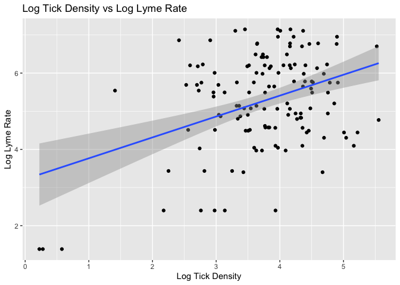

Cleaning and Description of Analytic dataset
================
2024-11-21

# Sarahy’s Data Cleaning

This document for cleaning and tidying the data.

``` r
library(tidyverse)
library(rvest)
library(sf)
library(purrr)
library(knitr)
library(readxl)
```

``` r
nineteen_twentyone_county_lyme = read_csv("new_york_county_lyme.csv") %>%  #read in the NYC lyme data
  janitor::clean_names() %>%  #clean the names 
  select(county_name, event_count,percent_rate ) %>%  # select variables of interest 
  rename(NAME = "county_name", 
         lyme_count = "event_count",
         lyme_rate = "percent_rate"
         ) %>%  # renaming so we can have a common variable when merging 
  mutate( data = "lyme") # created a new variable so double check that merging was accurate

print(nineteen_twentyone_county_lyme)
```

    ## # A tibble: 62 × 4
    ##    NAME      lyme_count lyme_rate data 
    ##    <chr>          <dbl>     <dbl> <chr>
    ##  1 Queens           336       4.9 lyme 
    ##  2 Saratoga         494      70.8 lyme 
    ##  3 Greene           612     427.  lyme 
    ##  4 Niagara           10       1.6 lyme 
    ##  5 Allegany          59      42.3 lyme 
    ##  6 Bronx             78       1.8 lyme 
    ##  7 Ulster           657     122.  lyme 
    ##  8 Jefferson        170      49.7 lyme 
    ##  9 Orange           878      75.1 lyme 
    ## 10 Wayne            120      44.2 lyme 
    ## # ℹ 52 more rows

Tidy deer tick data

``` r
tick_surveillance = read_csv("./Deer_Tick_Surveillance__Adults__Oct_to_Dec__excluding_Powassan_virus__Beginning_2008_20241116.csv") %>% 
  janitor::clean_names() %>% # clean the names so they follow normal form 
  filter(year %in% 2019:2021 ) %>%  # filtering from the years of interest that are based from the lyme disease data 
  rename(NAME = "county") %>% # renaming for common identifier
  rename(ticks_tested = "total_tested") %>% 
  select(-total_sites_visited, -school_districts_2016_shp, -local_waterfront_revitalization_program_lwrp_communities, -new_york_zip_codes, -counties, -nys_senate_districts, -a_phagocytophilum_percent, -b_microti_percent, -b_miyamotoi_percent) %>%  # selecting and removing variables of interest , 
mutate(data = "ticks")  # adding a variable to identify merging 


print(tick_surveillance)
```

    ## # A tibble: 138 × 8
    ##     year NAME       total_ticks_collected tick_population_density ticks_tested
    ##    <dbl> <chr>                      <dbl>                   <dbl>        <dbl>
    ##  1  2021 Albany                       366                    85.8          168
    ##  2  2021 Chautauqua                   199                    36.7          107
    ##  3  2021 Dutchess                     438                    66.8           51
    ##  4  2021 Warren                        88                    13.8           87
    ##  5  2020 Albany                       114                    37.2          103
    ##  6  2020 Chemung                      271                   257.            50
    ##  7  2020 Delaware                      75                    21.9           69
    ##  8  2020 Tompkins                     131                    52.4           44
    ##  9  2020 Oneida                       157                    78.5           50
    ## 10  2020 Seneca                        51                    35.5           50
    ## # ℹ 128 more rows
    ## # ℹ 3 more variables: b_burgdorferi_percent <dbl>, county_centroid <chr>,
    ## #   data <chr>

Read in shp file for NY counties

``` r
ny_county =  st_read("./Data Preparation/Counties.shp")  # read in the county shapefile 
```

    ## Reading layer `Counties' from data source 
    ##   `/Users/kalebfrierson/Desktop/MPH/Year 2/Fall Semester 2024/Data Science I /Final/p8105_final/Data Preparation/Counties.shp' 
    ##   using driver `ESRI Shapefile'
    ## Simple feature collection with 62 features and 17 fields
    ## Geometry type: MULTIPOLYGON
    ## Dimension:     XY
    ## Bounding box:  xmin: 105571.4 ymin: 4480943 xmax: 779932.1 ymax: 4985476
    ## Projected CRS: NAD83 / UTM zone 18N

``` r
print(ny_county)
```

    ## Simple feature collection with 62 features and 17 fields
    ## Geometry type: MULTIPOLYGON
    ## Dimension:     XY
    ## Bounding box:  xmin: 105571.4 ymin: 4480943 xmax: 779932.1 ymax: 4985476
    ## Projected CRS: NAD83 / UTM zone 18N
    ## First 10 features:
    ##           NAME ABBREV GNIS_ID FIPS_CODE   SWIS   NYSP_ZONE POP1990 POP2000
    ## 1       Albany   ALBA  974099     36001 010000        East  292594  294565
    ## 2     Allegany   ALLE  974100     36003 020000        West   50470   49927
    ## 3        Bronx   BRON  974101     36005 600000 Long Island 1203789 1332650
    ## 4       Broome   BROO  974102     36007 030000     Central  212160  200536
    ## 5  Cattaraugus   CATT  974103     36009 040000        West   84234   83955
    ## 6       Cayuga   CAYU  974104     36011 050000     Central   82313   81963
    ## 7   Chautauqua   CHAU  974105     36013 060000        West  141895  139750
    ## 8      Chemung   CHEM  974106     36015 070000     Central   95195   91070
    ## 9     Chenango   CHEN  974107     36017 080000     Central   51768   51401
    ## 10     Clinton   CLIN  974108     36019 090000        East   85969   79894
    ##    POP2010 POP2020 DOS_LL DOSLL_DATE NYC CALC_SQ_MI    DATEMOD Shape_Leng
    ## 1   304204  314848   <NA>       <NA>   N  532.79178 2017-11-10  166077.83
    ## 2    48946   46456   <NA>       <NA>   N 1035.20913 2019-04-26  210499.34
    ## 3  1385108 1472654   <NA>       <NA>   Y   57.47215 2019-10-04   57253.86
    ## 4   200600  198683   <NA>       <NA>   N  715.28747 2019-04-26  227933.33
    ## 5    80317   77042   <NA>       <NA>   N 1324.30922 2019-04-26  276084.51
    ## 6    80026   76248   <NA>       <NA>   N  881.82350 2018-07-18  334039.80
    ## 7   134905  127657   <NA>       <NA>   N 1507.79455 2019-04-26  247508.47
    ## 8    88830   84148   <NA>       <NA>   N  410.95932 2019-04-26  146916.78
    ## 9    50477   47220   <NA>       <NA>   N  897.81864 2018-10-03  226955.16
    ## 10   82128   79843   <NA>       <NA>   N 1116.81373 2018-12-07  235243.35
    ##    Shape_Area                       geometry
    ## 1  1379924372 MULTIPOLYGON (((605729 4737...
    ## 2  2681179340 MULTIPOLYGON (((229573.9 47...
    ## 3   148852180 MULTIPOLYGON (((595540.7 45...
    ## 4  1852586030 MULTIPOLYGON (((428899.3 46...
    ## 5  3429945130 MULTIPOLYGON (((169747.3 47...
    ## 6  2283912393 MULTIPOLYGON (((369644.2 47...
    ## 7  3905169964 MULTIPOLYGON (((161319.8 47...
    ## 8  1064379743 MULTIPOLYGON (((353386.9 46...
    ## 9  2325339613 MULTIPOLYGON (((464936.4 47...
    ## 10 2892534278 MULTIPOLYGON (((629506.7 49...

Merging the data sets

``` r
# merging the excel sheets first 

NY_lyme_tick = full_join(tick_surveillance, nineteen_twentyone_county_lyme, by = "NAME") %>% 
  select(-data.x, -data.y)

print(NY_lyme_tick)
```

    ## # A tibble: 147 × 9
    ##     year NAME       total_ticks_collected tick_population_density ticks_tested
    ##    <dbl> <chr>                      <dbl>                   <dbl>        <dbl>
    ##  1  2021 Albany                       366                    85.8          168
    ##  2  2021 Chautauqua                   199                    36.7          107
    ##  3  2021 Dutchess                     438                    66.8           51
    ##  4  2021 Warren                        88                    13.8           87
    ##  5  2020 Albany                       114                    37.2          103
    ##  6  2020 Chemung                      271                   257.            50
    ##  7  2020 Delaware                      75                    21.9           69
    ##  8  2020 Tompkins                     131                    52.4           44
    ##  9  2020 Oneida                       157                    78.5           50
    ## 10  2020 Seneca                        51                    35.5           50
    ## # ℹ 137 more rows
    ## # ℹ 4 more variables: b_burgdorferi_percent <dbl>, county_centroid <chr>,
    ## #   lyme_count <dbl>, lyme_rate <dbl>

``` r
# now merging the shape file with excel file 

NY_lyme_tick_county = NY_lyme_tick %>%
  left_join(ny_county, by = "NAME") %>% 
  janitor::clean_names() 

# didn't delete the other parts from abbrev and later because they are part of the shapefile and if I delete I have to convert it to a dataframe making the shapefile no longer spatial. 
```

``` r
# merging and reading in tammy csv file with avg temps 

ny_temp = read_csv("./avg_temp_county.csv", skip =1) %>% 
  janitor::clean_names() %>% 
  select(county:dec_22) %>% 
mutate(county = str_replace_all(county, "(?i) county$", "")) %>% #mutated to remove the suffix county so that the data can be merged and have common identifier
  rename(name = "county") %>%  # renaming to have common identifier 
  drop_na(name) # there are two rows with entirely no data so I dropped them 
```

    ## New names:
    ## Rows: 65 Columns: 56
    ## ── Column specification
    ## ──────────────────────────────────────────────────────── Delimiter: "," chr
    ## (1): County dbl (48): Jan-19, Feb-19, Mar-19, Apr-19, May-19, Jun-19, Jul-19,
    ## Aug-19, Se... lgl (7): ...50, ...51, ...52, ...53, ...54, ...55, ...56
    ## ℹ Use `spec()` to retrieve the full column specification for this data. ℹ
    ## Specify the column types or set `show_col_types = FALSE` to quiet this message.
    ## • `` -> `...50`
    ## • `` -> `...51`
    ## • `` -> `...52`
    ## • `` -> `...53`
    ## • `` -> `...54`
    ## • `` -> `...55`
    ## • `` -> `...56`

``` r
tick_lyme_weather = NY_lyme_tick_county  %>% # now merging the entire dataset with avg weather 
  left_join(ny_temp, by = "name") %>% 
  janitor::clean_names() 
```

    ## Warning in left_join(., ny_temp, by = "name"): Detected an unexpected many-to-many relationship between `x` and `y`.
    ## ℹ Row 145 of `x` matches multiple rows in `y`.
    ## ℹ Row 2 of `y` matches multiple rows in `x`.
    ## ℹ If a many-to-many relationship is expected, set `relationship =
    ##   "many-to-many"` to silence this warning.

# Saved Final Dataset

``` r
write_csv(tick_lyme_weather, "final_data.csv")

tidied = read_csv("final_data.csv")
```

    ## Rows: 148 Columns: 74
    ## ── Column specification ────────────────────────────────────────────────────────
    ## Delimiter: ","
    ## chr   (7): name, county_centroid, abbrev, swis, nysp_zone, nyc, geometry
    ## dbl  (64): year, total_ticks_collected, tick_population_density, ticks_teste...
    ## lgl   (2): dos_ll, dosll_date
    ## date  (1): datemod
    ## 
    ## ℹ Use `spec()` to retrieve the full column specification for this data.
    ## ℹ Specify the column types or set `show_col_types = FALSE` to quiet this message.

## Attempt Using NOAA data

``` r
# importing the weather data 

library(dplyr)
library(rnoaa)

# Get a list of all NY station IDs
stations <- ghcnd_stations()
nystationids <-  stations %>% 
  filter(state == "NY") %>% 
  distinct(id)

# Pull the desired weather data for all of these stations
nydat <- meteo_pull_monitors(nystationids$id, 
                             date_min = "2019-01-01", 
                             date_max = "2021-12-31", 
                             var = c("PRCP", "SNOW", "SNWD", "TMAX", "TMIN"))

# Save the resulting data
save(nystationids, nydat, file = "nynoaadat.RData")
```

``` r
# convert from rdata to csv

load("nynoaadat.RData")

ls()  # This will list all the objects in your environment

str(nydat)


noaa_data <- as.data.frame(nydat)


write.csv(data, file = "nydat.csv", row.names = FALSE)
```

``` r
ny_weather = read_csv("./nydat.csv") %>% 
  select(id, date, prcp,tmax) %>% 
  drop_na(tmax) 


ny_weather <- ny_weather %>%
  group_by(id, date) %>%
  summarise(
    prcp = mean(prcp, na.rm = TRUE),
    tmax = mean(tmax, na.rm = TRUE),
    .groups = 'drop'
  ) %>%
  pivot_wider(
    names_from = id,
    values_from = c(date, prcp, tmax)
  )

ny_weather <- ny_weather %>%
  unnest(cols = c(date, prcp, tmax))

print(ny_weather)

summary(tick_lyme_weather)
```

# Mary’s Data Analysis

``` r
#load necessary libraries
library(broom)
library(ggplot2)
library(dplyr)
```

### Relationship between tick density and average temperature per month

``` r
density_vs_avg_temp <- lm(tick_population_density ~ jan_19 + feb_19 + mar_19 + apr_19 + may_19 +jun_19 + jul_19 + aug_19 + sep_19 + oct_19 + nov_19 + dec_19 + jan_20 + feb_20 + mar_20 + apr_20 + may_20 + jun_20 + jul_20 + aug_20 + sep_20 + oct_20 + nov_20 + dec_20+ jan_21 + feb_21 + mar_21 + apr_21 + may_21 + jun_21 + jul_21 + aug_21 + sep_21 + oct_21 + nov_21 + dec_21, data = tick_lyme_weather, na.action = na.exclude) #examine the relationship between tick density and average temperature

broom::tidy(density_vs_avg_temp) |> select(term, estimate, p.value) |>knitr::kable(digits =3)
```

| term        | estimate | p.value |
|:------------|---------:|--------:|
| (Intercept) |  -52.953 |   0.971 |
| jan_19      |   32.671 |   0.063 |
| feb_19      |   87.834 |   0.009 |
| mar_19      |   -2.218 |   0.937 |
| apr_19      |  -31.786 |   0.374 |
| may_19      |   -7.172 |   0.861 |
| jun_19      |  131.641 |   0.015 |
| jul_19      | -203.546 |   0.000 |
| aug_19      |  104.829 |   0.031 |
| sep_19      |   44.756 |   0.105 |
| oct_19      |   59.240 |   0.223 |
| nov_19      |   15.851 |   0.625 |
| dec_19      |   15.815 |   0.483 |
| jan_20      |  -70.825 |   0.117 |
| feb_20      |  -68.034 |   0.007 |
| mar_20      |  136.275 |   0.002 |
| apr_20      | -111.410 |   0.000 |
| may_20      |   61.492 |   0.235 |
| jun_20      |  -90.638 |   0.055 |
| jul_20      |    2.760 |   0.134 |
| aug_20      |  147.522 |   0.001 |
| sep_20      |  -58.779 |   0.176 |
| oct_20      |  -74.293 |   0.208 |
| nov_20      |  -40.459 |   0.053 |
| dec_20      |   39.541 |   0.063 |
| jan_21      |  -68.826 |   0.017 |
| feb_21      |   52.352 |   0.047 |
| mar_21      |  -44.201 |   0.267 |
| apr_21      |   70.047 |   0.047 |
| may_21      |    5.560 |   0.921 |
| jun_21      |   13.545 |   0.583 |
| jul_21      |  -74.811 |   0.031 |
| aug_21      |   58.128 |   0.058 |
| sep_21      |  -49.404 |   0.246 |
| oct_21      |  -68.462 |   0.041 |
| nov_21      |   32.918 |   0.394 |
| dec_21      |  -25.287 |   0.329 |

This output demonstrates that many of the months show non-significant
results, therefore meaning a weak or unclear association of each month
with tick density. However some months in 2019, like June (p-value=
0.015) and August (p-value = 0.031), which have significant positive
outcomes, and July (p-value \< 0.005) had a negative outcome. The
intercept was -53.0 with a large of SE of 1,473, and a p-value of 0.971.
Therefore  
NEED TO LOOK AT THE REST OF THE VARIABLES

### Relationship between lyme_count and average temperatures per month

``` r
lyme_vs_avg_temp <- lm(lyme_count ~ jan_19 + feb_19 + mar_19 + apr_19 + may_19 + jun_19 + jul_19 + aug_19 + sep_19 + oct_19 + nov_19 + dec_19 + jan_20 + feb_20 + mar_20 + apr_20 + may_20 + jun_20 + jul_20 + aug_20 + sep_20 + oct_20 + nov_20 + dec_20+ jan_21 + feb_21 + mar_21 + apr_21 + may_21 + jun_21 + jul_21 + aug_21 + sep_21 + oct_21 + nov_21 + dec_21, data = tick_lyme_weather)

broom::tidy(lyme_vs_avg_temp) |> select(term, estimate, p.value) |>knitr::kable(digits =3)
```

| term        |   estimate | p.value |
|:------------|-----------:|--------:|
| (Intercept) | -17066.636 |   0.000 |
| jan_19      |    258.449 |   0.000 |
| feb_19      |      3.441 |   0.971 |
| mar_19      |   -300.180 |   0.001 |
| apr_19      |     75.273 |   0.461 |
| may_19      |    -44.239 |   0.680 |
| jun_19      |    -96.697 |   0.429 |
| jul_19      |    264.719 |   0.038 |
| aug_19      |    244.749 |   0.041 |
| sep_19      |   -272.592 |   0.000 |
| oct_19      |    -79.027 |   0.533 |
| nov_19      |     39.460 |   0.686 |
| dec_19      |      8.347 |   0.873 |
| jan_20      |    204.935 |   0.086 |
| feb_20      |   -104.129 |   0.104 |
| mar_20      |    394.157 |   0.002 |
| apr_20      |   -505.587 |   0.000 |
| may_20      |     -1.507 |   0.992 |
| jun_20      |   -270.712 |   0.032 |
| jul_20      |     33.252 |   0.000 |
| aug_20      |   -137.283 |   0.222 |
| sep_20      |    284.838 |   0.024 |
| oct_20      |     41.076 |   0.778 |
| nov_20      |   -127.534 |   0.059 |
| dec_20      |   -280.467 |   0.000 |
| jan_21      |   -212.407 |   0.004 |
| feb_21      |    122.543 |   0.128 |
| mar_21      |   -243.546 |   0.016 |
| apr_21      |    424.075 |   0.000 |
| may_21      |    259.209 |   0.049 |
| jun_21      |   -122.999 |   0.097 |
| jul_21      |   -547.860 |   0.000 |
| aug_21      |    682.250 |   0.000 |
| sep_21      |     47.721 |   0.670 |
| oct_21      |    152.558 |   0.101 |
| nov_21      |   -388.754 |   0.001 |
| dec_21      |    315.730 |   0.000 |

Lyme count has similar findings to tick density, with strong positive
relationships in August 2019, and negative relationships in June 2019.
The intercept was -17,100 with a (SE: 3592) and a p-value \< 0.005.

### Relationship between lyme_count and population variables

``` r
lyme_rate_vs_population <- lm(lyme_count ~ tick_population_density + total_ticks_collected, data = tick_lyme_weather)

broom::tidy(lyme_rate_vs_population) |> select(term, estimate, p.value) |>knitr::kable(digits =3)
```

| term                    | estimate | p.value |
|:------------------------|---------:|--------:|
| (Intercept)             |  236.969 |   0.000 |
| tick_population_density |   -0.403 |   0.489 |
| total_ticks_collected   |    0.596 |   0.000 |

This linear regression analyzes the relationship between Lyme rate and
tick population density and total ticks collected. Intercept estimate
was 121 (SE: 16.4), with a test statistic of 7.39 and p-value\<0.005.
Therefore the intercept is highly signficant, however the predictors are
not. This demonstrates a weak association between Lyme rates and the
variables.

The calculated square mileage estimate was -0.0305 (SE: 0.0159), with a
statistic of -1.92 and a p-value\<0.005.

### Relationship between lyme_count and area variables

``` r
lyme_rate_vs_area <- lm(lyme_count ~ shape_area  + shape_leng + pop2020, data = tick_lyme_weather)

broom::tidy(lyme_rate_vs_area) |> select(term, estimate, p.value) |>knitr::kable(digits =3)
```

| term        | estimate | p.value |
|:------------|---------:|--------:|
| (Intercept) |  259.909 |   0.014 |
| shape_area  |    0.000 |   0.657 |
| shape_leng  |    0.000 |   0.763 |
| pop2020     |    0.000 |   0.000 |

``` r
summary(tick_lyme_weather$pop2020)
```

    ##    Min. 1st Qu.  Median    Mean 3rd Qu.    Max.    NA's 
    ##    5107   49532   92434  273104  234663 2736074       2

Considering that all other variables but the intercept are weak, there
does not appear to be an association between lyme rate and area
variables (shape area, shape length, and calculated square miles).

### Trying the relationship between lyme_count and area variables, including human population density in 2020

``` r
lyme_rate_vs_area_human <- lm(lyme_count ~ shape_area  + shape_leng  + pop2020, data = tick_lyme_weather)

broom::tidy(lyme_rate_vs_area_human) |> select(term, estimate, p.value) |>knitr::kable(digits =3)
```

| term        | estimate | p.value |
|:------------|---------:|--------:|
| (Intercept) |  259.909 |   0.014 |
| shape_area  |    0.000 |   0.657 |
| shape_leng  |    0.000 |   0.763 |
| pop2020     |    0.000 |   0.000 |

Human population was found to be negatively associated(-4.14) and
significantly association (p-value\<0.005) with lyme rate.

### Relationship between b_burgdorferi_percent and population variables

``` r
b_burgdorferi_percent_vs_population <- lm(b_burgdorferi_percent ~ lyme_count + tick_population_density + total_ticks_collected, data = tick_lyme_weather)

broom::tidy(b_burgdorferi_percent_vs_population) |> select(term, estimate, p.value) |>knitr::kable(digits =3)
```

| term                    | estimate | p.value |
|:------------------------|---------:|--------:|
| (Intercept)             |   49.796 |   0.000 |
| lyme_count              |    0.004 |   0.302 |
| tick_population_density |    0.056 |   0.025 |
| total_ticks_collected   |   -0.002 |   0.651 |

The findings from the table demonstrate that the lyme rate and tick
population density are slightly positively and significantly associated
with B. burgdorferi percent. However, this does not appear to be related
to the number of ticks collected considering that the number did not
have a significant impact on the B. burgdorferi percent.

### Logarithmic examination of lyme rate versus number of ticks collected and tick population density

``` r
#Convert everything to a logarithmic format
tick_lyme_weather_log <- tick_lyme_weather |>
  mutate(
    log_total_ticks =log1p(total_ticks_collected), 
    log_tick_density = log1p(tick_population_density),
    log_lyme_count = log1p(lyme_count)
  )

# Check for linear relationship with a scatterplot
ggplot(tick_lyme_weather_log, aes(x = log_tick_density, y = log_lyme_count)) +
  geom_point() +
  geom_smooth(method = "lm") +
  labs(title = "Log Tick Density vs Log Lyme Rate",
       x = "Log Tick Density",
       y = "Log Lyme Rate")
```

    ## `geom_smooth()` using formula = 'y ~ x'

    ## Warning: Removed 13 rows containing non-finite outside the scale range
    ## (`stat_smooth()`).

    ## Warning: Removed 13 rows containing missing values or values outside the scale range
    ## (`geom_point()`).

<!-- -->

``` r
#Examination of log-linear regression 
log_model <- lm(log_lyme_count ~ log_total_ticks + log_tick_density + b_burgdorferi_percent, data = tick_lyme_weather_log)
summary(log_model)
```

    ## 
    ## Call:
    ## lm(formula = log_lyme_count ~ log_total_ticks + log_tick_density + 
    ##     b_burgdorferi_percent, data = tick_lyme_weather_log)
    ## 
    ## Residuals:
    ##      Min       1Q   Median       3Q      Max 
    ## -2.12044 -0.68382  0.02336  0.65471  2.83909 
    ## 
    ## Coefficients:
    ##                        Estimate Std. Error t value Pr(>|t|)    
    ## (Intercept)            1.668607   0.494218   3.376 0.000967 ***
    ## log_total_ticks        0.697176   0.111747   6.239 5.65e-09 ***
    ## log_tick_density      -0.161116   0.145584  -1.107 0.270456    
    ## b_burgdorferi_percent  0.015459   0.007675   2.014 0.046041 *  
    ## ---
    ## Signif. codes:  0 '***' 0.001 '**' 0.01 '*' 0.05 '.' 0.1 ' ' 1
    ## 
    ## Residual standard error: 1.015 on 131 degrees of freedom
    ##   (13 observations deleted due to missingness)
    ## Multiple R-squared:  0.363,  Adjusted R-squared:  0.3485 
    ## F-statistic: 24.89 on 3 and 131 DF,  p-value: 8.276e-13

``` r
# Analyze seasonal weather effects
tick_lyme_weather_seasonal <- tick_lyme_weather_log %>%
  mutate(across(ends_with(c("19", "20", "21")), log1p, .names = "log_{.col}"))

weather_model <- lm(log_lyme_count ~ jan_19 + feb_19 + mar_19 + apr_19 + may_19 + jun_19 + jul_19 + aug_19 + sep_19 + oct_19 + nov_19 + dec_19 + jan_20 + feb_20 + mar_20 + apr_20 + may_20 + jun_20 + jul_20 + aug_20 + sep_20 + oct_20 + nov_20 + dec_20+ jan_21 + feb_21 + mar_21 + apr_21 + may_21 + jun_21 + jul_21 + aug_21 + sep_21 + oct_21 + nov_21 + dec_21, data = tick_lyme_weather_seasonal)

broom::tidy(weather_model) |> select(term, estimate, p.value) |>knitr::kable(digits =3)
```

| term        | estimate | p.value |
|:------------|---------:|--------:|
| (Intercept) |  -28.689 |   0.050 |
| jan_19      |    1.018 |   0.000 |
| feb_19      |    1.922 |   0.000 |
| mar_19      |   -0.925 |   0.009 |
| apr_19      |    0.681 |   0.100 |
| may_19      |   -1.180 |   0.007 |
| jun_19      |   -0.021 |   0.967 |
| jul_19      |    0.170 |   0.739 |
| aug_19      |    1.588 |   0.001 |
| sep_19      |    0.103 |   0.734 |
| oct_19      |   -0.130 |   0.799 |
| nov_19      |   -0.653 |   0.100 |
| dec_19      |   -0.205 |   0.331 |
| jan_20      |   -0.966 |   0.045 |
| feb_20      |   -0.683 |   0.009 |
| mar_20      |    1.894 |   0.000 |
| apr_20      |   -0.717 |   0.046 |
| may_20      |    0.554 |   0.381 |
| jun_20      |   -1.549 |   0.003 |
| jul_20      |    0.115 |   0.000 |
| aug_20      |    0.223 |   0.622 |
| sep_20      |   -0.490 |   0.332 |
| oct_20      |   -0.415 |   0.480 |
| nov_20      |   -0.503 |   0.065 |
| dec_20      |    0.353 |   0.184 |
| jan_21      |   -1.341 |   0.000 |
| feb_21      |    0.260 |   0.422 |
| mar_21      |   -0.703 |   0.084 |
| apr_21      |    0.627 |   0.095 |
| may_21      |    1.585 |   0.003 |
| jun_21      |   -0.027 |   0.926 |
| jul_21      |   -2.820 |   0.000 |
| aug_21      |    0.998 |   0.010 |
| sep_21      |    1.168 |   0.011 |
| oct_21      |    0.890 |   0.018 |
| nov_21      |   -0.879 |   0.053 |
| dec_21      |    0.619 |   0.036 |

The logarithmic analysis found that the total number of ticks found and
the B. burgdoferi percent had a positive, significant association with
increased lyme disease rates.

Some interesting findings from looking at the log of the weather
variables include that months like March 2019 ( β=−1.002, p\<0.001) and
October 2020 (β=1.325, p=0.006) showing strong effects. Meanwhile,
months like June 2021 (β=0.848, p=0.001) and July 2021 (β=−1.159,
p=0.001)) had contrasting impacts, highlighting intra-annual variability
in environmental or biological drivers.These months highlight that tick
activity is present whenever the temperature is above freezing, is
highly variable. The low R^2 value demonstrates significant variability.
Therefore further analysis with environmental, demographic and
behavioral data would be beneficial.
